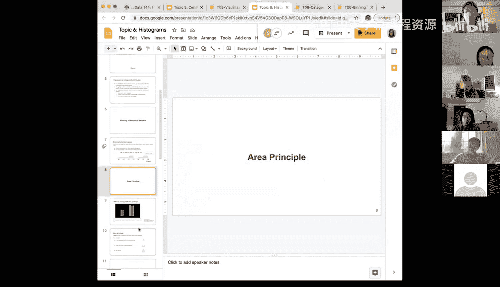
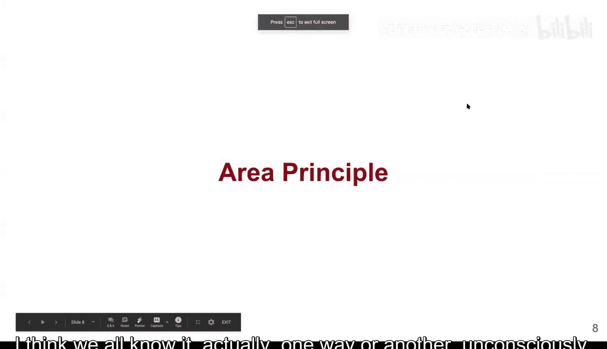
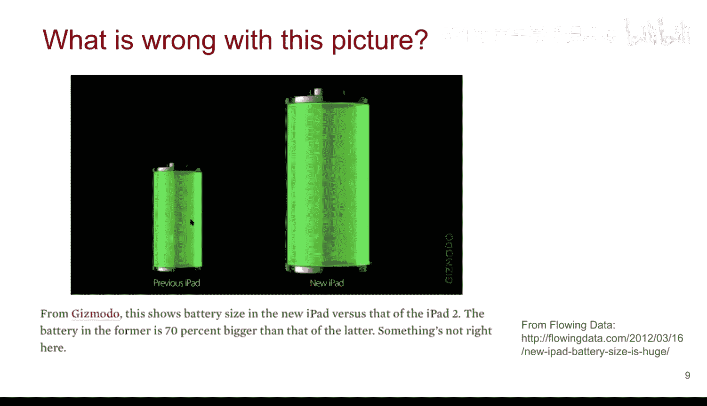
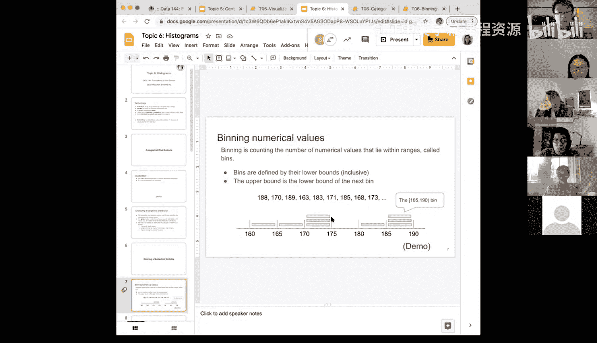

# 23：面积原则与直方图基础

在本节课中，我们将学习数据可视化中的一个核心概念——**面积原则**，并理解它对于正确构建和理解直方图的重要性。

## 面积原则概述

上一节我们介绍了数据可视化的基础，本节中我们来看看一个关键原则。面积原则指出，在可视化中，图形元素的**面积**应与它所代表的数值成比例。这是一个看似简单但至关重要的概念。

让我们通过一个例子来理解。下图展示了一篇关于新旧iPad电池尺寸对比的新闻报道。

文章声称新款iPad的电池比旧款大70%。然而，图中右侧代表新电池的圆柱体，其视觉尺寸看起来远不止是左侧圆柱体的1.7倍。

问题在于，绘图者错误地放大了圆柱体的**半径**，而非**体积**。圆柱体的体积公式是：
`体积 = π × r² × 高`
因此，若要使体积变为1.7倍，半径只需增加约 `√1.7 ≈ 1.3` 倍。但图中圆柱体的半径看起来被放大了接近1.7倍，这导致其面积（在二维投影中）被错误地放大到了约 `1.7² ≈ 2.9` 倍，从而严重误导了观感。

这个错误清晰地展示了违反面积原则的后果：图形面积没有正确反映数据间的真实比例关系。

## 面积原则的核心要点

以下是面积原则需要牢记的几个关键点：

1.  **面积代表数值**：图形元素的面积应直接对应于它所要表示的数值大小。
2.  **避免线性放大**：当数值翻倍时，不应简单地使图形的边长或半径翻倍，这会导致面积被过度放大（例如，边长翻倍会使正方形面积变为四倍）。
3.  **应用于直方图**：这个原则是理解直方图的基础。在直方图中，每个矩形条的面积代表落入该数据区间（即“分箱”）的数据点所占的**百分比**。

## 从条形图到直方图

为了更清晰地理解，我们可以对比条形图和直方图。

下图展示的是一个典型的条形图，它用于展示分类数据。

在条形图中，每个条形的**高度**（或长度）直接表示该类别对应的数值（例如电影票房）。横轴是类别名称，条形宽度通常固定且无实际意义。

然而，直方图用于可视化**数值型数据**的分布。其核心在于“分箱”——将整个数据范围划分为若干个连续的区间。

考虑以下分箱计数的简单示例：假设我们统计了数据落入各个区间的数量，例如 `[2, 1, 3, 1, 1]`。要将其转化为百分比，我们需要将这些计数除以数据点的总数。

在直方图中：
*   每个矩形条的**面积** = 该分箱内数据点的百分比。
*   矩形条的**高度** = 频率密度，计算公式为：`高度 = 面积 / 宽度`。

这意味着：
*   如果所有分箱的**宽度相等**，那么条形的**高度**就与百分比成比例，此时观察高度即可。
*   如果分箱的**宽度不相等**，就必须通过面积（高度 × 宽度）来判断百分比，而不能直接比较高度。否则就会犯类似iPad电池图例中的错误。

## 总结与预告

本节课中我们一起学习了**面积原则**。我们了解到，在数据可视化中，必须保证图形面积与所代表的数据值成比例，这是避免视觉误导的基石。我们通过一个错误的图表案例加深了这一认识，并初步探讨了这一原则如何应用于直方图。

直方图是可视化数值数据分布极其有用的工具。要正确创建和理解它，需要经历分箱、计数、计算百分比等多个步骤，并始终牢记面积原则。当分箱宽度不等时，条形的**高度**需要根据 `高度 = 百分比 / 宽度` 的公式来计算，以确保每个条形的**面积**正确反映了数据分布。

在接下来的课程中，我们将深入直方图的构建细节，届时今天所学的面积原则将变得至关重要。如果届时感到困惑，请务必回顾本节课关于面积原则的讨论。