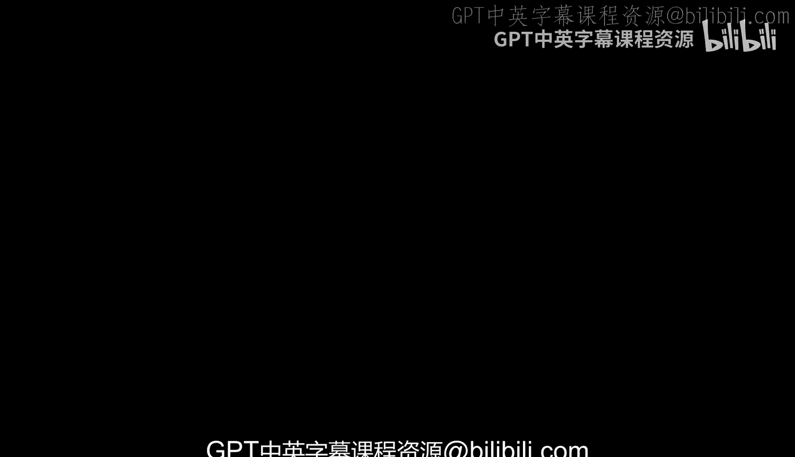
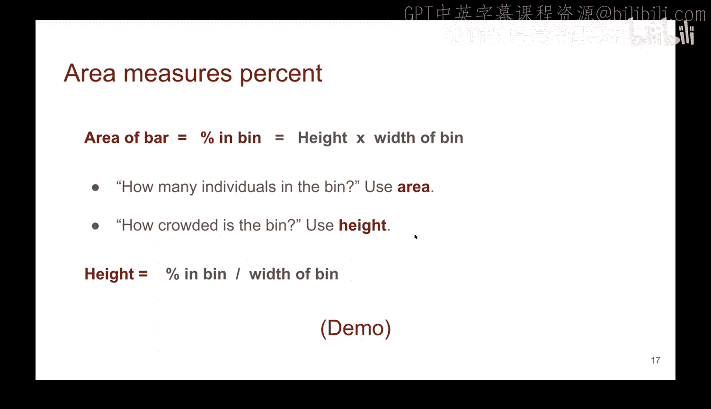
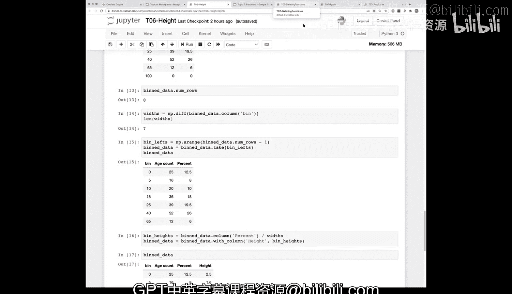

# 24：绘制直方图 📊

在本节课中，我们将学习直方图的核心概念、计算方法及其与条形图的区别。我们将通过一个电影年龄分布的实例，详细拆解直方图的绘制过程，理解面积、高度和密度之间的关系。

---

## 直方图与条形图的区别

上一节我们介绍了数据可视化的基础。本节中，我们来看看直方图与条形图的关键区别。

直方图用于展示**数值变量**的分布。这与条形图不同，条形图更适合展示**分类变量**的分布。

直方图的一个主要特点是使用**数据分箱**。由于处理的是数值数据，我们可以将数据划分到不同的区间（即“箱”）中。每个箱对应直方图中的一个条形。与条形图不同，直方图中箱的宽度可以由我们自定义，并且各个箱的宽度不必统一。但需要注意的是，当箱的宽度不均匀时，直方图遵循**面积原则**。

面积原则是指：每个条形的**面积**（即高度乘以宽度）代表了落入该箱的数据点占总体的**百分比**。这个原则对于准确解读直方图至关重要。

---

## 面积、高度与密度的关系

既然我们理解了面积代表百分比，那么我们应该讨论如何计算条形的高度，以及高度在分布密度方面意味着什么。

默认情况下，如果我们使用表格的内置 `hist` 方法，它会使用归一化尺度。这意味着整个图表的面积总和为100。这再次印证了每个箱下的面积对应于整个群体的百分比。既然我们讨论的是百分比，我们自然希望总和为100。

水平轴（X轴）的刻度如前所述，不必均匀。由于我们是从面积的角度来思考，垂直轴（Y轴）的单位将是“百分比 / X轴单位”。在下方的图表中，单位是“百分比 / 年”。

那么，我们如何计算高度呢？这源于一个事实。让我们看一个电影的例子，稍后会进行演示。

假设我们有一个箱。记住我们计算箱的方式，这很容易让人混淆，并且它采用了非常Python中心化的视角。在这个例子中，我们有一个从40到65的箱，使用了区间表示法。方括号 `[` 表示箱的起点包含数字40。因此，这个特定的箱从40开始，一直到但不包括65，用圆括号 `)` 表示。这意味着该箱中的所有项目都大于或等于40且小于65。

要计算一个箱的高度，我们可以先计算落入该箱的项目数量。对于稍后演示的电影例子，这个箱有52部电影，总共有200部电影。因此，该箱的百分比是52/200，即26%。

我们希望该箱的整个面积代表26%。为了计算高度，我们将这26%除以箱的宽度。在这个例子中，箱的宽度是65 - 40 = 25年。因此，条形的高度将是 26% / 25年 = 1.04% / 年。然后，用高度乘以年数25，就得到了我们26%的面积。

另一种看待高度的方式是从密度角度思考。从我们的公式 **`高度 = 百分比 / 箱宽`** 出发，我们可以重新排列。

高度代表了箱内百分比相对于箱宽的比例。我们可以将高度理解为衡量数据在箱内**密集程度**的指标。换句话说，高度越高，该箱内的数据点就越“拥挤”，密度越大。因此，一种理解方式是：**面积代表百分比，高度代表该箱的密度**。高度的单位是“百分比 / X轴单位”。

为了便于参考，面积就是高度乘以宽度，结果就是百分比。如果你问“箱里有多少个体？”，这是一个关于面积的问题。但如果你想知道一个特定箱有多“拥挤”，只需看高度即可。

---

## 实例演示：电影年龄分布

让我们通过一个例子来看看具体如何操作。

我们将读取2017年的热门电影数据。这个列表是在2017年发布的，因此我们要计算电影在2017年时的年龄。我们将从表格中提取“年份”列，创建一个新数组，用2017减去电影的制作年份，得到电影在2017年的年龄，然后将这个新列添加回表格。

如果我们想为直方图自定义箱，需要自己创建。可以使用 `make_array` 方法，然后传入箱边界的列表。记住，第一个箱从0开始，包含0但不包含5；第二个箱从5开始，包含5但不包含10，依此类推。最后一个箱从65开始，包含65但不包含100。

现在，我们可以在电影表上调用 `bin` 方法。第一个参数 `age` 是我们想要分箱的数值数据，第二个参数 `bins` 是我们定义的箱。如果不指定 `bins` 参数，方法会尝试自动猜测合适的箱。

查看分箱数据时，需要注意一个细节：它会显示最后一个箱（例如65到100），但该箱内可能没有任何数据。这只是绘图库的一个特点，我们需要知道这个箱的终点位置以便计算宽度，但就数据而言，它是一个宽度为零的空箱。

分箱后，我们得到了每个箱的计数。为了将其转换为百分比，我们添加一个新列“percent”，用每个箱的计数除以总电影数（200）。

现在，我们可以使用 `hist` 方法绘制直方图。第一个参数是我们要绘制直方图的数值数据列（`age`），`bins` 参数使用我们自定义的箱，`unit` 参数用于在坐标轴标签上显示单位（例如“年”）。

绘制完成后，Y轴的单位是“百分比 / 年”。图表将每个箱的百分比均匀地分布在其宽度上。要得到实际百分比，需要用该条形的高度乘以箱的宽度。

让我们看一个具体例子。查看分箱数据中 `bin` 为40的行，可以看到有26%的电影落在40到65这个箱中。该箱的宽度是25年。因此，高度是 26% / 25年 = 1.04% / 年。观察图表，对应条形的高度确实略高于1，这与计算相符。

我们可以使用 `diff` 方法计算每个箱的宽度，它会计算数组中相邻元素的差值，从而得到各个箱的宽度。

为了手动计算所有条形的高度，我们可以创建一个只包含每个箱起点的数组（去掉最后一个终点值），然后用每个箱的百分比除以其对应的宽度，得到高度值。将这些手动计算的高度与直方图自动绘制的高度进行比较，它们应该完全一致。

关键要点是：我们计算的高度代表**密度**，高度乘以宽度得到面积，即该箱内个体的百分比。虽然 `hist` 方法会自动完成这些计算，但逐步理解这个过程有助于我们记住直方图背后的原理：**面积代表百分比，高度代表该箱的相对密度**。从图表中可以看到，0到5年的第一个箱非常“拥挤”，该箱内电影数量相对于箱宽来说很多；而末尾的箱则相对稀疏。

关于最后一个空箱的显示问题，这是绘图库的一个特性。它显示100这个值，实际上是前一个箱（65到100）的终点，以便于计算宽度。对于绘图目的而言，它是一个宽度为零的箱，因此不会显示任何数据。如果中间某个箱没有数据，直方图中则会显示为一个缺口。

---

## 总结

本节课中，我们一起学习了直方图的核心概念。我们明确了直方图适用于展示数值变量的分布，并理解了其与条形图在数据分箱和面积原则上的根本区别。我们深入探讨了直方图中面积、高度和密度之间的关系：**面积（高度 × 宽度）代表数据百分比，高度代表数据在箱内的密度**。通过一个电影年龄分布的实际案例，我们逐步演示了从数据分箱、计算百分比和高度，到最终绘制直方图的完整过程。理解这些原理，将帮助我们更准确地创建和解读直方图，从而洞察数据的分布特征。