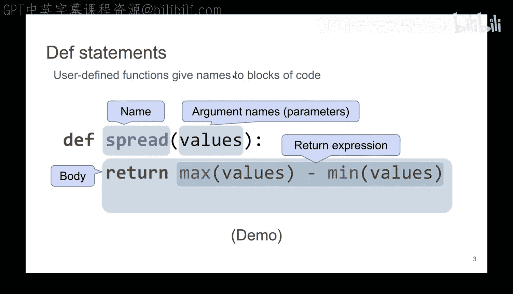
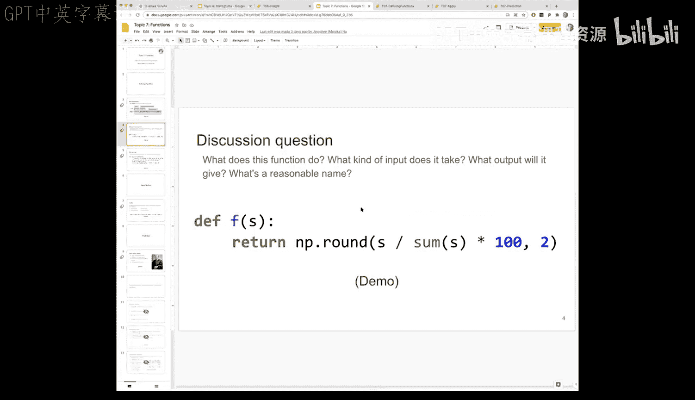
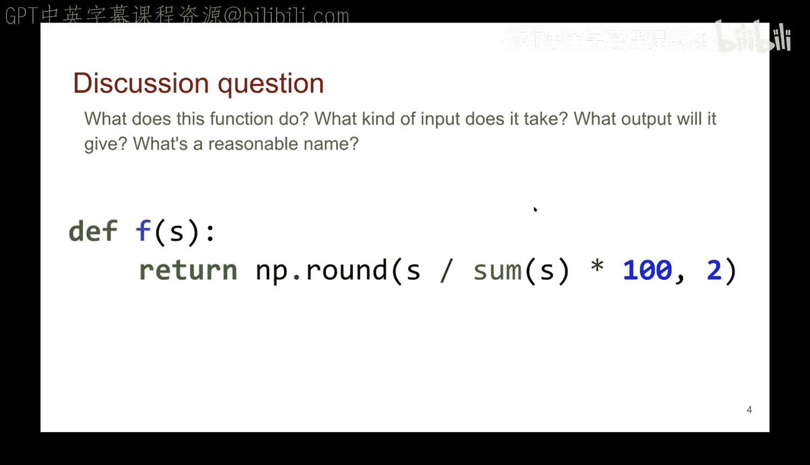
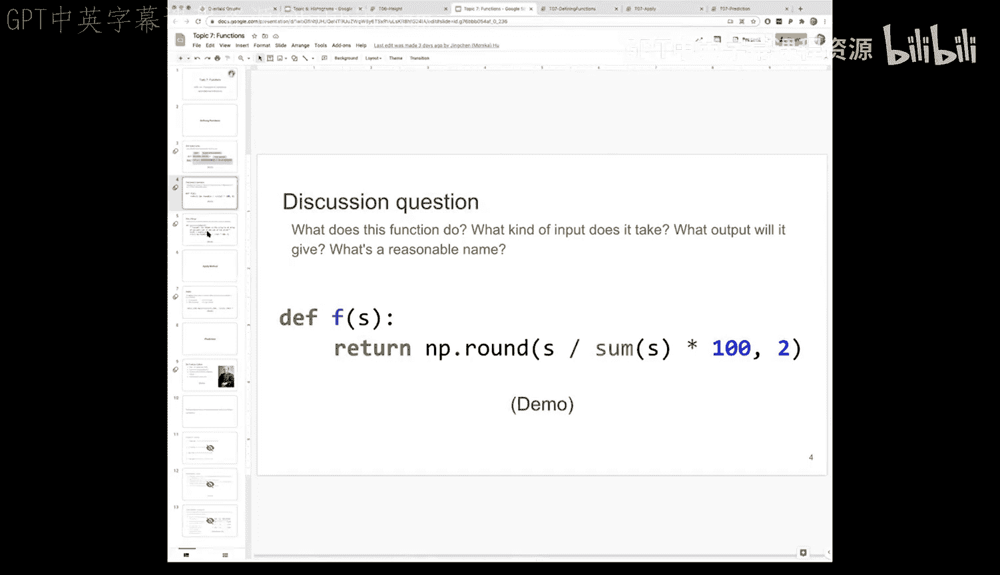
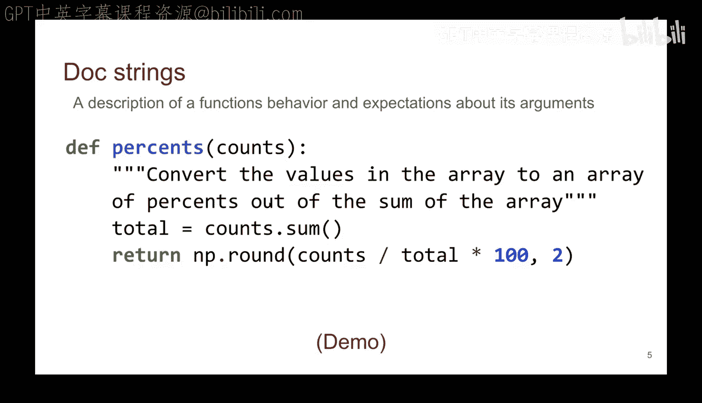
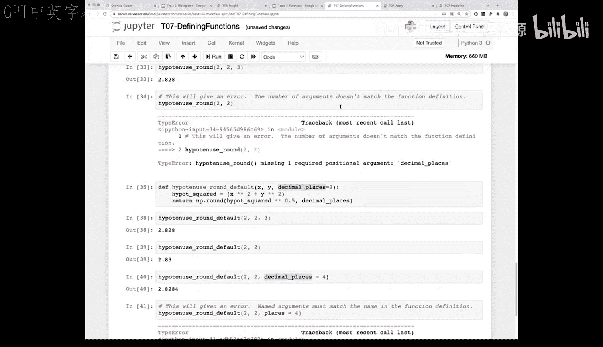

# 25：定义函数 📘


在本节课中，我们将学习如何定义自己的函数。函数是编程中用于封装和重用代码的强大工具。我们将从函数的基本结构开始，逐步了解如何定义、调用函数，以及如何使用参数和返回值。

## 概述 📋

函数允许我们将一系列操作命名并打包，以便在程序中多次使用。与内置函数不同，自定义函数使我们能够执行特定的、重复的计算任务。本节将详细介绍函数的定义方法、参数传递、作用域以及如何编写文档字符串。

## 函数与方法 🔍

在开始之前，我们先区分两个概念：函数和方法。两者都用于执行计算和操作，并且都可以接受参数。主要区别在于，函数是独立的，不依附于任何特定对象。而方法则通过点符号（如 `table.show()`）在现有对象上调用。本节课我们专注于学习如何编写独立的函数。

## 函数的解剖结构 🧬



Python 使用 `def` 关键字来定义函数。一个函数的基本结构包括名称、参数、函数体和可选的返回语句。

以下是定义一个计算数组“展布”（最大值与最小值之差）的函数示例：

```python
def spread(values):
    return max(values) - min(values)
```

*   **`def`**：定义函数的关键字。
*   **`spread`**：函数名称，遵循变量命名规则（字母开头，可包含数字和下划线）。
*   **`(values)`**：参数列表，放在括号内。本例中有一个参数 `values`。
*   **`:`**：冒号表示函数体开始。
*   **函数体**：所有属于函数的代码行必须**缩进**相同的宽度。
*   **`return`**：`return` 关键字用于指定函数的返回值。调用函数时，整个函数调用表达式的值就是 `return` 语句后面的值。

## 定义与调用函数 💻

理解了结构后，我们来看看如何实际操作。首先必须定义函数，然后才能调用它。

```python
# 1. 定义函数
def triple(x):
    return 3 * x

# 2. 调用函数
result = triple(3)  # result 的值现在是 9
print(result)  # 输出：9
```

*   定义函数（`def triple(x):...`）只是让Python知道这个函数的存在，并不会立即执行其中的代码。
*   调用函数（`triple(3)`）才会执行函数体内的代码。参数 `3` 被传递给函数，在函数内部，变量 `x` 的值就是 `3`。
*   函数调用本身是一个表达式，其值由 `return` 语句决定。我们可以将这个值赋给变量（如 `result`）以便后续使用。

参数可以是任何已定义的对象或表达式：

```python
num = 4
val1 = triple(num)       # 传递变量，val1 为 12
val2 = triple(num * 5)   # 传递表达式，先计算 num*5=20，再调用 triple(20)，val2 为 60
```

## 变量的作用域 🎯

函数内部定义的变量（如参数 `x`）具有**局部作用域**。这意味着它们只在函数执行期间存在，函数外部无法访问。这个概念称为**封装**，它避免了变量名冲突，让我们只需关心函数的功能，而不必担心其内部使用了哪些变量名。

```python
x = 5  # 全局变量 x



def triple(x):  # 这里的 x 是局部变量，与全局变量 x 无关
    return 3 * x

print(triple(10))  # 输出 30，函数内部的 x 是 10
print(x)           # 输出 5，全局变量 x 的值没有改变
```

## 函数的通用性 🌐

只要传入的数据类型与函数体内的操作兼容，函数就可以处理各种类型的数据，如数字、字符串甚至数组。



```python
print(triple("ha"))     # 输出: 'hahaha'，字符串乘法是重复
print(triple([0, 1, 2, 3]))  # 输出: [0, 3, 6, 9]，数组乘法是逐元素操作
```

## 分析一个函数示例 🔎



让我们分析一个更复杂的函数，以理解其输入、输出和功能。

```python
def mystery_function(s):
    return round(100 * s / sum(s), 2)
```



我们可以通过以下步骤来分析：
1.  **输入**：函数 `sum()` 通常作用于数组，因此 `s` 应该是一个数组。
2.  **内部计算**：`sum(s)` 计算数组总和。`s / sum(s)` 计算每个元素占总和的比例。`100 * ...` 将比例转换为百分比。
3.  **输出**：`round(..., 2)` 将结果四舍五入到两位小数，并返回这个新数组。
4.  **命名**：根据其功能，可以将其命名为 `percent_of_total` 或 `to_percent`。

改进后的、带有清晰变量名和文档的版本如下：

## 文档字符串与代码可读性 📝

为函数添加文档字符串（docstring）是良好的编程习惯。它使用三引号 `"""` 包裹，用于说明函数的功能、参数和返回值，有时还会包含使用示例。其他开发者（或未来的你）可以通过 `help(函数名)` 或 `函数名?`（在Jupyter中）来查看这些文档。

```python
def to_percent(counts):
    """
    将数组中的值转换为占总和的百分比。

    参数:
    counts -- 一个数值数组。

    返回:
    一个数组，其中每个元素是原数组对应元素占总和的百分比（四舍五入到整数）。
    """
    total = sum(counts)
    return round(100 * counts / total)

# 查看文档
help(to_percent)
# 或在Jupyter中: to_percent?
```

将复杂的计算步骤分解为有意义的中间变量（如 `total = sum(counts)`），可以显著提高代码的可读性。

## 多参数与默认参数 ⚙️

函数可以接受多个参数，用逗号分隔。

```python
def hypotenuse(x, y):
    return (x**2 + y**2)**0.5

print(hypotenuse(3, 4))  # 输出: 5.0
```

我们还可以为参数指定**默认值**，使其成为可选参数。带有默认值的参数必须放在参数列表的末尾。

```python
def hypotenuse_round(x, y, decimal_places=2):
    """计算直角三角形的斜边长度，并四舍五入到指定小数位。"""
    hyp = (x**2 + y**2)**0.5
    return round(hyp, decimal_places)

print(hypotenuse_round(3, 4))      # 使用默认值2，输出: 5.0
print(hypotenuse_round(3, 4, 3))   # 覆盖默认值，输出: 5.0
```

如果需要跳过前面的有默认值的参数去设置后面的参数，必须使用参数名进行指定。

```python
# 错误：试图按位置传递值给 `decimal_places`，但 `y` 没有值
# hypotenuse_round(3, 2)



# 正确：使用参数名指定
print(hypotenuse_round(3, decimal_places=4, y=4))  # 输出: 5.0
```

## 总结 🎓

本节课我们一起学习了如何定义和使用自定义函数。我们掌握了函数的基本结构（`def`、参数、函数体、`return`），理解了变量的作用域和封装概念，并学会了如何通过文档字符串和清晰的代码结构来提高程序的可读性和可维护性。我们还探讨了如何处理多参数和设置默认参数。


函数是模块化编程的基石。在接下来的课程中，我们将学习如何将函数应用到表格的整列数据上，这将极大地扩展我们进行数据分析和处理的能力。