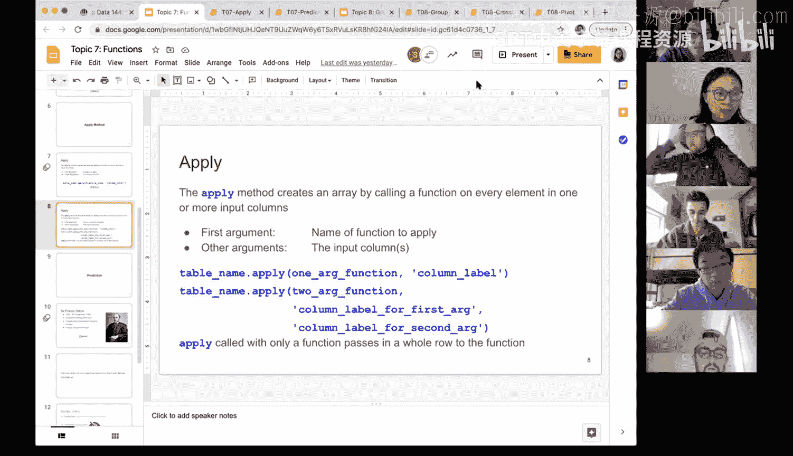

# 26：函数应用 🧮


在本节课中，我们将深入学习 `apply` 方法。这是一种在数据表的特定列上，对每个元素调用指定函数以生成新数组的强大工具。我们将通过具体示例，详细讲解其用法、灵活性以及如何将结果整合回原数据表。

---

上一节我们介绍了函数的基本概念，本节中我们来看看如何将函数系统地应用于整列数据。

`apply` 方法会通过调用一个函数来处理输入列中的每一个元素，并最终生成一个新的数组。请注意，根据函数的设计，`apply` 可以应用于单列或多列数据。例如，有些函数只接受一个输入，而有些函数可能需要同时比较两列数据。目前，我们主要通过演示来确保大家理解如何通过对单列调用函数来使用 `apply` 方法。

以下是使用 `apply` 方法的一个基础示例。

我们有一个名为 `ages` 的数据表，其中包含人名及其出生年份。

```python
# 示例数据表 ‘ages’
| 人名   | 出生年份 |
|--------|----------|
| Jim    | 1985     |
| Prime  | 1988     |
| Micro  | 1967     |
| Create | 1904     |
```

假设我们想将所有出生年份“封顶”在1980年，即任何大于1980年的年份都视为1980。为此，我们需要定义一个函数。

```python
def cap_at_1980(x):
    return min(x, 1980)
```

这个函数 `cap_at_1980` 接受一个输入 `x`，并返回 `x` 和 `1980` 中较小的那个值。例如，输入1985会返回1980，输入1967则会返回1967。

现在，我们可以将这个函数应用到“出生年份”这一整列上。

```python
capped_values = ages.apply(cap_at_1980, ‘出生年份’)
```

执行这行代码后，`capped_values` 将是一个数组：`[1980, 1980, 1967, 1904]`。可以看到，前两个大于1980的年份被限制为1980，后两个小于1980的年份则保持不变。

---

`apply` 方法返回的是一个数组。如果我们希望将这个结果作为新列添加回原数据表，可以结合使用 `with_column` 方法。

例如，我们想添加一个名为“封顶年份”的新列。

```python
ages_with_capped = ages.with_column(‘封顶年份’, ages.apply(cap_at_1980, ‘出生年份’))
```

这样，我们就得到了一个包含原始数据和计算后新列的数据表。在实际分析中，是直接使用返回的数组，还是将其添加回表中，取决于你的具体目标。随着学习的深入，我们需要综合运用各种方法来完成不同的任务。

---

`apply` 方法同样适用于需要多个输入参数的函数。这展示了其强大的灵活性。

例如，我们定义一个函数 `name_and_age`，它接受人名和出生年份，返回一个描述年龄的字符串。

```python
def name_and_age(name, birth_year):
    age = 2021 - birth_year
    return name + ‘ is ‘ + str(age)
```

这个函数需要两个参数：`name` 和 `birth_year`。我们可以将 `apply` 方法应用于包含这两列的数据。

```python
age_statements = ages.apply(name_and_age, ‘人名’, ‘出生年份’)
```

执行后，`age_statements` 将是一个字符串数组：`[‘Jim is 36’, ‘Prime is 33’, ‘Micro is 54’, ‘Create is 117’]`。这说明了 `apply` 方法可以处理多列输入，并将结果以数组形式返回。

---



本节课中我们一起学习了 `apply` 方法的核心用法。我们了解到，它可以对数据表的列应用自定义函数，无论是单参数还是多参数函数。其输出总是一个数组，我们可以根据需要决定是直接使用这个数组，还是利用 `with_column` 等方法将其整合回原数据表。`apply` 方法是数据分析中极为常用和灵活的工具，请务必通过课程演示和实验练习来巩固理解。如果在实践中忘记具体语法，随时查阅课程资料或帮助文档是完全正常且高效的学习过程。