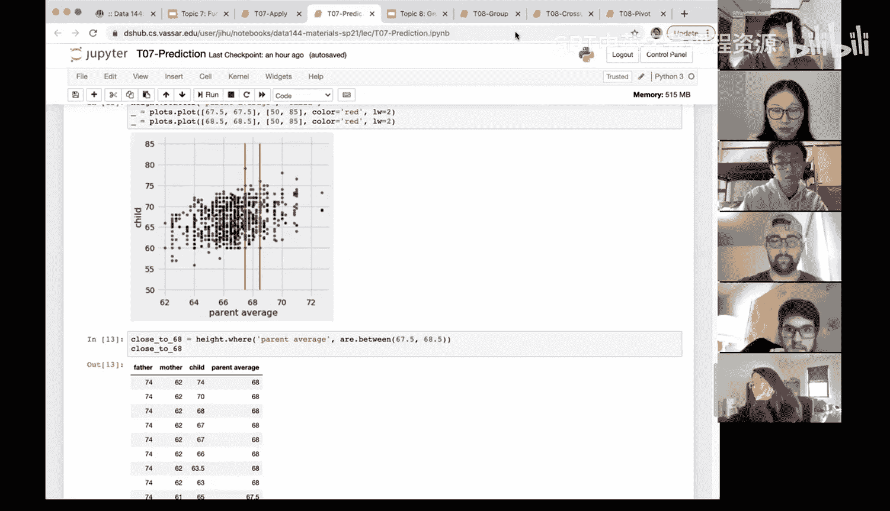

# 27：预测 📊


在本节课中，我们将要学习数据科学中的一个重要目标：预测。我们将通过一个具体的例子——利用父母身高预测子女身高——来理解预测的基本概念，并学习如何使用Python函数来实现这一过程。

## 概述

在学期初，我们讨论了数据科学的目标。我们首先学习了如何通过散点图、折线图、条形图、直方图等多种方法来可视化数据。选择哪种方法取决于我们正在处理的变量类型。可视化通常是数据分析的第一步。

之后，我们想要进行推断，即从数据中得出有用、可靠且有效的结论。我们将在后续课程中更多地探讨推断。

数据科学中通常非常重要的下一步是进行预测。本节课我们将对预测进行概述，特别是展示如何通过函数来完成预测。这也是为什么我们将预测这个主题放在“函数”这个章节中首次介绍。未来，你还会看到更多进行预测的方法。

预测本身并不神秘，存在许多不同的方法。当然，有些方法可能比其他方法更好。当我们说“更好”时，你可以想象我们希望有更高的预测准确率。因此，自然会有一些方法来比较不同的预测方法。今天，我们主要想展示一种预测是如何实现的，以及如何通过函数来完成它。我们的目标是让你能够运用目前所学的知识，去做一些你可能还没想过的新事情。

## 数据介绍：高尔顿身高数据

我们将从一个例子开始，这个例子来自弗朗西斯·高尔顿爵士。他是一位预测领域的先驱，尽管存在一些争议，但他在那个年代（他出生于1822年，逝世于1911年）无疑是数据收集和分析方面的重要人物。

高尔顿收集了关于父亲身高、母亲身高和子女（成年）身高的信息。他好奇的是，如何根据父母的身高信息来预测子女的身高。这是我们本节课要关注的核心问题。

首先，让我们看看数据。这是一个非常丰富的数据集。我们可以创建一个**叠加直方图**来同时可视化父亲、母亲和子女的身高分布。

```python
# 假设数据表名为 `height`，包含 `father`, `mother`, `child` 三列
height.hist(bins=...)
```

如果我们不指定具体的列，`hist` 方法会自动为数据表中所有数值型列（本例中是父亲、母亲和子女身高）创建直方图，并将它们叠加在一起，同时自动进行颜色编码。

从叠加直方图中，我们可以观察到一些有趣的现象：父亲的身高总体上高于母亲的身高，而子女的身高似乎介于两者之间，像是某种平均值。当然，这也取决于子女的性别，但当前数据集中我们没有这个信息。

## 构建一个简单的预测模型

现在，让我们开始思考预测。假设一对夫妇想知道他们未来孩子的可能身高，一个非常粗略的预测方法是：取父母身高的平均值作为孩子身高的预测值。

我们可以通过为数据表添加新列来实现这个想法：

```python
# 计算父母平均身高，并添加到数据表中
height = height.with_column('parent average', (height.column('mother') + height.column('father')) / 2)
```

这段代码使用了 `.with_column` 方法。第一个参数是新列的名称 `'parent average'`。第二个参数是一个数组，它是通过分别获取 `'mother'` 和 `'father'` 列的数据（两个长度相同的数组），将它们相加再除以2得到的。这就是我们定义的“父母平均身高”。

现在，数据表中多了一列 `parent average`。我们可以检查前几行数据，确保计算正确：对于父母身高相同的记录，其父母平均值也相同。

这虽然是一个简单的预测，但更重要的是，我们学会了如何在Python数据表上进行操作：使用 `.with_column` 添加新列，使用 `.column` 获取数组，并对数组进行算术运算。

## 评估预测效果

为了评估使用“父母平均身高”进行预测的效果，我们可以绘制一个散点图，将 `parent average` 放在x轴，将实际的 `child` 身高放在y轴。

```python
# 绘制父母平均身高与子女实际身高的散点图
height.scatter('parent average', 'child')
```

观察这个散点图，我们会思考两者之间的相关性。如果父母平均身高与子女身高的相关性不强，那么它可能不是一个好的预测指标。从图中我们可以看到，有些数据点预测得很准（例如父母平均身高66英寸，孩子身高也是66英寸），但也有很多点偏离较远。

这告诉我们，直接使用父母平均身高可能不是最佳预测方法，但它是一个起点。

## 改进预测：使用局部平均值

我们可以进一步改进预测。与其对每个数据点直接使用其父母平均值，不如考虑一个更小的窗口。例如，我们只关注父母平均身高在68英寸附近（比如67.5到68.5英寸之间）的所有记录，然后计算这些记录中子女身高的平均值，并将这个平均值作为该窗口内所有记录的预测值。

这样做的好处是，通过对一个小范围内的多个数据点取平均，可以消除一些随机噪声。

首先，我们手动实现这个步骤：

```python
# 1. 筛选出父母平均身高在指定范围内的记录
close_to_68 = height.where('parent average', are.between(67.5, 68.5))

# 2. 计算这些记录中子女身高的平均值
prediction_68 = close_to_68.column('child').mean()
```

我们筛选出了 `parent average` 在67.5到68.5之间的所有记录，存储在 `close_to_68` 这个新数据表中。然后，我们取出这些记录的 `child` 列数据，计算其平均值，作为预测值。

## 将预测过程函数化

显然，如果我们想为每一个可能的父母平均身高值都进行这样的预测，手动操作非常繁琐。这时，函数就派上用场了。我们可以将上述步骤封装成一个函数。

以下是预测子女身高的函数定义：

```python
def predict_child(pa):
    """
    根据给定的父母平均身高 `pa`，预测子女身高。
    预测方法：取父母平均身高在 `pa ± 0.5` 范围内的所有记录，计算其子女身高的平均值。
    """
    # 筛选出在指定范围内的记录
    close_points = height.where('parent average', are.between(pa - 0.5, pa + 0.5))
    # 返回这些记录中子女身高的平均值
    return close_points.column('child').mean()
```

这个函数 `predict_child` 接受一个参数 `pa`（父母平均身高）。它首先使用 `.where` 方法和 `are.between` 条件筛选出 `parent average` 在 `pa - 0.5` 到 `pa + 0.5` 之间的所有记录。然后，它返回这些记录中 `child` 身高的平均值。

我们可以测试这个函数：
```python
print(predict_child(68))  # 应接近我们之前手动计算的值
print(predict_child(62))
```

现在，我们可以将这个函数应用到整个数据集的 `parent average` 列上，为每个值生成一个预测值，并将这些预测值添加到数据表中进行可视化。

```python
# 应用函数，为每一行生成预测值（这里演示为几个特定值生成预测，实际可应用映射）
predictions = height.apply(predict_child, 'parent average')
height = height.with_column('prediction', predictions)

# 绘制散点图，比较实际值与预测值
height.scatter('parent average', 'child') # 实际值
# 可以再叠加预测值的连线（具体绘图代码略）
```

改进后的预测图会显示，预测值（可能用黄色点或线表示）比直接使用父母平均值更平滑，更贴近数据的中心趋势，因为它消除了每个小窗口内的噪声。

## 总结

本节课中，我们一起学习了数据科学中的预测概念。我们以高尔顿身高数据为例，探索了如何根据父母身高预测子女身高。

我们首先构建了一个简单的基线模型——直接使用父母身高的平均值。然后，我们通过可视化评估了它的效果，并发现可以进一步改进。



接着，我们引入了一个更精细的方法：对于给定的父母平均身高，取其附近一个小范围内所有记录的子代身高平均值作为预测。这种方法通过局部平均来减少噪声。

最后，也是最重要的，我们将整个预测流程封装成了一个可重用的函数 `predict_child`。这体现了函数在数据科学中的强大作用：它将复杂的多步操作抽象化、自动化，使我们能够轻松地将预测逻辑应用到大量数据点上。


你可以尝试进一步改进这个预测函数，例如调整窗口大小（将 ±0.5 改为 ±0.25），或者尝试完全不同的预测逻辑。关键在于：先构思你的预测方法，然后将其分解为清晰的步骤，最后用Python代码（尤其是函数）来实现它。这就是用计算思维解决预测问题的过程。