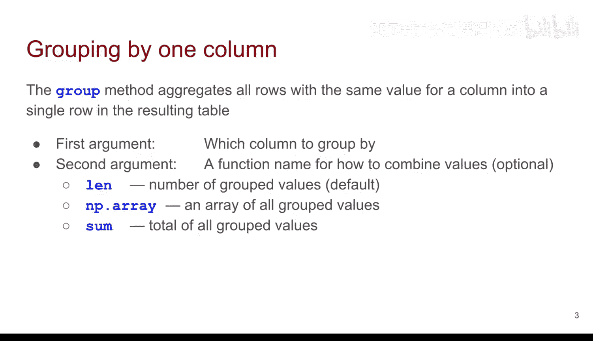
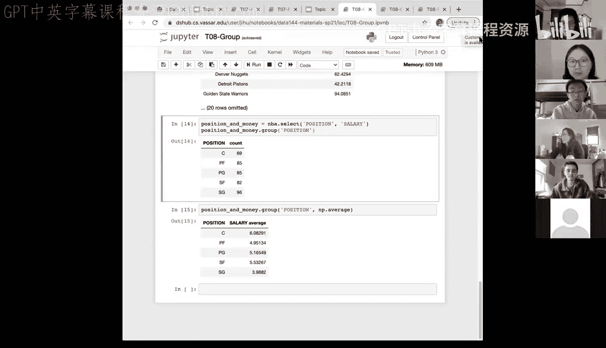

# 28：分组与透视 🧩


在本节课中，我们将学习一个非常有趣的新主题：**分组与透视**。我们将继续处理不同类型的数据，并探索如何为不同变量进行各种汇总。本节课的核心是学习如何使用 `group` 方法，根据一个属性对数据进行分类和汇总。

---


## 按一个属性分类 📊

上一节我们介绍了数据汇总的基本概念，本节中我们来看看如何使用 `group` 方法按一个属性对数据进行分类。

`group` 方法将所有在指定列上具有相同值的行聚合为结果表中的单一行。例如，我们之前分析过2017年票房前200的电影，并按制作公司（`studio`）进行分组，统计了每家公司的电影数量。这就是聚合的过程。

`group` 方法的第一个参数是用于分组的列名。我们之前只使用了一个参数，它默认返回每个组的计数。然而，`group` 方法的功能远不止于此。

我们可以提供可选的第二个参数，它是一个**函数**，用于指定如何组合组内的值。默认函数是 `len`，即计算每组中的行数。但我们也可以使用其他函数，例如：
*   `np.array`：列出组内所有的值。
*   `sum`：计算组内值的总和。

接下来，让我们通过演示来更好地理解这些功能。

---

## 演示：冰淇淋数据 🍦



我们将使用一个简单的数据集进行演示，它包含冰淇淋的 `flavor`（口味）和 `price`（价格）两列。`flavor` 是一个分类变量。

首先，我们仅使用一个参数进行分组，这将返回每种口味的计数。

```python
# 默认分组，返回计数
cones.group('flavor')
```

结果会显示 `chocolate` 出现了3次，`strawberry` 出现了2次。

现在，我们尝试使用第二个参数。如果我们想查看每种口味对应的所有价格，可以使用 `np.array` 函数。

```python
# 分组并列出每种口味的所有价格
cones.group('flavor', np.array)
```

输出将显示 `chocolate` 组的所有价格数组和 `strawberry` 组的所有价格数组。

如果我们想找出每种口味的最低价格，可以使用 `min` 函数。

```python
# 分组并找出每种口味的最低价格
cones.group('flavor', min)
```

这将返回 `chocolate` 口味的最低价格和 `strawberry` 口味的最低价格。

同样地，我们可以计算每种口味的平均价格。

```python
# 分组并计算每种口味的平均价格
cones.group('flavor', np.average)
```

我们甚至可以自定义函数。例如，定义一个计算价格范围（最大值减最小值）的函数。

```python
# 定义计算范围的函数
def price_range(arr):
    return max(arr) - min(arr)

# 应用自定义函数进行分组
cones.group('flavor', price_range)
```

结果显示，`chocolate` 口味的价差是50美分，而 `strawberry` 口味的价差是它的三倍。

这个简单的例子展示了 `group` 方法的灵活性。接下来，让我们在一个更大的数据集上应用这些概念。

---

## 演示：NBA球员薪资数据 🏀

我们将使用NBA球员数据集，其中包含 `player`（球员）、`position`（位置）、`team`（球队）和 `salary`（薪资，单位：百万美元）等列。

以下是我们可以用 `group` 方法回答的一些问题。

**问题一：计算每支球队的总薪资。**

首先，我们只选择 `team` 和 `salary` 这两列，然后按 `team` 分组，并对 `salary` 应用 `sum` 函数。

```python
# 选择相关列
teams_and_money = nba.select('team', 'salary')
# 分组并计算总薪资，然后按降序排列
teams_and_money.group('team', sum).sort('salary sum', descending=True)
```

结果将显示总薪资最高的球队是克利夫兰骑士队，依此类推。

**问题二：计算每个位置的平均薪资。**

首先，我们查看每个位置的球员数量。

```python
# 按位置分组，查看计数
nba.select('position', 'salary').group('position')
```

我们发现 `SG`（得分后卫）人数最多，`C`（中锋）人数最少。因此，比较总薪资意义不大，比较平均薪资更为合理。

接下来，我们计算每个位置的平均薪资。

```python
# 选择相关列
position_and_money = nba.select('position', 'salary')
# 分组并计算平均薪资，然后按降序排列
position_and_money.group('position', np.average).sort('salary average', descending=True)
```

现在，我们可以清楚地看到不同位置的平均薪资对比。

---

## 总结 📝

本节课中，我们一起深入学习了 `group` 方法在数据分类和汇总中的应用。

我们了解到：
1.  `group` 方法的核心是按指定列（通常是分类变量）的值对行进行分组。
2.  其第一个参数是**分组依据的列名**。
3.  第二个参数是一个**聚合函数**，用于对组内的其他列（通常是数值变量）进行计算，例如 `count`、`sum`、`min`、`max`、`np.average`，甚至可以是自定义函数。
4.  有效使用 `group` 方法的关键在于：明确要对哪个分类变量进行分组，以及要对哪个数值变量进行何种汇总。




通过冰淇淋和NBA数据的演示，我们看到了 `group` 方法如何高效地替代繁琐的手动筛选和计算，使我们能够快速从数据中提取有意义的洞察。多加练习，你就能熟练掌握这个强大的工具。