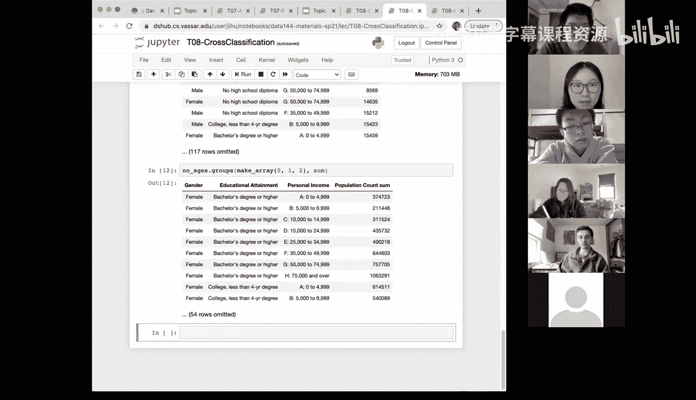

# 29：交叉分类与分组 🧩


在本节课中，我们将学习如何使用`group`和`groups`方法对数据进行分类和汇总。我们将从单一属性的分类开始，逐步深入到如何同时基于多个分类变量进行交叉分类和汇总分析。

## 概述

之前我们已经学习了如何基于单个分类变量对数据进行分组和汇总。然而，在实际分析中，我们常常需要同时考虑多个分类变量。本节将介绍如何使用`groups`方法进行交叉分类，从而对多个分类变量组合下的数值变量进行汇总分析。

## 单一属性分类回顾


上一节我们介绍了如何使用`group`方法基于单个分类变量进行分组。例如，对于一个包含`flavor`（口味）和`price`（价格）的数据集，我们可以按`flavor`分组并计算价格的最小值：

```python
data.group('flavor', min)
```

此操作会返回每个不同口味对应的最低价格。

## 引入交叉分类

然而，如果我们的数据集中包含多个分类变量，例如`flavor`（口味）和`color`（颜色），我们可能希望同时基于这两个变量进行汇总。这时，就需要使用`groups`方法。

`groups`方法的功能非常强大，它允许我们根据多个列的组合值来聚合行。其基本语法如下：

```python
data.groups([column1, column2, ...], function_name)
```

第一个参数是一个数组，包含所有需要用于分组的列名。第二个参数是应用于数值列的汇总函数名（如`min`、`max`、`average`等）。如果不指定函数，默认会返回每个组合的计数。

以下是使用`groups`方法进行计数的示例：

```python
data.groups(make_array('flavor', 'color'))
```

此代码会统计每种`flavor`和`color`组合出现的次数。

## 在交叉分类中应用汇总函数

与`group`方法类似，`groups`方法也可以应用各种汇总函数，但该函数是作用于与分组组合相关联的数值列上。

例如，如果我们想找出每种`flavor`和`color`组合下的最高价格，可以这样做：

```python
data.groups(make_array('flavor', 'color'), max)
```

这段代码会为每个唯一的`flavor`和`color`组合计算`price`列的最大值，并输出一个包含`price max`列的新表格。

## 实战应用：NBA球员数据分析

让我们回到更实际的例子。假设我们有一个NBA球员数据集，包含`player`（球员）、`position`（位置）、`team`（球队）和`salary`（薪水）等列。

如果我们不关心具体球员姓名，而希望分析不同球队和位置组合下的平均薪水，可以按以下步骤操作：

1.  首先，删除不需要的`player`列。
2.  然后，使用`groups`方法按`team`和`position`分组，并计算`salary`的平均值。

```python
# 假设`nba_data`是原始数据表
data_to_analyze = nba_data.drop('player')
result = data_to_analyze.groups(make_array('team', 'position'), np.average)
```

执行后，我们将得到一个表格，其中每一行代表一个唯一的`team`和`position`组合，并显示该组合下球员的平均薪水。

如果只想按`position`计算平均薪水，则使用`group`方法更为合适：

```python
nba_data.group('position', np.average)
```

## 处理更多分类变量

`groups`方法的能力不仅限于两个变量。我们可以对任意数量的分类变量进行交叉分类。

例如，考虑一个包含`age_group`（年龄组）、`gender`（性别）、`education`（教育程度）、`income`（收入）和`population_count`（人口数）的大型数据集。如果我们想了解按`gender`、`education`和`income`分组后的总人口数，可以这样做：

```python
# 假设`census_data`是原始数据表，并已删除无关列
summary_table = census_data.groups(make_array('gender', 'education', 'income'), sum)
```

这段代码将生成一个汇总表，显示每个性别、教育程度和收入水平组合对应的总人口数。

## 总结

本节课我们一起学习了数据交叉分类的核心方法。我们回顾了基于单一变量的`group`方法，并重点掌握了基于多个变量的`groups`方法。关键点在于：
*   **`group`** 用于基于**单个**分类变量进行分组汇总。
*   **`groups`** 用于基于**多个**分类变量（两个或更多）的组合进行交叉分类汇总。
*   使用`groups`时，必须将分组列名放入一个数组（如`make_array('col1', 'col2')`）中作为第一个参数传递。
*   两种方法都通过第二个参数指定应用于数值列的汇总函数（如`min`、`max`、`average`、`sum`）。




掌握`group`和`groups`方法，能够帮助我们从不同维度对数据进行深入的分析和洞察。