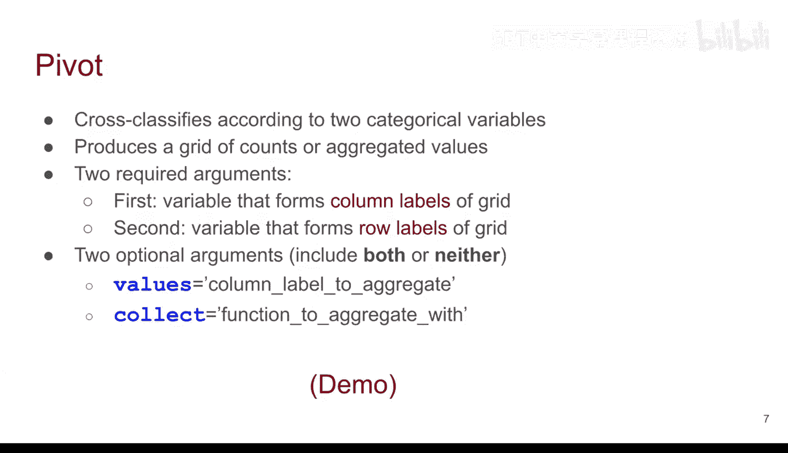
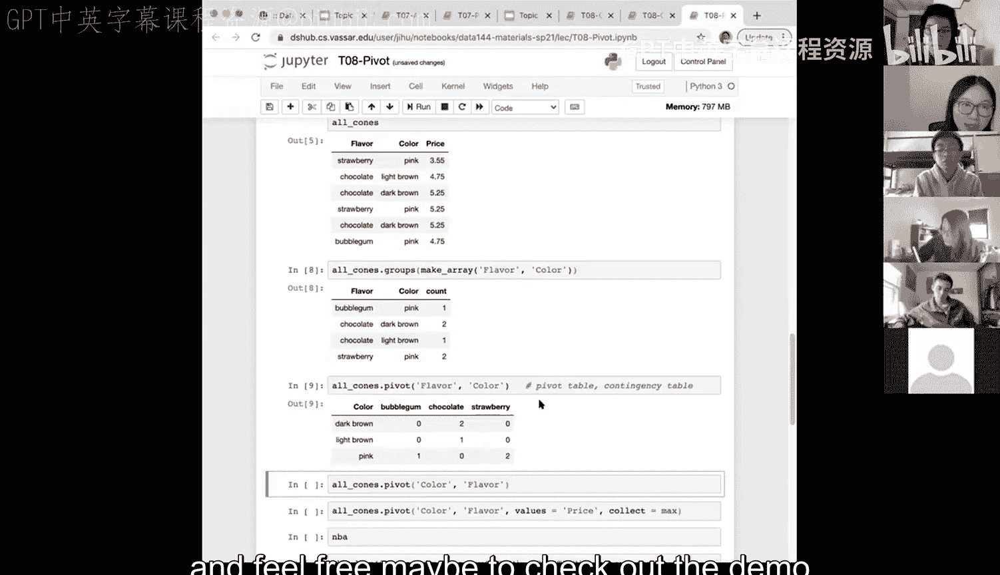

# 30：透视表（第一部分）📊


在本节课中，我们将要学习数据透视表（Pivot Tables）的基本概念和应用。透视表是一种强大的数据汇总工具，能够根据分类变量对数据进行交叉分类和聚合计算。我们将通过对比之前学过的分组方法，来理解透视表的独特优势。


## 分组方法回顾

上一节我们介绍了分组方法，本节中我们来看看分组方法在处理多分类变量时的表现。分组方法能够根据多个分类变量对数据进行聚合。

以下是使用分组方法的一个示例：

```python
# 假设我们有一个名为df的DataFrame，包含'flavor'和'color'两列
grouped_data = df.groupby(['flavor', 'color']).size()
```

这段代码会根据‘flavor’和‘color’的组合进行分组，并计算每个组合的数量。然而，分组方法只会返回数据集中实际存在的组合，对于数量为零的组合则不会显示。

## 透视表介绍

现在，让我们进入本节课的核心内容——透视表。透视表旨在根据两个分类变量进行交叉分类。



**公式**：`pivot_table(data, values=None, index=None, columns=None, aggfunc='mean', ...)`

与分组方法不同，透视表会生成一个完整的网格（也称为列联表），即使某些组合的计数为零，也会在表中显示出来。这使得数据汇总更加全面和直观。

## 透视表参数详解

透视表函数需要一些关键参数来定义其结构。

以下是透视表的主要参数：
*   **`columns`**：第一个参数，用于定义网格的列标签。
*   **`index`**：第二个参数，用于定义网格的行标签。
*   **`values`**（可选）：指定需要对哪一列数值进行聚合计算。
*   **`aggfunc`**（可选）：指定聚合函数，如`‘count’`、`‘sum’`、`‘mean’`等，默认为`‘mean’`。

## 实战演示：透视表 vs. 分组

为了更清晰地理解，让我们通过一个冰淇淋数据集的演示来对比两种方法。我们将使用包含‘flavor’（口味）和‘color’（颜色）列的数据。

以下是使用透视表生成列联表的代码：

```python
# 创建透视表，以‘flavor’为列，‘color’为行，计算数量
pivot_result = df.pivot_table(index='color', columns='flavor', aggfunc='size', fill_value=0)
```

执行上述代码后，我们将得到一个网格。行代表不同的颜色（如深棕色、浅棕色、粉色），列代表不同的口味（如泡泡糖味、巧克力味、草莓味）。网格中的每个单元格显示了对应组合的数量。

关键区别在于，即使某些组合（如“深棕色-泡泡糖味”或“粉色-巧克力味”）在数据集中不存在，透视表也会在相应位置显示0。而之前的分组方法则会完全省略这些零计数组合。

## 总结与展望

本节课中我们一起学习了数据透视表的基础知识。我们了解到透视表能够生成完整的列联表，清晰地展示所有分类变量组合的计数，包括零值组合。这与分组方法形成了对比。

透视表还提供了额外的参数（如`values`和`aggfunc`），允许我们对其他数值型变量进行进一步的汇总分析，这为数据探索提供了更大的灵活性。




这些工具（分组和透视）对于数据操作和摘要至关重要。虽然它们在开始时可能有些容易混淆，但通过持续的练习和应用，特别是在作业和实验中使用，你会逐渐熟悉它们各自的用途和优势。请继续保持练习，并在遇到问题时随时提问。