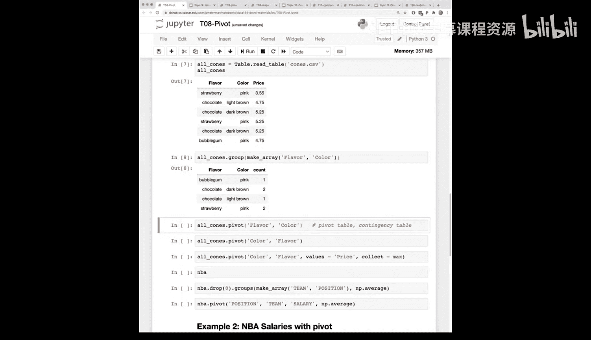
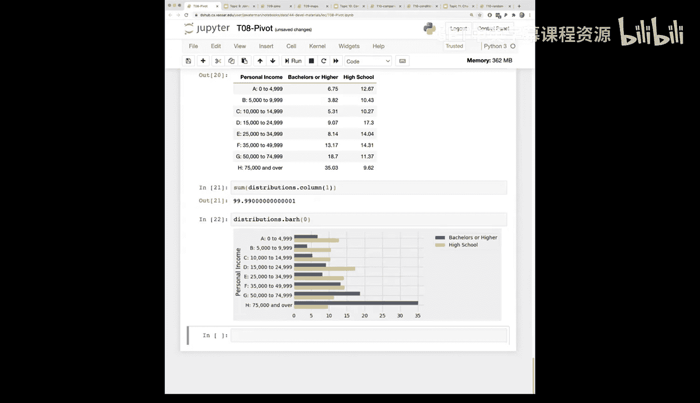

# 31：分组与透视表（第二部分）


在本节课中，我们将继续深入学习数据分析的核心工具，重点是透视表。我们将通过具体示例，理解透视表的工作原理、它与分组操作的区别，以及如何利用它来组织和可视化数据，从而进行更深入的分析。

---

## 回顾：分组操作

上一节我们介绍了分组操作，本节中我们来看看透视表。首先，让我们快速回顾一下分组。

分组操作 `group` 用于收集指定列中具有相同类别的所有行。然后，我们可以对聚合后的数据应用函数。

以下是分组操作的核心概念：
```python
# 按‘team’列分组，并计算‘salary’列的总和
grouped_table = table.drop('player').group('team', sum)
```

分组操作的关键点：
*   `group` 函数收集所有匹配指定列类别的行。
*   随后应用的函数（如 `sum`、`max`）作用于聚合后的数据数组。
*   这与 `apply` 函数不同，`apply` 是将函数独立应用于每一行的单个值。

---

## 引入透视表

现在，让我们转向透视表。透视表是一种强大的工具，它能以交叉表的形式展示数据，便于我们观察不同类别之间的关系。

透视表的核心思想是“旋转”数据。它将一个分类列中的各个类别“旋转”为新的列标题。

以下是透视表的基本语法：
```python
# 创建透视表：以‘flavor’为列，以‘color’为行，默认计算数量
pivoted_table = table.pivot('flavor', 'color')
```



在这个例子中：
*   第一个参数 `'flavor'` 指定了哪些类别将成为新表的列。
*   第二个参数 `'color'` 指定了哪些类别将成为新表的行。
*   默认情况下，表格单元格中填充的是每个行列组合在原始数据中出现的次数。


透视表得名于其操作：它将一个垂直的类别列“旋转”为水平的列标题。

---

## 透视表的进阶应用

与分组操作类似，透视表不仅可以计数，还可以对聚合数据应用其他函数。

以下是应用自定义聚合函数的透视表示例：
```python
# 创建透视表：计算每个组合的‘price’最大值
pivoted_table = table.pivot('flavor', 'color', values='price', collect=max)
# 简写形式
pivoted_table = table.pivot('flavor', 'color', 'price', max)
```

在这个例子中：
*   `values='price'` 指定了要收集和计算的数据列。
*   `collect=max` 指定了应用于每个单元格数据集合的函数（这里是求最大值）。

---

## 实战分析：篮球薪资数据

让我们在一个更大的数据集上应用透视表。假设我们有一个NBA球员薪资表，包含球队、位置和薪资信息。

我们可以使用一行命令，快速得到每个球队、每个位置的平均薪资概况：
```python
# 生成以‘position’为列、‘team’为行的平均薪资透视表
salary_pivot = nba_table.pivot('position', 'team', 'salary', np.average)
```

这行代码生成了一个表格，行是各球队，列是不同位置（如中锋、前锋、后卫），单元格内的值是该球队该位置球员的平均薪资。这极大地简化了跨多个维度的数据汇总和比较。

---

## 实战分析：教育与收入数据

透视表在比较不同分布时尤其有用。考虑一个关于教育程度和收入的研究数据表。

我们可以创建一个透视表，忽略年龄和性别，专注于教育程度和个人收入的关系：
```python
# 生成以‘education’为列、‘income’为行的总人口数透视表
income_edu_pivot = census_table.pivot('education', 'income', values='population', collect=sum)
```

生成的表格让我们能够一目了然地看到不同教育背景的人群在不同收入区间的分布情况。例如，我们可以轻松提取拥有学士学位及以上学历的人群在各个收入区间的百分比，并与仅拥有高中学历的人群进行对比，从而直观地展示教育对收入的影响。

为了验证计算结果的合理性，我们可以对百分比列进行求和，理论上总和应接近100%。这是一种有效的数据交叉检查方法。

最后，我们可以将透视表的结果进行可视化，例如绘制条形图，让数据趋势更加清晰直观。

---

## 总结




本节课中我们一起学习了透视表这一强大的数据分析工具。我们了解了透视表如何通过“旋转”分类列来重新组织数据，生成易于阅读和比较的交叉表格。我们探讨了透视表与分组操作的联系与区别，并通过篮球薪资和教育收入的实际案例，掌握了如何使用透视表进行多维度数据汇总、分布比较和初步的可视化洞察。透视表是数据探索阶段不可或缺的工具，它能帮助我们快速把握数据中不同类别变量之间的关系。