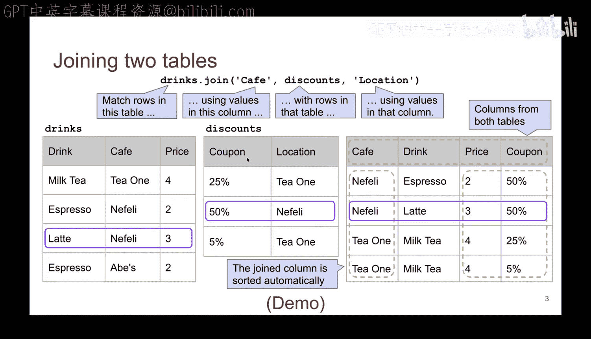
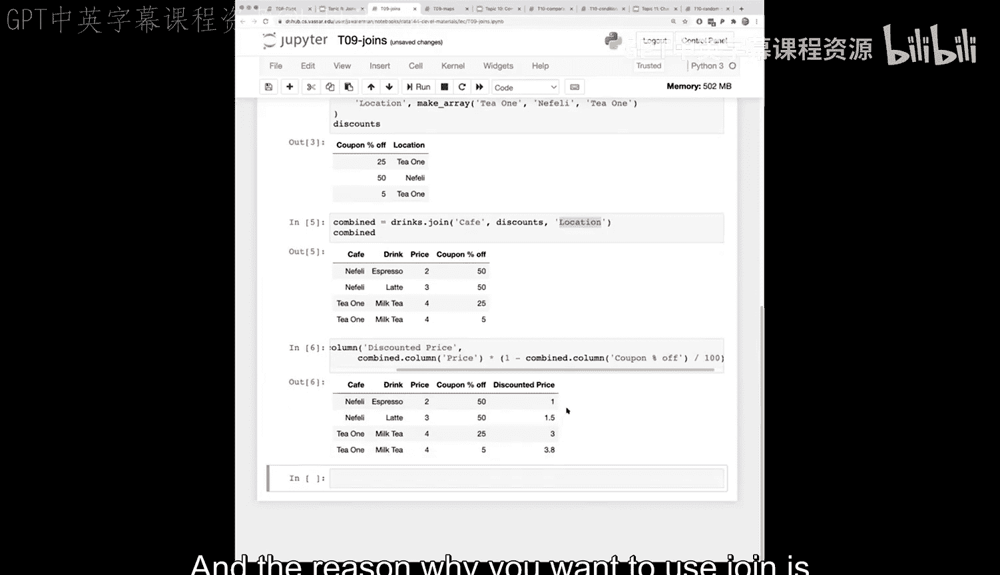

# 32：连接与映射


在本节课中，我们将要学习数据操作中的两个核心工具：**连接** 和 **映射**。连接操作允许我们将分散在多个表中的数据组合在一起，而映射则是一种强大的数据转换方法。我们将通过具体的例子来理解它们的工作原理和应用场景。


---

## 连接操作

上一节我们介绍了分组和透视表。本节中我们来看看**连接**。连接操作要解决的问题是：我们所需的数据常常并不方便地存放在单个表格中，而是分散在一个或多个表格里。连接操作允许我们将来自两个不同表格的数据，基于一个共同的列，合并到一个单一的表格中。

### 连接示例

为了更好地理解，让我们看一个简单的例子。假设我们有两个表格：

1.  **饮品表**：包含饮品名称、提供该饮品的咖啡馆以及价格。
2.  **折扣表**：包含不同咖啡馆提供的优惠券及其折扣力度。

这两个表格通过“咖啡馆”这个共同的分类列相关联。连接操作将根据匹配的咖啡馆名称，把折扣信息“附加”到饮品信息上。

以下是连接操作的基本语法结构：
```python
combined_table = first_table.join(common_column_label, second_table, other_common_column_label)
```
*   `first_table`：我们调用`.join`方法的表格。
*   `common_column_label`：第一个表格中用于匹配的列标签。
*   `second_table`：要与之连接的第二个表格对象。
*   `other_common_column_label`：第二个表格中用于匹配的列标签。

连接的结果是一个新表格，它包含两个原始表格的所有列（用于匹配的列在结果中只出现一次）。对于第一个表格中的每一行，系统会在第二个表格中寻找所有匹配的行，并为每个匹配项生成结果表中的一行。

### 连接结果的应用

连接完成后，我们就可以在新的组合表格上进行计算。例如，我们可以计算每款饮品在使用优惠券后的折后价格。

计算公式如下：
**折后价格 = 原价 × (1 - 折扣百分比/100)**

通过连接，我们能够将存储在不同表格中的相关信息（如基础价格和动态折扣）高效地整合起来，从而进行更深入的分析。

---

## 映射操作

在理解了如何合并数据之后，我们来看看如何高效地转换数据。**映射** 是一种对表格中的每个元素应用指定函数的方法，它可以极大地简化复杂的数据转换过程。

### 映射的基本概念



映射操作的核心是 `table.apply(func)` 方法。它会将函数 `func` 应用到表格的每一个元素上，并返回一个包含所有结果的新表格。这比使用循环逐行逐列处理数据要简洁和高效得多。

### 映射示例

假设我们有一个包含各种数值的表格，我们希望将每个数字转换为其平方根。

我们可以这样使用映射：
```python
import numpy as np
new_table = original_table.apply(np.sqrt)
```
这行代码会将 `np.sqrt` 函数应用到 `original_table` 的每个单元格，生成 `new_table`。

映射不仅限于数学运算，它可以应用于任何自定义函数，例如字符串处理、条件判断等，是数据清洗和特征工程中非常强大的工具。



---

## 总结

本节课中我们一起学习了数据操作中的两个关键工具：
1.  **连接**：用于基于共同列合并多个表格中的数据，解决了数据分散存储的问题。其核心是匹配两个表格中共有的分类列。
2.  **映射**：用于对表格中的每个元素应用一个函数，从而高效地完成数据转换任务。


掌握连接和映射，能够帮助我们将分散的数据源整合起来，并灵活地进行数据转换，为后续更复杂的数据分析和挖掘任务打下坚实的基础。在实际工作中，尤其是在处理真实世界的不规整数据时，这两个工具的使用频率会非常高。