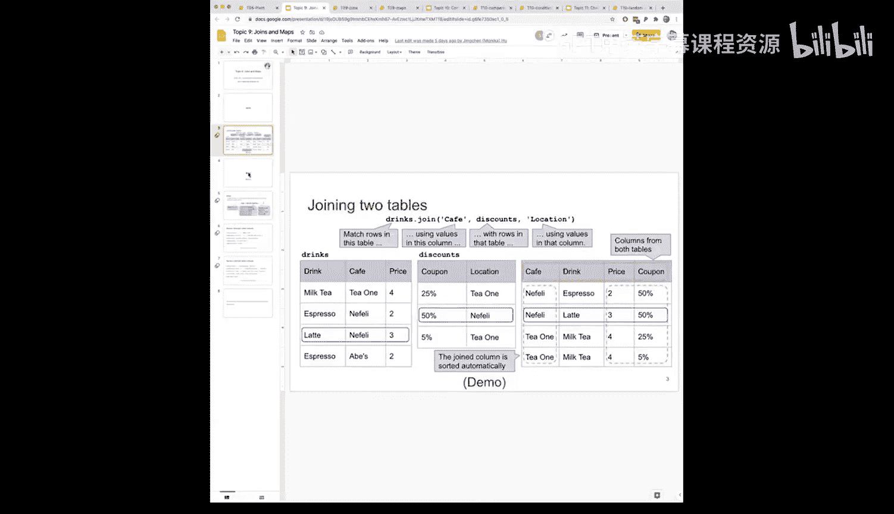
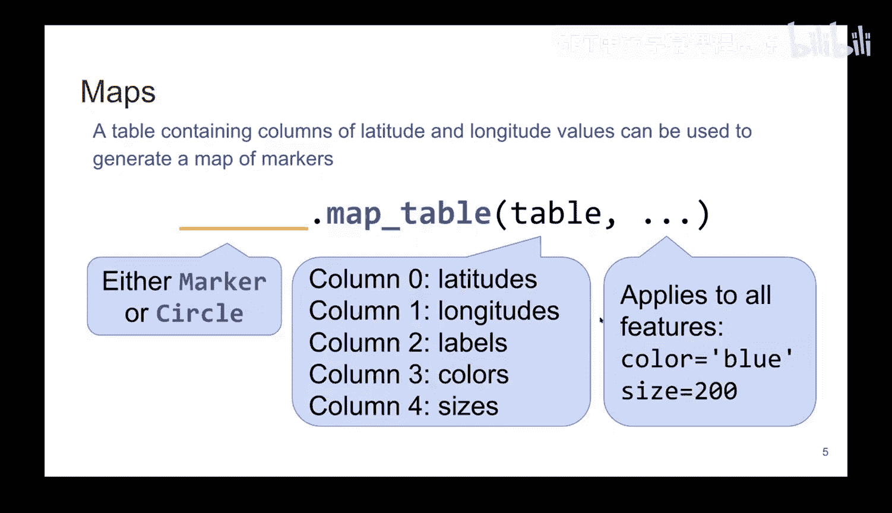
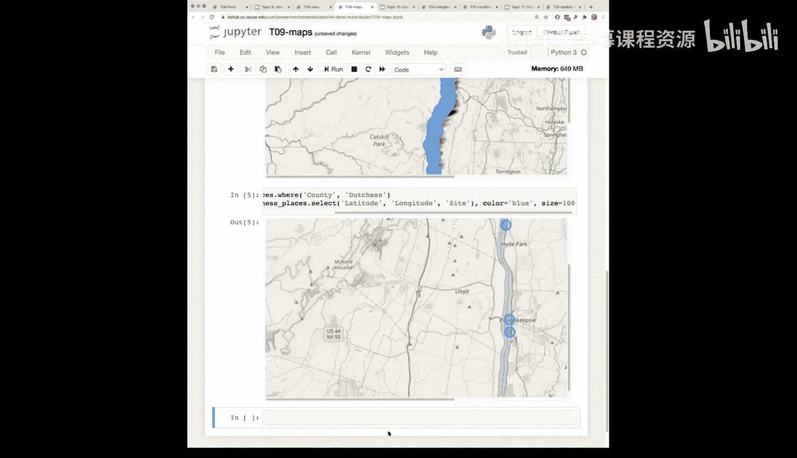

# 33：地图绘制 📍




在本节课中，我们将学习如何使用数据科学包中的地图绘制功能。这个功能非常强大，只需一行代码，就能将包含经纬度数据的表格转换为交互式地图。这对于最终项目中的地理数据可视化尤其有用。

上一节我们讨论了数据连接与映射，本节中我们来看看如何将地理坐标数据直观地展示在地图上。

## 地图绘制基础

地图绘制功能封装在库中，为我们完成了所有繁重的工作。要使用此功能，我们需要一个特殊的“地图表”。本质上，它就是一个包含`latitude`（纬度）和`longitude`（经度）列的普通表格。



我们可以在这个表格上调用两种方法来生成地图：
*   **标记**：看起来像谷歌地图上的水滴状标记。
*   **圆圈**：在地图位置上显示一个圆圈。

调用方法时，需要提供包含经纬度的表格，以及可选的标签、颜色和大小等参数。这些参数将应用于地图上的所有特征点。

以下是创建地图标记的基本代码结构：
```python
Table.map_table(latitudes, longitudes, labels, color, size)
```

接下来，让我们通过一个具体例子来了解其应用。

## 实战示例：哈德逊河绿道站点

为了进行本地化演示，我们使用了一个关于“哈德逊河河谷绿道水上步道指定站点”的数据集。这个表格包含了沿哈德逊河的各种站点信息，如公园名称、所属社区、县，以及最重要的——**纬度和经度**。

首先，我们从原始表格中选取所需的列：
```python
# 假设原始表格名为 `places`
map_data = places.select('latitude', 'longitude', 'site')
```
在这段代码中，第一列将被解释为纬度，第二列为经度，第三列`site`将作为标记点的标签。

使用一行代码即可生成地图：
```python
map_data.map_table('latitude', 'longitude', labels='site')
```
执行后，我们会得到一个可交互的地图，上面布满了标记点。我们可以滚动、缩放地图，并点击标记点查看站点名称（尽管示例中可能存在标签显示的小问题）。

同样地，我们可以使用`.circle_table`方法来生成圆圈而非标记，用法完全相同。

## 数据清洗的重要性

在准备示例时，我遇到了一个数据问题。当我筛选`Duchess`县的数据时，地图上没有显示任何内容。经过排查，发现原始CSV文件中“Duchess”一词后面多了一个空格，导致字符串匹配失败。

这个经历提醒我们，现实世界中的数据往往不够“干净”。作为数据科学家，你会发现相当多的时间实际上花在了**数据清洗和验证**上。在进行任何分析或可视化之前，检查数据的完整性和一致性至关重要。

## 自定义地图样式

除了基本功能，我们还可以轻松自定义地图点的外观。例如，我们可以将所有点的颜色设置为蓝色，并调整其大小：
```python
# 使用圆圈，并设置颜色和大小
map_data.circle_table('latitude', 'longitude', color='blue', size=10)
```
通过调整`color`和`size`参数，你可以让地图更符合你的可视化需求。

## 总结

本节课中我们一起学习了如何使用数据科学包快速绘制交互式地图。核心步骤是：
1.  准备一个包含`latitude`和`longitude`列的表格。
2.  使用`.map_table`方法创建标记地图，或使用`.circle_table`方法创建圆圈地图。
3.  可以通过参数自定义标记的颜色和大小。




记住这个工具，它在处理任何地理空间数据时都非常有用。同时，也请记住在现实项目中进行数据验证和清洗的重要性。