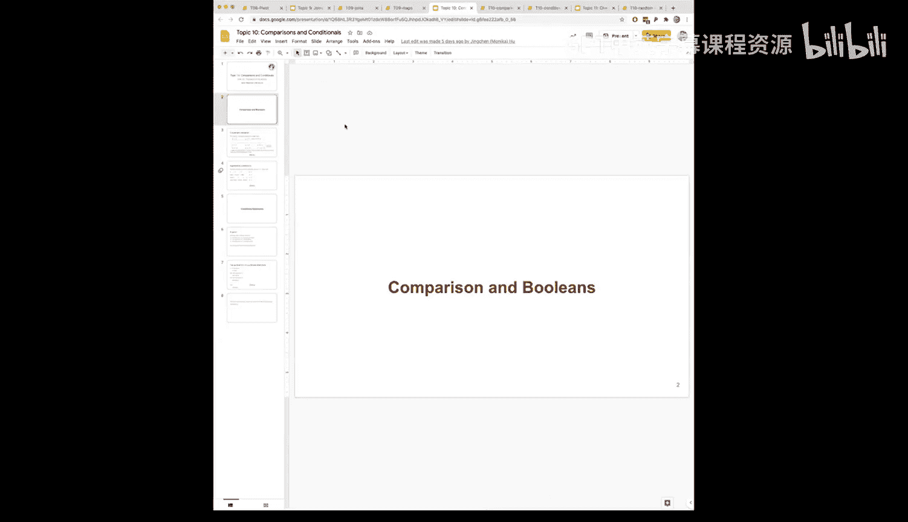
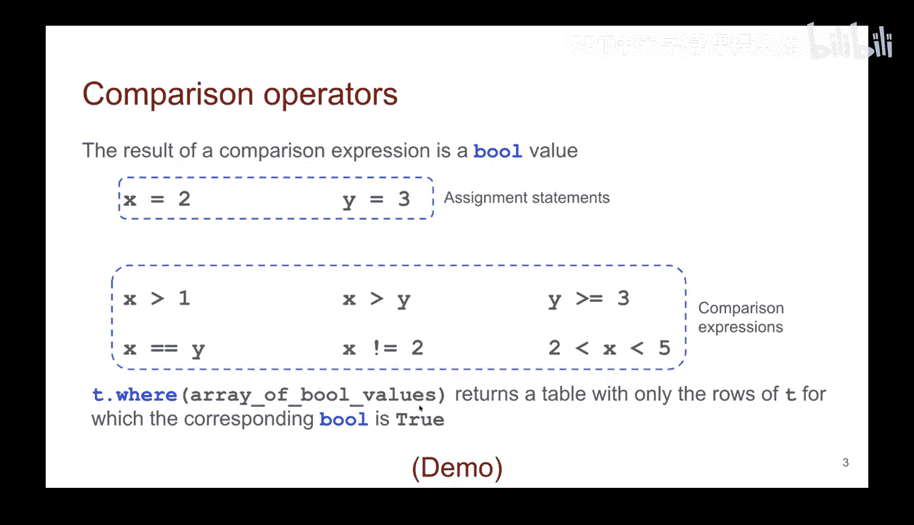
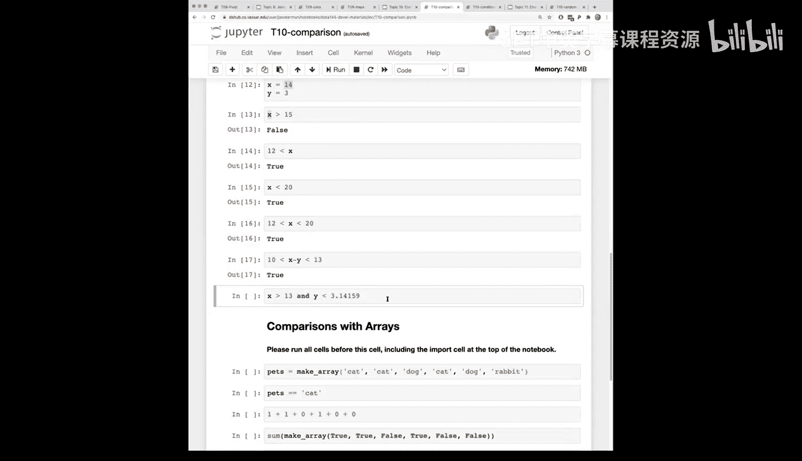

# 34：比较与条件判断




在本节课中，我们将学习计算机如何通过一种新的数据类型——布尔类型（Boolean）来进行决策。我们将探讨比较运算符、布尔表达式，并了解它们如何在数据筛选（如`where`方法）中发挥作用。

---

## 布尔类型与比较运算符

上一节我们介绍了计算机决策的基本概念。本节中，我们来看看实现这一功能的核心工具：布尔类型和比较运算符。

布尔类型是一种只有两个值的数据类型：`True`（真）和`False`（假）。在Python中，布尔值用于表示比较或逻辑测试的结果。

**公式**：`布尔值 ∈ {True, False}`

需要特别注意区分**赋值运算符**（`=`）和**比较运算符**（`==`）。赋值是将一个值（右侧表达式的结果）与一个名称（左侧）关联起来。例如：
```python
y = 3  # 将数值3赋值给变量y
```
而比较运算符则用于判断两个值之间的关系，其结果为布尔值。

以下是Python中主要的比较运算符：

*   **`>`**：大于。例如，`x > 1` 判断`x`的值是否大于1。
*   **`<`**：小于。
*   **`>=`**：大于或等于。例如，`y >= 3` 判断`y`是否大于或等于3。
*   **`<=`**：小于或等于。
*   **`==`**：等于。判断左右两边的值是否相等。
*   **`!=`**：不等于。这是逻辑“非”操作，判断左右两边的值是否不相等。

一个表达式可以包含多个比较，例如 `2 < x < 5` 表示判断`x`是否大于2且小于5。

---

## 布尔表达式在数据筛选中的应用

我们已经使用过`where`方法来筛选数据行。现在，我们来理解其背后的原理。

`where`方法接收一个布尔数组作为参数。这个数组为原始表格的每一行对应一个布尔值（`True`或`False`）。

**代码**：
```python
# 假设 T 是一个表格，condition_array 是一个布尔数组
filtered_table = T.where(condition_array)
```

`where`方法的工作机制是：检查这个布尔数组，并返回所有对应位置为`True`的行。因此，我们之前传递给`where`的筛选条件（如 `T[‘column’] > 10`），实际上就是在生成这样一个布尔数组。



---

## 实践演示与注意事项

了解了基本概念后，我们通过一些代码示例来巩固理解。

首先，比较运算符直接对值进行判断：
```python
3 > 1  # 结果为 True
type(3 > 1)  # 结果为 bool，即布尔类型
```

`True`和`False`是布尔类型的字面量，就像数字`5`是整数一样。它们**区分大小写**，必须为首字母大写。

**代码**：
```python
True   # 正确的布尔字面量
true   # 错误！Python会将其视为未定义的变量名，导致 NameError
```

赋值语句的左侧必须是变量名，不能是字面量或表达式：
```python
3 = 5  # 错误！不能给数字3赋值。
```

比较运算符`==`可以处理不同类型但值相等的比较：
```python
3 == 3.0  # 结果为 True，整数3等于浮点数3.0
```

对于浮点数的精确比较需要小心，由于精度问题，建议先进行舍入操作。

我们可以对变量进行比较：
```python
x = 14
y = 12
print(x > 15)  # False，因为14不大于15
print(y < x)   # True，因为12小于14
print(12 < x < 20)  # True，x（14）在12和20之间
```

此外，可以使用逻辑运算符`and`（与）和`or`（或）组合多个布尔表达式：
```python
import math
x = 14
y = 3
print(x > 13 and y < math.pi)  # True，两个条件都满足
# 使用 and 时，所有条件都必须为 True，整个表达式才为 True
```

---



## 总结


本节课中我们一起学习了布尔类型和比较运算符。我们明确了赋值（`=`）与比较（`==`、`>`等）的区别，了解到布尔表达式的结果是`True`或`False`。我们还揭示了`where`方法筛选数据的底层逻辑：即通过一个布尔数组来选择行。最后，我们通过代码示例练习了比较运算符和逻辑运算符的使用，为后续学习条件判断语句打下了基础。