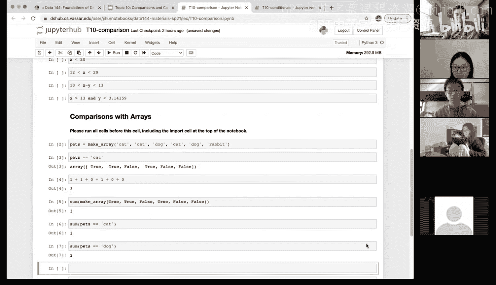
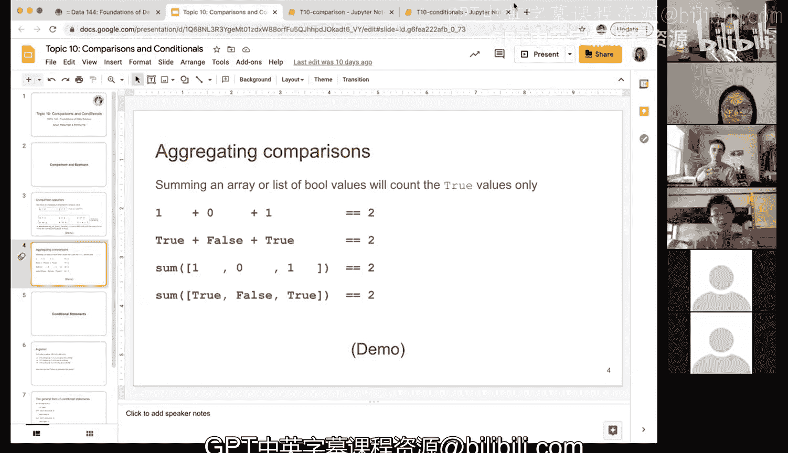

# 35：数组比较与条件判断 🧮


在本节课中，我们将学习如何在Python中对数组进行比较操作，并利用比较结果进行计数和条件判断。我们将从回顾比较运算符开始，然后深入探讨如何对数组应用这些运算符，以及如何利用布尔值（True/False）的数值特性（True为1，False为0）进行高效的数据分析。

---

## 回顾比较运算符

上一节我们介绍了Python中的基本比较运算符。本节中我们来看看如何将这些运算符应用于数组。

在Python中，比较运算符（如 `==`、`!=`、`>`、`<` 等）不仅可用于标量（单个值），也可用于数组。当对数组进行比较时，会返回一个由布尔值（True或False）组成的数组，其中每个元素表示原数组中对应位置的元素是否满足比较条件。

例如，比较标量时：
```python
1 + 0 + 1 == 2  # 返回 True
True + False + True == 2  # 返回 True，因为True被编码为1，False为0
```

对于数组，同样适用：
```python
import numpy as np
np.array([1, 0, 1]).sum() == 2  # 返回 True
np.array([True, False, True]).sum() == 2  # 返回 True
```

记住，**True在数值计算中等同于1，False等同于0**，这是后续操作的基础。

---

## 对字符串数组进行比较

现在，让我们创建一个字符串数组并进行比较操作。




首先，我们创建一个包含宠物名称的数组：
```python
import numpy as np
pets = np.array(['cat', 'cat', 'dog', 'cat', 'dog', 'rabbit'])
```

我们可以检查数组中的每个元素是否等于“cat”：
```python
pets == 'cat'
```
执行上述代码会返回一个布尔数组：`[True, True, False, True, False, False]`。这表示第一、二、四个元素是“cat”，其余不是。

---

## 利用布尔值进行计数

由于True和False具有数值特性，我们可以对布尔数组进行求和，从而快速计算满足条件的元素数量。

以下是计算数组中“cat”数量的几种方法：

1.  **直接对布尔数组求和**：因为True=1，False=0，所以求和结果就是True的数量。
    ```python
    (pets == 'cat').sum()  # 返回 3
    ```

2.  **使用`np.count_nonzero`函数**：此函数专门用于计算数组中非零（或True）元素的数量。
    ```python
    np.count_nonzero(pets == 'cat')  # 返回 3
    ```

3.  **计算非“cat”的数量（即False的数量）**：有多种方法可以实现。
    *   **方法一**：使用不等于运算符 `!=`，然后求和。
        ```python
        (pets != 'cat').sum()  # 返回 3
        ```
    *   **方法二**：用数组总长度减去“cat”的数量。
        ```python
        len(pets) - (pets == 'cat').sum()  # 返回 3
        ```

这些方法同样适用于计算其他条件的数量，例如计算“dog”的数量：
```python
(pets == 'dog').sum()  # 返回 2
```

---

## 对数值数组进行比较

比较操作同样适用于数值数组。让我们创建一个数值数组并执行比较。

创建一个从20到30（不包括31）的数组：
```python
x = np.arange(20, 31)  # 数组为 [20, 21, 22, ..., 30]
```

检查数组中的每个元素是否大于28：
```python
x > 28
```
这将返回布尔数组：`[False, False, False, False, False, False, False, False, False, True, True]`。只有最后两个元素（29和30）满足条件。

**重要提示**：这种比较操作不会改变原始数组 `x` 本身。除非你将结果赋值给一个新变量，否则原始数据保持不变。

我们可以轻松计算大于28的元素数量：
```python
(x > 28).sum()  # 返回 2
```

---

## 总结

本节课中我们一起学习了数组的比较与条件判断。核心要点包括：
1.  比较运算符可以应用于整个数组，并返回一个布尔数组。
2.  **布尔值True和False在数值计算中分别被视为1和0**，这是进行条件计数的关键。
3.  我们可以使用 `.sum()` 或 `np.count_nonzero()` 来快速计算满足特定条件的元素数量。
4.  通过使用不等于运算符 `!=` 或利用数组总长度，可以计算不满足条件的元素数量。
5.  所有的比较操作都不会修改原始数组，除非显式地将结果赋值给变量。



掌握这些技巧，能够帮助你在数据挖掘和分析中高效地进行数据筛选和统计。