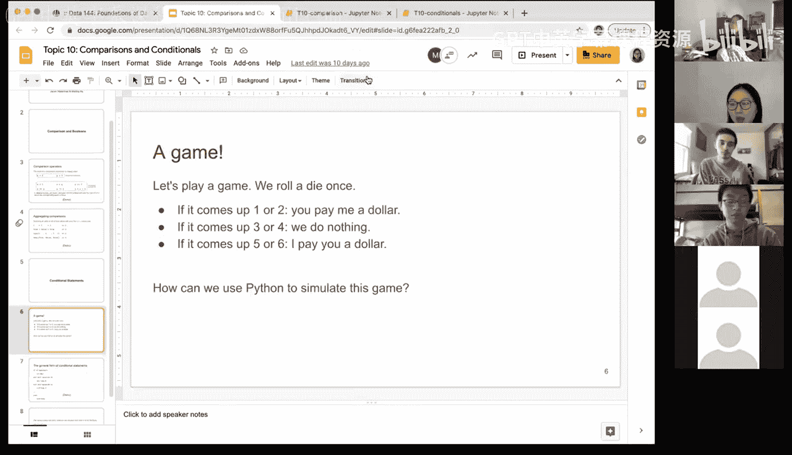
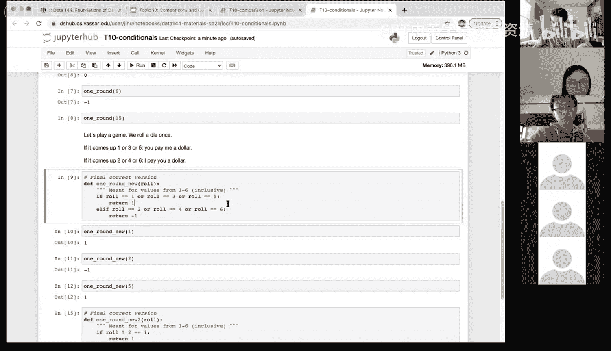

# 36：条件语句 🎲


在本节课中，我们将学习Python中的条件语句。条件语句允许程序根据不同的情况执行不同的代码块，是实现逻辑判断的核心工具。我们将通过模拟一个简单的掷骰子游戏来理解其工作原理。

## 概述

我们将创建一个函数来模拟一个掷骰子游戏。游戏规则如下：掷一次六面骰子，如果点数为1或2，你付给我1美元；如果点数为3或4，无事发生；如果点数为5或6，我付给你1美元。我们将使用 `if`、`elif` 和 `else` 语句来实现这个逻辑。




## 条件语句的基本结构

条件语句的基本形式是 `if-elif-else`。它允许我们检查多个条件，并根据第一个为真的条件执行相应的代码块。

其通用结构如下：
```python
if condition1:
    # 执行语句块1
elif condition2:
    # 执行语句块2
else:
    # 执行语句块3
```

## 实现游戏逻辑

我们将把游戏逻辑封装在一个名为 `one_round` 的函数中。函数的输入是骰子的点数 `roll`。

首先，我们实现初始版本，只处理第一个条件。

```python
def one_round(roll):
    if roll <= 2:
        return 1
```

在这个版本中，如果点数为1或2，函数返回1（表示我获得1美元）。对于其他点数，函数没有指定返回值，因此会返回 `None`。

现在，让我们完成完整的函数，包含所有三种情况。

```python
def one_round(roll):
    if roll <= 2:
        return 1
    elif roll <= 4:
        return 0
    elif roll <= 6:
        return -1
```

在这个完整的版本中：
*   当 `roll <= 2` 时，返回 `1`。
*   当 `roll <= 4` 时（且不满足第一个条件），返回 `0`。
*   当 `roll <= 6` 时（且不满足前两个条件），返回 `-1`（表示我付出1美元）。

`elif` 关键字确保了条件的互斥性，每个点数只会触发一个分支。

## 处理更复杂的条件

上一节我们介绍了按数值范围进行判断的条件。有时，条件可能不是连续的范围。例如，假设游戏规则改为：点数为奇数时你付我1美元，点数为偶数时我付你1美元。

以下是实现此规则的一种方法，使用多个 `or` 运算符连接条件：

```python
def one_round_v2(roll):
    if roll == 1 or roll == 3 or roll == 5:
        return 1
    elif roll == 2 or roll == 4 or roll == 6:
        return -1
```

另一种更简洁的方法是使用取模运算符 `%` 来判断奇偶性：

```python
def one_round_v3(roll):
    if roll % 2 == 1:  # 如果除以2的余数为1，则是奇数
        return 1
    else:               # 否则为偶数
        return -1
```
取模运算符 `%` 计算的是除法后的余数。这种方法逻辑清晰且代码更简短。

## 总结

本节课中我们一起学习了Python条件语句 `if-elif-else` 的使用。
*   我们了解了其基本语法结构，它允许程序根据不同的布尔表达式结果执行不同的代码路径。
*   我们通过实现一个掷骰子游戏函数，实践了如何将现实规则转化为条件判断逻辑。
*   我们探讨了处理不同条件类型的方法，包括连续数值范围判断、离散值枚举判断以及利用取模运算进行数学特性判断。
*   关键点在于，`elif` 和 `else` 提供了处理多种情况的清晰、有序的方式，而取模运算符 `%` 是进行周期性或奇偶性判断的有力工具。




掌握条件语句是进行程序逻辑控制的基础，对于数据分析和任何编程任务都至关重要。