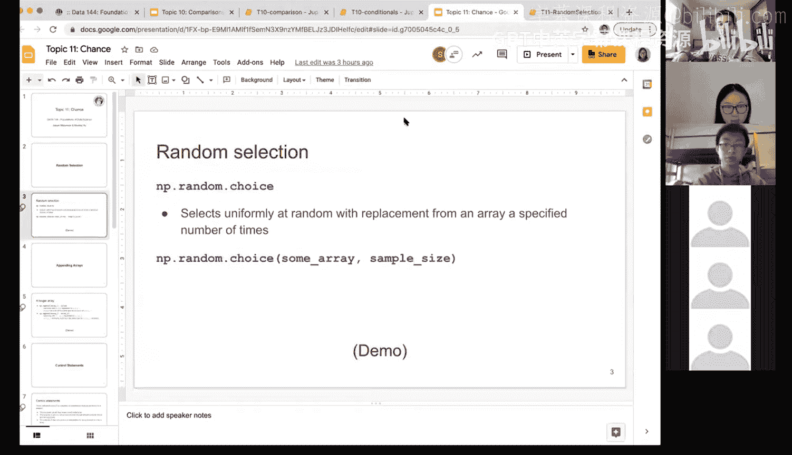

# 37：随机选择 🎲


在本节课中，我们将要学习“随机选择”这一概念。这是进行模拟推断的基础，我们将看到如何通过随机选择来模拟游戏或实验。

上一节我们介绍了条件语句和比较操作，它们是构建模拟逻辑的基石。本节中我们来看看如何引入“随机性”，以模拟现实世界中的不确定事件。


## 随机选择的概念

随机选择是指从一个给定的集合中，以等可能的方式选取一个或多个元素。在模拟实验中，这通常对应着“掷骰子”或“随机分配”等过程。

## 在Python中实现随机选择

在Python中，我们可以使用NumPy库中的 `np.random.choice` 方法来实现随机选择。该方法会从给定的数组中均匀地、有放回地进行随机抽样。

以下是 `np.random.choice` 方法的核心语法：

```python
np.random.choice(a, size=None, replace=True, p=None)
```

*   **a**：一个一维数组，代表可供选择的元素集合。
*   **size**：一个整数或元组，指定要抽取的样本数量。默认值为 `None`，表示只抽取一个样本。
*   **replace**：布尔值，表示抽样是否是有放回的。默认值为 `True`。
*   **p**：一个与数组 `a` 长度相同的数组，指定每个元素被抽取的概率。默认值为 `None`，表示均匀抽样。

## 应用示例

以下是随机选择的一些常见应用场景。

### 示例1：模拟实验分组

在因果推断中，我们经常需要将受试者随机分配到处理组或对照组。

```python
import numpy as np

# 定义可供选择的组别
experiment_groups = np.array(['treatment', 'control'])

# 进行一次随机分配
single_assignment = np.random.choice(experiment_groups)
print(single_assignment)  # 输出可能是 'treatment' 或 'control'

# 进行十次随机分配，模拟为10个受试者分组
ten_assignments = np.random.choice(experiment_groups, size=10)
print(ten_assignments)
```

### 示例2：统计分组结果

我们可以对随机分配的结果进行统计，例如计算对照组的人数。

```python
# 进行10次分配并保存结果
assignments = np.random.choice(experiment_groups, size=10)

# 计算对照组('control')的数量
num_control = np.sum(assignments == 'control')
print(f"Control group count: {num_control}")

# 计算处理组('treatment')的数量
num_treatment = np.sum(assignments == 'treatment')
print(f"Treatment group count: {num_treatment}")
```

**注意**：每次调用 `np.random.choice` 都会生成一组新的随机结果。为了后续分析，通常需要将结果保存到一个变量中。

### 示例3：完成游戏模拟

现在，我们将随机选择与之前学过的条件判断结合起来，完成一个完整的掷骰子游戏模拟。

首先，回顾一下判断游戏结果的函数：

```python
def one_round(roll):
    """根据掷出的点数判断游戏结果"""
    if roll <= 2:
        return -1
    elif roll <= 4:
        return 0
    else: # roll 是 5 或 6
        return 1
```

这个函数需要一个输入参数 `roll`（掷出的点数）。为了完全模拟游戏，我们需要先“掷骰子”来生成这个点数。

接下来，我们创建一个新的模拟函数，它集成了“随机掷骰子”和“判断结果”两个步骤：

```python
def simulate_one_round():
    """模拟一轮完整的游戏：先掷骰子，再判断结果"""
    # 1. 随机掷骰子：从1-6中随机选择一个数
    die_faces = np.arange(1, 7) # 创建数组 [1, 2, 3, 4, 5, 6]
    die_roll = np.random.choice(die_faces)

    # 2. 根据点数判断本轮结果
    outcome = one_round(die_roll)
    return outcome
```

现在，每次调用 `simulate_one_round()` 函数，都会进行一次完整的游戏模拟：

```python
# 模拟一轮游戏
result = simulate_one_round()
print(result) # 输出可能是 -1， 0， 或 1
```

## 总结




本节课中我们一起学习了随机选择的核心概念及其在Python中的实现。我们了解到 `np.random.choice` 方法是进行模拟推断的关键工具，它可以让我们从一组选项中均匀地抽取样本。通过将随机选择与条件逻辑结合，我们能够构建完整的模拟程序，例如模拟掷骰子游戏或随机实验分组。这是后续进行更复杂的数据分析和统计推断的重要基础。