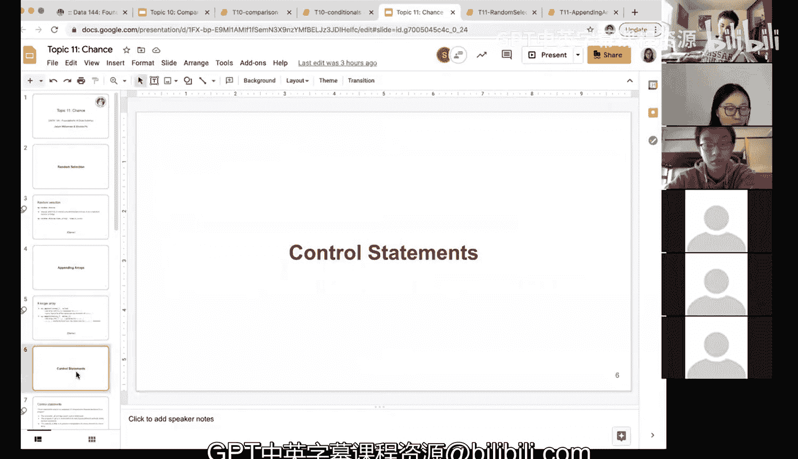

# 38：数组追加与重复实验


在本节课中，我们将学习如何使用NumPy的`append`方法来动态地收集和组合数据。这对于需要重复运行实验（例如模拟掷骰子游戏）并记录所有结果的情况至关重要。

上一节我们介绍了模拟单次掷骰子游戏的方法，本节中我们来看看如何将多次实验的结果收集到一个数组中。


## 数组追加方法

`np.append`方法用于向现有数组中添加新元素。其核心概念是创建一个包含原数组所有元素加上新元素的新数组。原始数组本身不会被修改。

以下是`np.append`方法的两种基本用法：

1.  **向数组追加单个值**：
    语法为 `np.append(array, value)`。例如，`np.append([1, 2, 3], 6)` 将返回一个新数组 `[1, 2, 3, 6]`。

2.  **连接两个数组**：
    语法为 `np.append(array1, array2)`。例如，`np.append([0, 1, 2], [10, 11, 12])` 将返回一个新数组 `[0, 1, 2, 10, 11, 12]`。

**重要注意事项**：数组中所有元素必须具有相同的数据类型。如果尝试将整数追加到浮点数数组，NumPy可能会自动转换类型，但混合不兼容类型（如字符串和数字）会导致错误。

## 在模拟实验中的应用

现在，让我们回到掷骰子游戏的例子。假设我们想重复这个游戏多次，并记录每次的结果。

首先，我们定义一个空数组来存储结果：
```python
import numpy as np
results = np.array([])  # 创建一个空数组
```

接着，我们进行单次游戏模拟，并将结果追加到`results`数组中：
```python
# 假设 simulate_one_roll() 函数模拟一次游戏并返回结果（如 1, 0, -1）
outcome = simulate_one_roll()
results = np.append(results, outcome)
```

每次运行游戏后，我们都将新结果追加到`results`中。这样，`results`数组就会随着实验次数的增加而增长，最终包含所有实验的结果。

## 代码演示

以下是一个完整的演示，展示了如何初始化空数组，并逐步追加多次模拟的结果：

```python
import numpy as np

# 假设的模拟函数，随机返回 1（赢）、0（平）或 -1（输）
def simulate_one_roll():
    return np.random.choice([1, 0, -1])

# 初始化空结果数组
results = np.array([])
print("初始结果数组:", results)

# 一次模拟并追加结果
results = np.append(results, simulate_one_roll())
print("第一次模拟后:", results)

# 二次模拟并追加结果
results = np.append(results, simulate_one_roll())
print("第二次模拟后:", results)

# 三次模拟并追加结果
results = np.append(results, simulate_one_roll())
print("第三次模拟后:", results)
```

运行上述代码，你会看到`results`数组从空开始，逐渐包含了每次模拟的结果。

## 为何需要追加数组？

你可能会问，为什么不直接创建一个足够大的数组来存储所有预期结果？在许多数据分析场景，尤其是模拟和迭代计算中，我们可能事先不知道需要运行多少次实验，或者希望动态地增加数据。`append`方法提供了一种灵活的方式来逐步构建数据集，这在后续课程中进行大量重复模拟以进行统计推断时将非常有用。



本节课中我们一起学习了如何使用`np.append`方法来动态扩展数组，并将其应用于重复实验以收集所有结果。掌握这个方法对于进行模拟研究和逐步构建数据集至关重要。下一节，我们将介绍控制语句，以更高效地自动化这些重复过程。