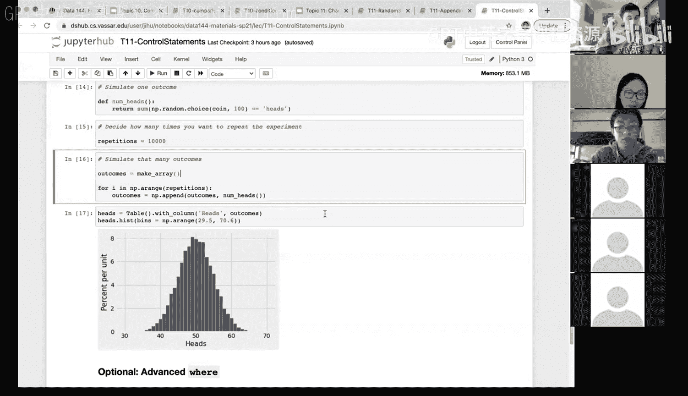

# 39：控制语句（第一部分） 🎮


在本节课中，我们将学习编程中的**控制语句**。控制语句用于管理程序中计算的执行顺序。我们将重点介绍两种核心的控制语句：**条件语句**（`if`）和**循环语句**（`for`）。通过理解它们，你将能够编写程序来根据条件执行不同操作，或对列表中的每个元素重复执行任务。

## 条件语句回顾

上一节我们介绍了条件语句。条件语句，如 `if` 语句，允许程序根据特定表达式的真假（条件）来决定执行哪部分代码。

**核心概念**：`if` 语句的基本结构如下：
```python
if 条件表达式:
    # 条件为真时执行的代码块
```

例如，我们可以定义一个函数，根据输入参数的不同值来选择不同的行为，就像之前我们使用 `if-elif-else` 结构所做的那样。条件语句是控制程序执行流程的基础工具。

## 循环语句：`for` 语句介绍

本节中，我们来看看另一种强大的控制语句：**`for` 循环**。`for` 语句用于对列表或数组中的**每一个元素**执行相同的计算或操作。

**核心概念**：`for` 循环的基本结构如下：
```python
for 变量 in 列表或数组:
    # 对列表中每个元素执行的代码块
```

以下是理解 `for` 循环工作原理的一个简单示例：

```python
for pet in [‘cat‘, ‘dog‘, ‘rabbit‘]:
    print(‘I love my ‘ + pet)
```

这段代码将依次处理列表 `[‘cat‘, ‘dog‘, ‘rabbit‘]` 中的每个元素。对于第一个元素 ‘cat‘，它会执行 `print(‘I love my cat‘)`，然后自动移动到下一个元素 ‘dog‘，执行 `print(‘I love my dog‘)`，依此类推。最终输出将是三行独立的句子。

如果不使用 `for` 循环，要达到同样的效果，我们需要手动访问数组的每个位置（如 `item[0]`, `item[1]`, `item[2]`）并分别打印，这在元素数量很多时会非常繁琐。`for` 循环极大地简化了这类重复性任务。

## 应用 `for` 循环进行模拟实验

现在，让我们将 `for` 循环应用到一个更实际的场景中。还记得之前模拟的掷骰子游戏吗？我们有一个模拟单轮游戏的函数 `one_round()`。

假设我们想将这个游戏运行5次并收集结果。在没有循环的情况下，我们需要手动调用函数5次并将结果追加到列表中。但有了 `for` 循环，我们可以轻松地重复实验任意次数。

以下是使用 `for` 循环运行游戏5次的代码：

```python
game_outcomes = np.array([]) # 初始化一个空数组来存储结果
for i in np.arange(5): # 循环5次，i 的值依次为 0, 1, 2, 3, 4
    new_roll = one_round() # 运行一轮游戏
    game_outcomes = np.append(game_outcomes, new_roll) # 将结果追加到数组中
```

运行这段代码后，`game_outcomes` 数组将包含5个游戏结果（例如 `[-1, -1, 0, -1, 1]`）。

`for` 循环的真正威力在于处理大量重复。例如，我们可以轻松地将循环次数改为5000次来运行大量模拟。通过检查结果数组的长度，我们可以确认模拟确实运行了指定的次数。然后，我们可以像之前一样，创建频数表或条形图来可视化结果（例如，输、平、赢的次数），验证在公平骰子的假设下，各结果大致均等出现。

## 另一个模拟示例：抛硬币实验

为了进一步巩固概念，我们来看另一个使用 `for` 循环的模拟实验：模拟抛硬币。

首先，我们定义硬币的正面和反面。然后，使用 `np.random.choice` 函数模拟单次抛掷。但更有趣的是，我们可以模拟“抛100次硬币，记录正面朝上的次数”这个实验。

**单次实验**的代码如下：
```python
coin = np.array([‘Heads‘, ‘Tails‘])
tosses = np.random.choice(coin, 100) # 模拟抛100次
num_heads = np.sum(tosses == ‘Heads‘) # 计算正面朝上的次数
```
对于一枚公平硬币，`num_heads` 应该接近50。

现在，我们使用 `for` 循环将这个“100次抛掷”的实验本身重复10,000次：

```python
def count_heads_in_100_tosses():
    tosses = np.random.choice(coin, 100)
    return np.sum(tosses == ‘Heads‘)

outcomes = np.array([]) # 存储每次实验的正面次数
for i in np.arange(10000):
    num_heads = count_heads_in_100_tosses()
    outcomes = np.append(outcomes, num_heads)
```

完成模拟后，`outcomes` 数组包含了10,000个数字，每个数字代表一次实验中正面朝上的次数。我们可以将这些数据放入表格并绘制**直方图**进行可视化。

观察这个直方图，你会发现大多数实验结果集中在50附近（最高频），但也会出现像35或65这样偏离较远的值。图形大致呈中间高、两边低的钟形形状，这类似于统计学中的**正态分布**。这个例子完美展示了什么是**基于模拟的推断**：我们通过计算机重复实验成千上万次，然后从模拟结果中得出结论，而不是仅仅依赖记忆公式。这种方法在本课程中将是进行统计推断的核心工具。

## 总结

本节课中我们一起学习了两种核心的**控制语句**。
1.  **条件语句 (`if`)**：根据条件表达式的真假，控制程序执行不同的代码分支。
2.  **循环语句 (`for`)**：对序列（如列表）中的每个元素重复执行特定的代码块。




我们看到了如何将 `for` 循环与之前学过的函数（如随机选择）结合，来自动化运行大量的模拟实验，例如重复掷骰子游戏或抛硬币实验。这种**基于模拟的推断**方法，通过计算而非纯理论公式来探索数据模式和进行统计推断，是数据科学中一项非常强大的技能。