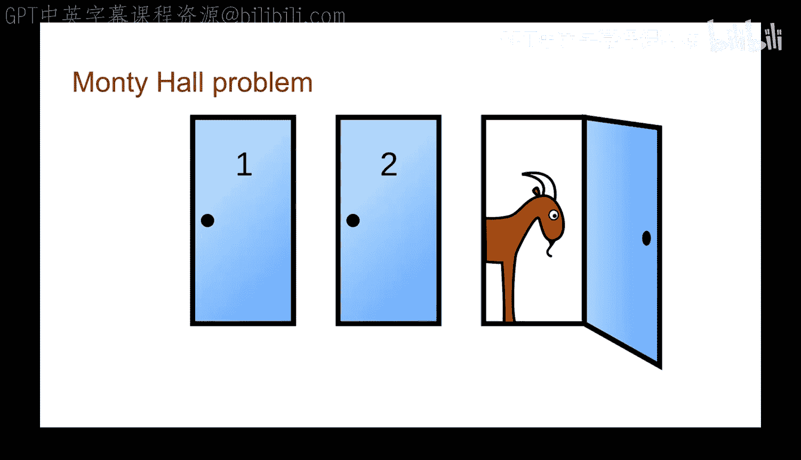
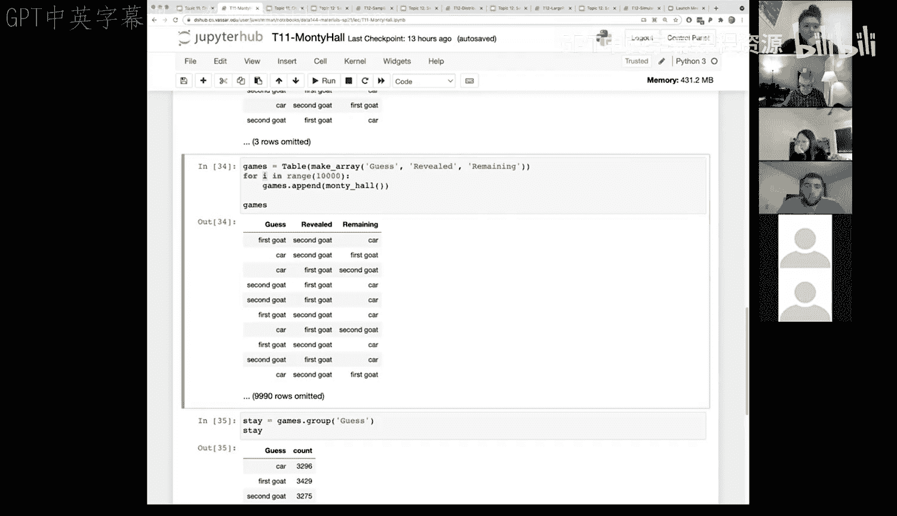

# 40：蒙提霍尔问题


在本节课中，我们将学习条件概率，并通过一个经典的概率谜题——蒙提霍尔问题来综合运用这些概念。我们将首先理解问题背景，然后通过编写一个模拟程序来直观地验证其概率结果。

蒙提霍尔问题源自上世纪60-70年代的一档名为《Let‘s Make a Deal》的游戏节目，主持人名叫蒙提·霍尔。节目中，参赛者会面对三扇关闭的门。其中一扇门后是汽车等大奖，另外两扇门后则是山羊等安慰奖。游戏规则如下：参赛者首先选择一扇门。随后，知道门后情况的主持人会打开一扇参赛者未选择的、后面是山羊的门。最后，主持人会给参赛者一个选择：是坚持最初的选择，还是切换到剩下的那扇未打开的门。我们将通过概率分析和计算机模拟来探讨哪种策略更优。

## 问题设置与模拟程序

上一节我们介绍了问题的背景。本节中，我们将开始编写模拟程序，通过代码来重现这个游戏。

首先，我们需要定义游戏中的数据。我们将创建代表三扇门后奖品的数组，并编写一个辅助函数。



```python
# 定义三扇门后的奖品可能性：一辆汽车和两只山羊
doors = make_array('car', 'first goat', 'second goat')
# 创建一个只包含两只山羊的数组，便于后续操作
goats = make_array('first goat', 'second goat')

# 定义一个辅助函数：输入一只山羊，返回另一只山羊
def other_goat(a_goat):
    if a_goat == 'first goat':
        return 'second goat'
    elif a_goat == 'second goat':
        return 'first goat'
```

接下来，我们编写模拟单轮游戏的主函数。这个函数将随机分配奖品，模拟参赛者的随机选择，并根据规则决定主持人打开哪扇门。

```python
def monty_hall_game():
    # 随机将汽车和山羊分配到三扇门后
    prizes = np.random.permutation(doors)
    # 参赛者随机选择一扇门
    contestant_choice = np.random.choice(prizes)

    # 根据参赛者的选择，决定主持人打开哪扇门以及剩下的门
    if contestant_choice == 'first goat':
        monty_choice = 'second goat'
        remaining = 'car'
    elif contestant_choice == 'second goat':
        monty_choice = 'first goat'
        remaining = 'car'
    else: # 参赛者选择了汽车
        # 主持人随机选择一只山羊门打开
        monty_choice = np.random.choice(goats)
        # 剩下的门是另一只山羊
        remaining = other_goat(monty_choice)

    # 返回结果数组：[参赛者选择， 主持人打开， 剩余的门]
    return make_array(contestant_choice, monty_choice, remaining)
```

## 运行多次模拟并收集数据

我们已经定义了单轮游戏的逻辑。本节中，我们将运行这个游戏成千上万次，并将结果收集到表格中进行分析。

首先，我们创建一个空表格来存储结果。

```python
# 创建结果表格，包含三列
games = Table().with_columns(
    'Guess', make_array(),
    'Revealed', make_array(),
    'Remaining', make_array()
)
```

为了高效地运行多次模拟，我们使用 `for` 循环。循环允许我们重复执行一段代码指定的次数。

```python
# 使用for循环模拟游戏10,000次
for i in np.arange(10000):
    # 运行一轮游戏并获得结果
    result = monty_hall_game()
    # 将结果添加到表格中
    games = games.with_row(result)
```

## 分析“坚持选择”策略的概率

在收集了足够的数据后，我们可以开始分析不同策略的胜率。首先，我们分析如果参赛者始终坚持最初的选择（不换门），获胜的概率是多少。

以下是分析步骤：

1.  我们根据参赛者最初的选择（`Guess`列）对结果进行分组。
2.  统计选择每类奖品（汽车、第一只山羊、第二只山羊）的次数。
3.  计算选择汽车的次数占总次数的比例。

```python
# 按参赛者最初的选择分组
stay_strategy = games.group('Guess')
# 计算坚持选择策略的获胜概率
prob_win_stay = stay_strategy.where('Guess', 'car').column('count').item(0) / sum(stay_strategy.column('count'))
```

模拟结果显示，如果坚持最初的选择，赢得汽车的概率大约为 **33%**。这与理论概率一致：因为奖品是随机分配的，参赛者第一次就选到汽车的概率是三分之一。

## 分析“改变选择”策略的概率

上一节我们分析了“坚持选择”的策略。本节中，我们来看看如果参赛者在主持人揭示一扇山羊门后改变选择（换到剩下的那扇门），获胜的概率是多少。

以下是分析步骤：

1.  当参赛者改变选择时，他最终得到的奖品对应于结果表中的`Remaining`列。
2.  我们根据`Remaining`列对结果进行分组。
3.  统计`Remaining`列中是汽车的次数占总次数的比例。

```python
# 按“剩余的门”（即改变选择后得到的奖品）分组
switch_strategy = games.group('Remaining')
# 计算改变选择策略的获胜概率
prob_win_switch = switch_strategy.where('Remaining', 'car').column('count').item(0) / sum(switch_strategy.column('count'))
```

模拟结果显示，如果改变最初的选择，赢得汽车的概率大约为 **67%**，是“坚持选择”策略胜率的两倍。

## 理解概率结果

为什么改变选择会将胜率从33%提高到67%呢？我们可以从概率角度来理解。

*   当你第一次选择时，选到汽车的概率是 **1/3**，选到山羊的概率是 **2/3**。
*   如果第一次选到了汽车（概率1/3），主持人可以打开任意一扇山羊门。如果你此时换门，你一定会换到山羊，从而失败。
*   如果第一次选到了山羊（概率2/3），主持人必须打开另一扇山羊门。此时，剩下的那扇门**一定**是汽车。如果你此时换门，你一定会换到汽车，从而获胜。
*   因此，换门策略的获胜概率就等于你第一次选到山羊的概率，即 **2/3**。

这个结论可以通过以下公式概括：
**换门获胜概率 = 1 - 第一次选到汽车的概率 = 1 - 1/3 = 2/3**

## 关于循环的补充说明

在模拟程序中，我们使用了 `for i in np.arange(10000):` 这样的循环。有同学可能对循环变量 `i` 的作用有疑问。

`for` 循环是遍历一个列表（或数组）中每个元素并执行相应操作的方法。其语法结构如下：

```python
for loop_name in an_array:
    # 循环体：对每个元素执行的语句
```

*   `for` 和 `in` 是关键字。
*   `loop_name` 是一个变量名（在本课程中我们称其为“名称”），在每次循环中，它会被自动赋值为当前遍历到的列表元素。
*   `an_array` 是一个数组或列表。
*   冒号 `:` 后缩进的代码块是循环体，会对列表中的每个元素执行一次。

在我们的例子中，`np.arange(10000)` 生成了一个从0到9999的数组。我们使用循环只是为了将游戏模拟重复执行10,000次，并不关心循环变量 `i` 在每次循环中的具体值，因此它在循环体内没有被使用。但为了符合语法，我们必须给它一个名称。



本节课中我们一起学习了蒙提霍尔问题及其概率分析。我们通过编写Python模拟程序，运行大量实验，验证了“改变选择”策略的优越性。这个例子生动地展示了条件概率的应用，以及如何通过计算模拟来理解和验证概率结论。同时，我们也复习了 `for` 循环在自动化重复任务中的重要作用。