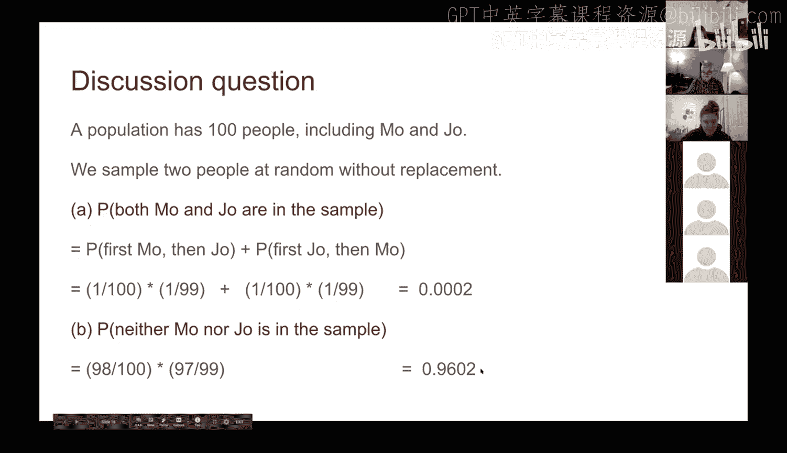

# 41：概率基础


在本节课中，我们将学习概率论的基础知识。虽然概率论本身是一门深奥的学科，但本课程的目标是掌握足够的知识，以便能够理解和运行后续的数据模拟实验。我们将从最核心的概念开始，确保内容简单易懂。

## 😊 概率的基本概念

概率用于描述某个事件发生的可能性。它的数值范围在0到1之间，也可以用百分比（0%到100%）来表示。

*   **0（或0%）**：表示事件**不可能**发生。无论尝试多少次，该结果都不会出现。
*   **1（或100%）**：表示事件**必然**发生。

对于一个事件，它要么发生，要么不发生。因此，一个事件发生的概率与其不发生的概率之和总是等于1（或100%）。例如，如果一个事件发生的概率是70%（`P(发生) = 0.7`），那么它不发生的概率就是30%（`P(不发生) = 1 - 0.7 = 0.3`）。

## 😊 等可能结果的概率计算

在有些场景中，所有可能的结果发生的可能性是相等的。典型的例子是抛一枚公平的硬币，或者掷一个均匀的骰子。

计算此类事件的概率公式很简单：

**概率 = （使事件发生的结果数量） / （所有可能结果的总数）**

例如，掷一个标准六面骰子，求掷出偶数的概率。
*   所有可能结果总数：6（即1, 2, 3, 4, 5, 6）。
*   使事件（掷出偶数）发生的结果数量：3（即2, 4, 6）。
*   因此，概率 = 3 / 6 = 0.5 或 50%。

## 😊 乘法规则（与事件）

上一节我们介绍了单一事件的概率，本节中我们来看看当多个事件需要**同时**发生时的概率计算，即“A **与** B”都发生的情况。这时我们需要使用**乘法规则**。

计算两个事件A和B同时发生的概率公式为：

**P(A 与 B) = P(A) × P(B | A)**

这里，`P(B | A)` 表示“在事件A已经发生的条件下，事件B发生的概率”。之所以要乘以条件概率，是因为在计算两者都发生的概率时，我们必须考虑事件A发生对事件B的影响。

从这个公式可以得出一个直观结论：因为概率值都在0到1之间，相乘的结果通常会小于或等于其中任何一个单独事件的概率。这意味着，要求同时满足的条件越多，所有条件都成立的概率就越低。这个规则可以推广到更多事件：`P(A 与 B 与 C) = P(A) × P(B | A) × P(C | A 与 B)`。

## 😊 加法规则（或事件）

与“与”事件相反，有时我们关心的是事件可以通过**多种方式之一**发生的情况，即“A **或** B”发生。这时我们需要使用**加法规则**。

计算事件可以通过两种方式之一发生的概率公式为：

**P(A 或 B) = P(A) + P(B)**

例如，从一副标准扑克牌中抽一张牌，求抽到红心或梅花的概率。
*   抽到红心的概率 P(红心) = 13/52。
*   抽到梅花的概率 P(梅花) = 13/52。
*   因此，P(红心 或 梅花) = 13/52 + 13/52 = 26/52 = 0.5。

需要注意的是，加法规则适用于**互斥**事件（即两种方式不能同时发生）。当事件不互斥时，公式需要调整以避免重复计算，但基础概念不变：通过增加满足事件的方式，其发生的总体概率会增大（大于或等于任一单独方式的概率）。

## 😊 应用示例：抛硬币问题

现在，让我们运用学到的规则来解决一个具体问题：连续抛掷硬币，求**至少出现一次正面**的概率。

假设我们抛硬币3次。直接计算“至少一次正面”的情况（1次正、2次正、3次正）比较复杂。一个更简单的方法是计算其对立事件——“**没有一次正面**”，即“全部是反面”的概率。

1.  每次抛掷得到反面的概率是 0.5。
2.  要求三次**都**是反面，使用乘法规则：
    `P(反，反，反) = 0.5 × 0.5 × 0.5 = 0.125`
3.  因此，“至少一次正面”的概率为：
    `P(至少一次正面) = 1 - P(全部反面) = 1 - 0.125 = 0.875` 或 87.5%。

我们可以将此逻辑推广到抛掷n次的情况。抛掷n次全部是反面的概率是 `(0.5)^n`。例如，抛掷10次，至少出现一次正面的概率为 `1 - (0.5)^10 ≈ 0.999`，即99.9%的可能性。

在Python中，这个计算可以表示为：
```python
prob_at_least_one_head = 1 - (0.5 ** 10)
```

## 😊 讨论题：抽样问题

让我们通过一个讨论题来巩固所学知识。假设一个群体有100人，其中包括Mo和Joe。

**问题1：我们采用“不放回”的方式随机抽取两人。问：Mo和Joe同时被抽中的概率是多少？**

“不放回抽样”就像从帽子中抽名字，抽出一个后不再放回。

**解答：**
Mo和Joe同时被抽中，可以通过两种互斥的方式实现：
1.  第一次抽中Mo，**并且**第二次抽中Joe。
2.  第一次抽中Joe，**并且**第二次抽中Mo。

*   方式1的概率：`P(先Mo后Joe) = (1/100) × (1/99)`
*   方式2的概率：`P(先Joe后Mo) = (1/100) × (1/99)`

由于这是“或”的关系，我们使用加法规则：
`P(同时抽中) = (1/100)*(1/99) + (1/100)*(1/99) = 2 / (100*99) ≈ 0.000202`

**问题2：Mo和Joe都**没有**被抽中的概率是多少？**

**解答：**
这要求第一次抽中的不是他俩**并且**第二次抽中的也不是他俩。
*   第一次抽，100人中有98人不是Mo或Joe，概率为 `98/100`。
*   第一次抽走一人后，剩下99人，其中97人不是Mo或Joe。在第一次已抽走一个“非Mo/Joe”之人的条件下，第二次再抽到一个“非Mo/Joe”之人的概率为 `97/99`。

使用乘法规则：
`P(两人均未抽中) = (98/100) × (97/99) ≈ 0.9602`

---



本节课中我们一起学习了概率论的基础核心概念：概率的取值范围和含义、等可能事件的概率计算、用于“与”事件的乘法规则、用于“或”事件的加法规则，并通过抛硬币和抽样问题进行了实际应用。这些知识为我们后续进行数据模拟和分析奠定了必要的数学基础。