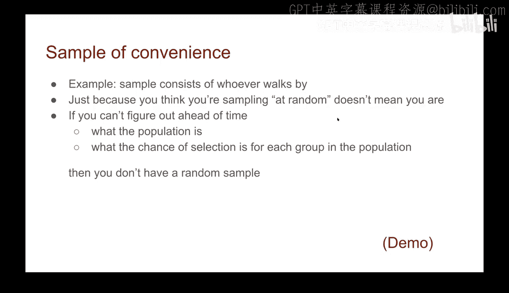
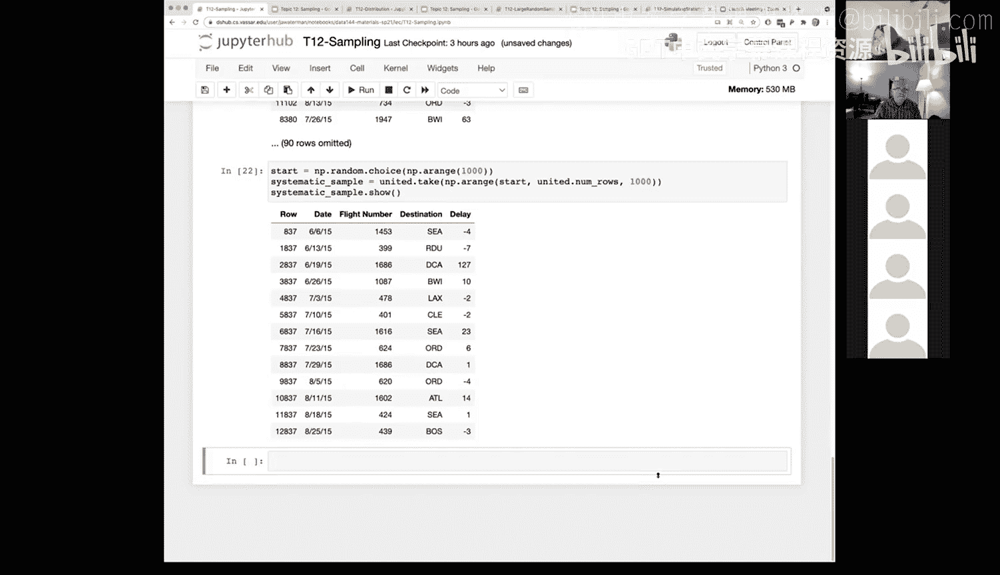

# 42：抽样简介 🎯


在本节课中，我们将要学习抽样的基本概念。抽样是数据科学中一项非常强大的技术，它允许我们基于部分数据来推断整个群体的特征。我们将探讨不同类型的抽样方法，并学习如何在实践中应用它们。

## 术语定义 📖

在深入抽样方法之前，我们先明确一些核心术语。理解这些术语是理解后续内容的基础。

*   **个体**：数据表中的每一行代表一个个体，即我们研究群体中的一个成员。
*   **变量**：数据表中的每一列代表一个变量，也称为特征或属性。它描述了每个个体的某个方面。
*   **群体**：我们想要研究的全部个体的集合。例如，一个国家、一所大学的所有学生。

## 抽样方法概览 🔍

上一节我们介绍了数据的基本结构，本节中我们来看看如何从群体中选取个体进行研究。抽样方法主要分为两大类：确定性抽样和概率性抽样。

### 确定性抽样

确定性抽样意味着样本的选取过程不涉及随机性，而是遵循某种确定的规则或算法。每次执行都会得到完全相同的结果。

以下是几种确定性抽样的例子：
*   **按行选取**：使用 `take` 方法直接选取特定的行（例如，第5行、第27行）。
*   **按条件筛选**：使用 `where` 方法，根据某个变量的条件（如“目的地是纽瓦克机场”）来选取行。只要数据不变，结果总是相同。

### 概率性抽样

概率性抽样意味着每个个体被选入样本的机会由概率决定。这是进行统计推断的基础。

以下是几种概率性抽样的类型：
*   **简单随机抽样**：群体中每个个体被抽中的概率相等。
*   **分层抽样**：先将群体划分为不同的组（层），然后在每个组内按特定概率进行抽样。各组间的抽样概率可以不同，这常用于确保某些代表性不足的群体在样本中有足够的体现。
*   **有放回抽样**：每次抽取一个个体后，将其放回群体中，因此同一个体可能被多次抽中。当群体足够大时，有放回抽样在计算上更简便，且结果近似于无放回抽样。
*   **无放回抽样**：个体一旦被抽中，便不再放回群体中，因此每个个体在样本中最多出现一次。
*   **系统抽样**：先随机选择一个起始点，然后每隔固定的间隔（如每第1000个）选取一个个体。虽然选取模式是系统的，但由于起始点是随机的，因此整体仍是随机样本。

### 便利抽样及其风险

便利抽样是指研究者根据方便程度来选取样本（例如，在街角采访路过的人）。虽然有时有用，但必须谨慎，因为它通常**不是**真正的随机样本。样本可能因地点、时间等因素而产生系统性偏差。

一个著名的警示案例是：两个研究小组用同一群实验室小鼠做实验，结果却不同。后来发现，一组是用计算机随机选择小鼠ID，另一组是“随机”伸手到笼子里抓第一只碰到的小鼠。后者总是抓到行动较慢、体型较大的小鼠，这并非真正的随机抽样。

**核心要点**：如果你无法事先确定群体中每个个体（或每个组）被选中的概率，那么你得到的就不是一个真正的随机样本。

## 代码实践：抽样操作 💻



现在，让我们通过具体的代码示例来看看如何在数据表中执行各种抽样操作。我们将使用一个航班延误时间的数据集。

首先，我们加载数据并添加一个行号列以便观察。

```python
# 假设 flights 是包含航班数据的表
# 添加一个显示行索引的‘row’列，并将其移动到第一列
flights_with_index = flights.with_column('row', np.arange(flights.num_rows)).move_to_start('row')
```

### 确定性抽样示例

1.  **按条件筛选（确定性）**：选取所有飞往纽瓦克机场（EWR）的航班。
    ```python
    # 每次运行都会得到完全相同的结果
    flights_with_index.where('Destination', 'EWR')
    ```
2.  **按固定间隔选取（确定性）**：选取第0行、第1000行、第2000行……。
    ```python
    # 这也是确定性的，结果固定
    flights_with_index.take(np.arange(0, flights_with_index.num_rows, 1000))
    ```

### 概率性抽样示例

1.  **简单随机抽样（有放回）**：使用 `np.random.choice` 随机选取行索引，允许重复。
    ```python
    # 从所有行索引中随机选取100个（可能重复）
    sample_size = 100
    random_indices = np.random.choice(np.arange(flights_with_index.num_rows), sample_size)
    random_sample_with_replacement = flights_with_index.take(random_indices)
    # 每次运行都会得到不同的样本
    ```
2.  **简单随机抽样（无放回）**：使用 `np.random.choice` 并设置 `replace=False`。
    ```python
    # 从所有行索引中随机选取100个（不重复）
    random_indices_no_replace = np.random.choice(np.arange(flights_with_index.num_rows), sample_size, replace=False)
    random_sample_without_replacement = flights_with_index.take(random_indices_no_replace)
    # 每次运行得到不同的样本，且样本内行唯一
    ```
3.  **系统抽样（随机起始点）**：在头1000行中随机选择一个起始点，然后每隔1000行选取一次。
    ```python
    start = np.random.choice(1000)  # 在0-999中随机选一个起始点
    systematic_indices = np.arange(start, flights_with_index.num_rows, 1000)
    systematic_sample = flights_with_index.take(systematic_indices)
    # 起始点随机，因此整体样本是随机的
    ```

## 总结 📝



本节课中我们一起学习了抽样的核心概念。我们首先明确了**个体**、**变量**和**群体**等基本术语。接着，我们探讨了**确定性抽样**与**概率性抽样**的区别，并介绍了多种具体的抽样方法，包括简单随机抽样、分层抽样、有放回/无放回抽样以及系统抽样。我们特别指出了**便利抽样**可能带来的偏差风险。最后，我们通过代码示例演示了如何在实际数据集中执行这些抽样操作。掌握这些方法是进行可靠数据分析和统计推断的关键第一步。