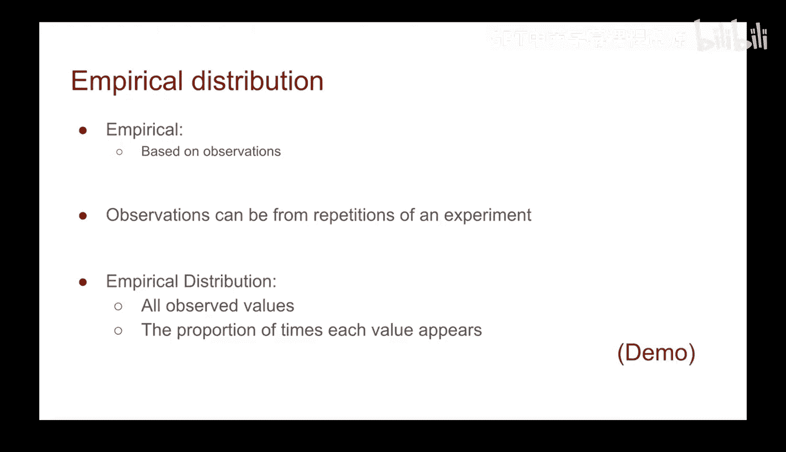
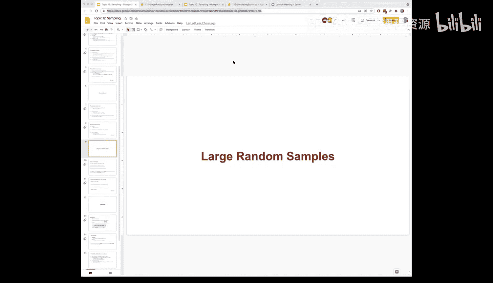

# 43：抽样分布


在本节课中，我们将要学习概率分布与经验分布的概念，并通过模拟掷骰子的例子，理解如何通过随机抽样来估计概率分布。

## 概率分布

上一节我们介绍了抽样的方法，本节中我们来看看什么是分布。我们讨论的是概率分布。概率分布描述的是一个随机变量可能取到的各种值及其对应的概率。

为了给出一个具体的例子，我们考虑掷一个六面骰子。掷骰子的每一个结果都是一个事件。概率分布包含了该随机变量（即掷出的点数）所有可能取值的概率。

在这个例子中，计算概率分布相当直接。对于一个公平的六面骰子，每个数字出现的概率是 **1/6**。因此，概率分布就是所有可能的结果（数字1到6）以及每个结果对应的概率（1/6）。

我们可以直接通过数学计算这个概率分布。然而，在许多我们将要研究的问题中，直接计算出概率分布可能非常困难。

## 经验分布

当我们无法直接计算概率分布时，我们可以采用模拟这个随机变量的方法。这就是我们将要采取的方法。但记住这些分布的来源是有益的。

我们可以通过随机抽样来估计概率分布。具体来说，我们可以观察经验分布。“经验”一词基本上意味着观察到的、实验性的值。

我们可以通过运行一个实验（如掷骰子、抛硬币或模拟蒙提霍尔问题）来观察结果，并基于这些观察值建立一个分布。蒙提霍尔问题就是一个很好的例子：我们既通过数学直接计算了概率分布，也通过模拟游戏获得了经验分布。

以下是经验分布的定义：

*   如果我们运行一个实验，并观察所有结果值的分布，我们称之为经验分布。
*   将其绘制成直方图，可以显示出每个值出现的比例。



## 模拟演示：掷骰子

让我们通过一个演示来看看如何计算分布和模拟经验分布。我们将使用表格进行操作。

首先，我们创建一个包含所有可能结果的“骰子”表格。

```python
# 创建一个骰子表格，包含‘face’列，值为1到6
die = Table().with_column('face', np.arange(1, 7))
```

这个表格代表了我们的理论概率模型：每个面出现的概率是均等的。

接下来，我们可以通过抽样来模拟掷骰子。例如，抽样10次：

```python
# 从骰子表格中抽样10次，模拟掷骰子
rolls_10 = die.sample(10)
```

如果我们绘制这10次抽样的直方图，得到的经验分布可能与理论分布（每个面概率为1/6）相差甚远，并且每次运行结果都可能不同。这是因为样本量太小。

现在，让我们增加样本量。抽样1000次：

```python
# 从骰子表格中抽样1000次
rolls_1000 = die.sample(1000)
```

绘制这1000次抽样的直方图，我们会发现经验分布开始看起来与理论分布非常相似了，尽管每次运行仍有细微差别。

最后，如果我们进行大量抽样，例如100,000次：

```python
# 从骰子表格中抽样100,000次
rolls_100000 = die.sample(100000)
```

此时，经验分布的直方图将与理论概率分布高度吻合。这个演示的关键结论是：

**随着样本量的不断增加，经验分布会收敛于真实的概率分布。**

## 总结



本节课中我们一起学习了概率分布与经验分布的核心概念。我们了解到，概率分布描述了随机变量的理论可能结果，而经验分布则通过实际观察或模拟实验获得。通过掷骰子的例子，我们演示了如何通过增加随机抽样的次数，使经验分布越来越接近真实的概率分布。这是数据挖掘和分析中通过模拟来理解和估计未知分布的基础方法。