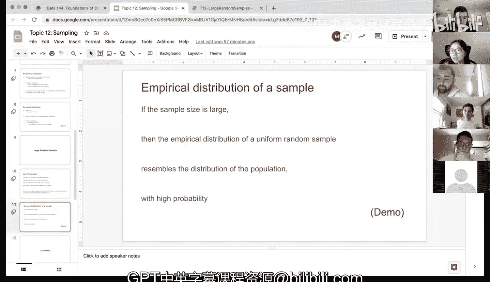

# 44：大随机样本 📊


在本节课中，我们将学习大随机样本的概念及其在数据推断中的重要性。我们将通过一个具体的数据集演示，理解样本大小如何影响样本分布对总体分布的近似程度。

## 概述

上一节我们介绍了抽样和分布的基本概念。本节中，我们将探讨大随机样本的核心思想：当样本量足够大时，随机样本的经验分布能以高概率近似总体分布。我们将通过Python代码演示这一过程，并观察不同样本量下的效果。

## 核心概念与定律

**大数定律**（或**中心极限定理**）指出：如果一个随机实验在相同条件下独立重复进行大量次数，那么某一特定事件发生的频率将趋近于该事件的理论概率。

**公式表示**：设事件A的概率为P(A)，在n次独立重复实验中，事件A发生的次数为k，则当n→∞时，有：
\[
\frac{k}{n} \to P(A)
\]

**核心结论**：若从一个总体中进行均匀随机抽样，且样本量足够大，则样本的经验分布将以高概率近似总体的分布。

## 演示：航班延误数据分析

我们将使用美国联合航空公司2015年夏季的航班数据集作为演示。该数据集包含航班日期、航班号、目的地和延误时间（分钟）等信息。在本例中，我们将此完整数据集视为“总体”。

以下是加载数据并查看总体延误分布及摘要统计的代码：

```python
# 假设数据已加载为名为 united 的表格
# 查看延误列的基本信息
delay_population = united.column('Delay')

# 绘制总体延误直方图
import matplotlib.pyplot as plt
plt.hist(delay_population, bins=range(-20, 201, 20))
plt.title('Population Distribution of Delay')
plt.xlabel('Delay (minutes)')
plt.ylabel('Frequency')
plt.show()

# 计算总体摘要统计量
min_delay = min(delay_population)
max_delay = max(delay_population)
mean_delay = np.mean(delay_population)  # 假设已导入 numpy 为 np
median_delay = np.median(delay_population)
```

总体延误的平均值约为16.6分钟，中位数可通过类似方式计算。数据集中约有接近14,000条观测记录。

## 不同样本量的比较

为了验证样本量大小对分布近似程度的影响，我们将从总体中抽取三个不同大小的随机样本：10、100和1000。以下是抽取样本并绘制其经验分布的代码：

```python
# 抽取样本量分别为10、100、1000的随机样本
sample_size_10 = united.sample(10).column('Delay')
sample_size_100 = united.sample(100).column('Delay')
sample_size_1000 = united.sample(1000).column('Delay')

# 绘制各样本的直方图，使用与总体相同的区间以便比较
plt.figure(figsize=(15, 4))

plt.subplot(1, 3, 1)
plt.hist(sample_size_10, bins=range(-20, 201, 20))
plt.title('Sample Size = 10')

plt.subplot(1, 3, 2)
plt.hist(sample_size_100, bins=range(-20, 201, 20))
plt.title('Sample Size = 100')

plt.subplot(1, 3, 3)
plt.hist(sample_size_1000, bins=range(-20, 201, 20))
plt.title('Sample Size = 1000')

plt.show()
```

通过对比这三个样本的直方图与总体直方图，我们可以直观地看到：

*   **样本量=10**：由于观测值太少，分布形状不规则，无法有效反映总体特征。
*   **样本量=100**：分布开始呈现出与总体相似的趋势，但仍有明显波动。
*   **样本量=1000**：分布形状与总体分布高度相似，能更好地代表总体的延误情况。

这个演示直观地验证了我们的核心观点：**样本量越大，随机样本的经验分布越有可能接近总体分布**。

## 实践意义

在实际的数据挖掘与分析中，我们通常无法获得完整的总体数据。此时，大随机样本的价值就体现出来了：

1.  **推断总体**：通过分析一个大随机样本，我们可以对总体的分布、均值、方差等参数进行可靠的估计。
2.  **确保代表性**：均匀随机抽样（即每个个体被选中的概率相同）结合足够大的样本量，是保证样本对总体有代表性的关键。
3.  **指导数据收集**：在设计实验或调查时，应尽可能扩大样本量，以提高推断的准确性和可靠性。

## 总结



本节课中，我们一起学习了大随机样本的核心原理及其在统计推断中的基础作用。我们通过航班延误数据的实例，演示了随着样本量从10增加到1000，样本分布如何越来越接近总体分布。记住，在进行数据分析时，获取一个量足够大的随机样本，是使我们能够自信地从样本结论推断总体情况的重要前提。在接下来的课程中，我们将以此为基础，学习更多具体的统计推断方法。