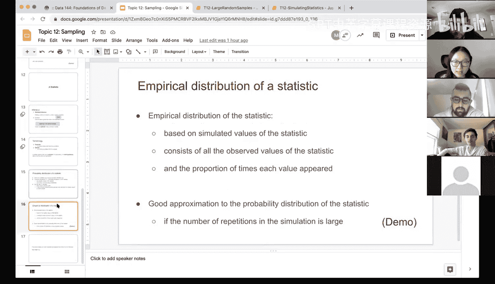

# 45：统计量 📊


在本节课中，我们将学习统计推断的核心概念——统计量。我们将了解如何利用样本数据来推断未知的总体参数，并探讨统计量的分布特性。

## 概述

统计推断的目标是基于随机样本数据得出结论。通常，我们无法获取整个总体数据，只能通过样本来了解总体。因此，我们需要使用从样本中计算出的统计量来估计总体中未知但固定的参数。

## 核心概念与术语

上一节我们介绍了统计推断的基本思想，本节中我们来看看几个关键术语。

*   **参数**：与总体相关的未知但固定的数值。例如，总体均值 `μ` 或总体中位数。
*   **统计量**：从样本数据中计算得出的数值。例如，样本均值 `x̄` 或样本中位数。
*   **估计**：使用样本统计量来推测总体参数值的过程。例如，用样本均值 `x̄` 估计总体均值 `μ`。
*   **假设检验**：统计量也可用于检验关于数据生成过程的假设。我们将在后续课程中详细讨论。

简而言之，我们想了解总体的某些特性（参数），但它是未知的。我们拥有样本，并能使用样本统计量来估计总体中的参数。

## 统计量的分布

我们了解到，统计量被用来估计总体参数。由于每次抽取的随机样本可能不同，因此基于样本计算出的统计量（如均值）本身也是一个随机变量。

如果我们能抽取大量样本，并为每个样本计算同一个统计量（如均值），那么这些统计量值就会形成一个分布。

以下是关于统计量分布的几个关键点：

*   **统计量的概率分布/抽样分布**：理论上，统计量所有可能取值及其对应概率构成的分布。
*   **统计量的经验分布**：实践中，通过模拟（如重复抽样）观测到的统计量值及其出现频率构成的分布。它是真实抽样分布的近似。
*   **获得良好近似的条件**：为了使经验分布能很好地近似理论上的抽样分布，需要确保模拟的重复次数足够多。同时，样本容量本身也不能太小，否则即使重复很多次，估计值也可能严重偏离真实参数。

## 演示：中位数的经验分布

现在，我们通过一个Python演示来直观理解上述概念。我们将使用一个航空延误数据集，研究样本中位数的经验分布如何随样本容量变化。

我们首先定义一个函数，用于计算给定样本容量的随机样本的中位数。

```python
def sample_median(size):
    # 从总体中抽取指定容量的随机样本，并计算‘delay’列的中位数
    return np.median(united.sample(size)['delay'])
```

接着，我们进行模拟。对于每个样本容量（如10， 100， 1000），我们都重复抽取大量样本（如1000次），并计算每次样本的中位数，最后绘制这些中位数的分布直方图。

以下是模拟的核心循环结构：

```python
sample_medians = [] # 用于保存所有计算出的样本中位数
for i in np.arange(1000): # 重复1000次
    # 每次抽取一个容量为‘size’的样本，并计算其中位数
    new_median = sample_median(size=10)
    sample_medians.append(new_median)
# 之后，我们可以用 sample_medians 列表绘制直方图
```

### 结果分析

我们比较了样本容量分别为10、100和1000时，样本中位数的经验分布（均基于1000次重复抽样）。

*   **相似性**：三个分布都大致围绕总体中位数（值为2）集中。这表明，只要重复次数足够多，样本统计量的平均值会接近总体参数。
*   **差异性**：样本容量越大，分布越集中（直方图更窄、更高）。样本容量为10时，分布非常分散，中位数可能落在-5到30的广阔区间；而样本容量为1000时，中位数几乎全部集中在2附近。

这个演示说明了两点：
1.  足够的重复次数能保证经验分布的中心接近总体参数。
2.  更大的样本容量能显著降低统计量的变异性（即分布更集中），从而使单次样本的估计更可靠。

## 总结

本节课中我们一起学习了统计推断的基石——统计量。我们明确了**参数**（总体中未知的固定值）与**统计量**（样本中可计算的值）的区别。我们了解到，统计量是随机的，它拥有自己的**概率分布（抽样分布）**，而通过大量模拟可以得到其**经验分布**。最后，通过代码演示我们看到，**足够的模拟重复次数**和**较大的样本容量**对于获得稳定、准确的统计量分布至关重要，这为我们后续进行参数估计和假设检验打下了基础。




> 注：本教程基于UCB《数据挖掘和分析》课程第45讲内容整理，核心是解释如何利用样本统计量推断总体参数，并强调了通过模拟理解统计量分布的方法。