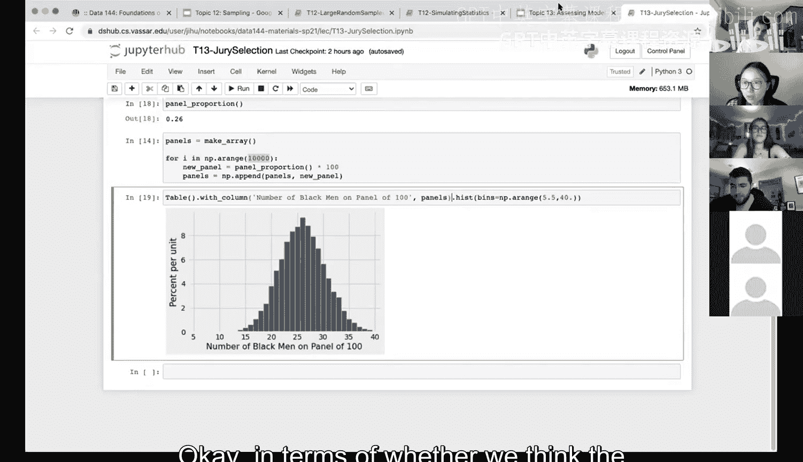
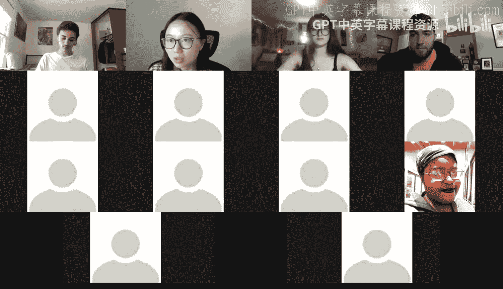
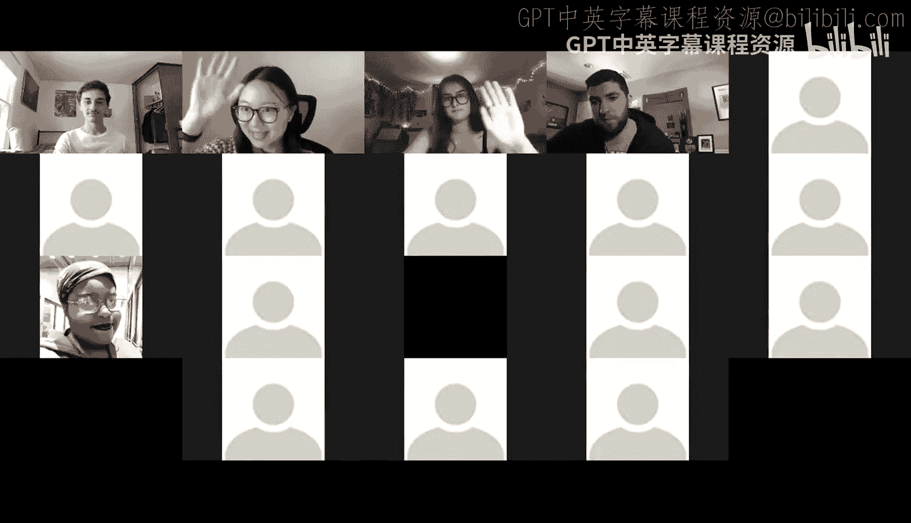

# 46：模型评估 🧐


在本节课中，我们将学习如何评估一个模型。模型本质上是对数据生成过程的一系列假设。我们将通过一个具体的例子——陪审团选择案例——来学习如何使用Python模拟数据，并将模拟结果与实际观测数据进行比较，从而判断模型假设是否合理。

上一节我们讨论了抽样，现在我们将更进一步，探讨如何利用样本统计量对未知但固定的总体参数进行推断。本节的主题是“模型评估”，这听起来可能与我们之前学过的内容不同，但你会发现，我们所说的模型，其实就是关于数据的一系列假设。本主题旨在介绍如何评估这些关于数据的假设（即模型）的好坏。在数据科学中，许多模型都涉及包含随机性的过程假设，因此我们称之为**机会模型**。

我们将看到，对于数据如何生成，可能存在许多不同的模型假设。我们将通过Python学习一种通用的方法来评估这类模型，并会用到我们之前学过的重复抽样、抽样分布等概念。

## 评估方法概述

评估模型的一般方法是：如果我们有一个模型（即一套假设），我们能够使用Python根据这些假设来**模拟生成数据**。通过模拟，我们可以了解模型会做出什么样的预测。

直观地说，如果我们有多个模型（例如模型A和模型B），我们可以从这两个模型中分别生成模拟数据，然后检查哪一组模拟数据与我们实际观测到的数据更相似，从而判断哪个模型更好。

下一步，正如我们刚才提到的，是将模型的**预测与观测数据进行比较**。如果观测数据与模型的预测不一致，那么这可能成为反对该模型的证据。

## 案例研究：陪审团选择

我们的第一个例子是“陪审团选择”，这是一个历史事件，即1965年的“斯温诉阿拉巴马州案”。在阿拉巴马州的一个县，一名叫罗伯特·斯温的非裔美国男子被判有罪。他后来提出上诉，因为人们注意到，由12人组成的陪审团全部是白人，这可能存在偏见。

在该县，26%的人口是黑人。当时的陪审团小组由100名21岁以上的男性组成。问题是：如果声称不存在偏见（这本身就是一个模型假设），那么在一个26%人口为黑人的地区，随机选出100名男性陪审员，全部是白人的可能性有多大？

实际上，观测数据显示，在100名陪审员中，有8名是黑人。而我们的模型（即“无偏见”假设）预测，平均而言，应有26%的陪审员是黑人，即大约26人。当时最高法院驳回了上诉。但现在，我们可以利用所学知识，通过模拟大量数据集来检验这个模型是否合理。

## 从已知分布中抽样

我们之前学习过如何从均匀分布等数值分布中抽样。现在，我们需要引入一个新概念：从**分类分布**中随机抽样。在这个案例中，模型是26%的人口为黑人，74%为白人。我们需要根据这个比例来模拟每次的陪审团选择。

这是一个分类分布，因为变量有两个类别：黑人或白人（非黑人）。我们将使用一个特定的命令来实现这一点。

以下是`sample_proportions`函数的核心代码描述：

```python
# 函数功能：根据给定的总体比例分布，生成指定样本量的类别比例样本。
# 参数：
#   sample_size: 想要抽取的样本数量。
#   pop_distribution: 一个列表，表示总体中各个类别的比例（总和应为1）。
# 返回值：一个数组，表示样本中各个类别的比例。
sample_proportions(sample_size, pop_distribution)
```

在这个案例中，样本量是100（模拟100人陪审团），总体分布是 `[0.26, 0.74]`（代表黑人和白人的比例）。每次调用这个函数，都会根据这个比例随机生成一个样本的类别分布，结果可能接近但不会完全等于 `[0.26, 0.74]`，因为抽样存在随机变异。

## 模拟与比较

我们根据“无种族偏见”的模型假设（即总体比例为26%黑人，74%白人）来模拟数据。具体方法是：使用 `sample_proportions` 函数重复模拟10000次，每次生成一个100人的陪审团样本，并记录其中黑人的数量。

以下是模拟过程的核心步骤：

1.  定义总体比例：`model_proportions = [0.26, 0.74]`
2.  定义一个函数，用于模拟一次陪审团选择并返回黑人比例：
    ```python
    def panel_proportion():
        return sample_proportions(100, model_proportions).item(0) # 取第一个元素（黑人比例）
    ```
3.  重复模拟10000次，并将每次的黑人比例转换为具体人数（乘以100）：
    ```python
    panels = np.array([])
    for i in np.arange(10000):
        new_panel = panel_proportion() * 100
        panels = np.append(panels, new_panel)
    ```
4.  绘制这10000次模拟中黑人陪审员数量的直方图。

模拟结果显示，黑人陪审员数量的分布大致以26为中心（符合26%的总体比例），范围大约在13到40人之间。而我们实际观测到的数据是8名黑人。

## 结果分析与P值

通过比较，我们发现观测值8远远落在模拟分布的极端左侧，在10000次模拟中一次也没有出现。这表明，如果“无种族偏见”的模型是正确的，那么我们观测到仅有8名黑人陪审员（或更少）的事件是极其不可能的。

这种“不可能性”可以用**P值**来量化。P值指的是**在模型假设成立的前提下，观察到与实际数据一样极端或更极端结果的概率**。在本例中，P值实际上为0（在10000次模拟中未发生），这构成了反对原模型（无偏见假设）的强有力证据。

因此，我们的评估结论是：观测数据与“无种族偏见”模型的预测严重不一致，我们有充分的证据怀疑该陪审团选择过程存在偏见。





## 总结




本节课我们一起学习了模型评估的基本方法。我们了解到，模型即假设，评估模型的关键在于根据假设模拟数据，并将预测结果与实际观测进行比较。通过“陪审团选择”的案例，我们实践了使用Python的 `sample_proportions` 函数从分类分布中抽样，进行大规模模拟，并通过比较模拟分布与观测值得出评估结论。当观测数据在模拟分布中出现的概率极低（即P值很小）时，我们就有证据反对原模型。这种方法为假设检验和统计推断奠定了坚实的基础。