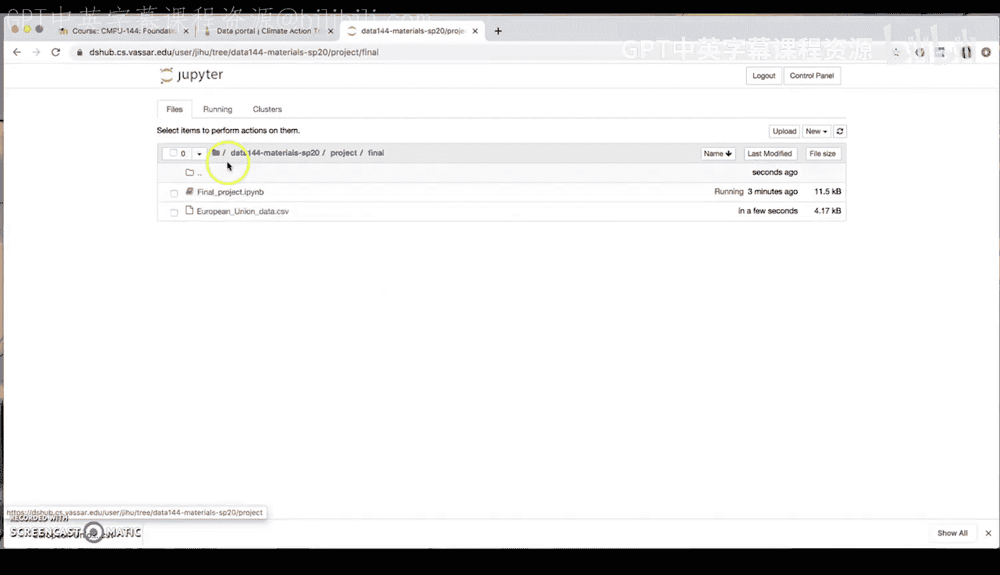
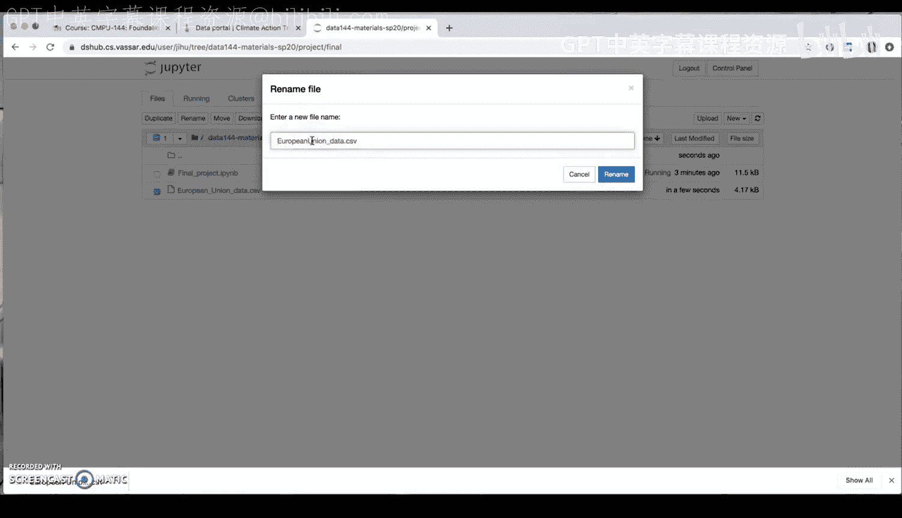
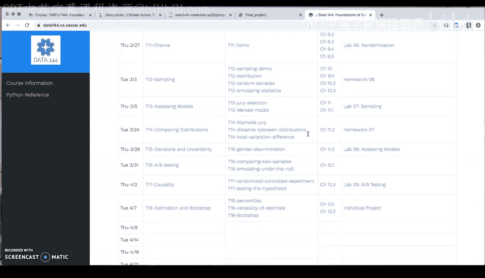
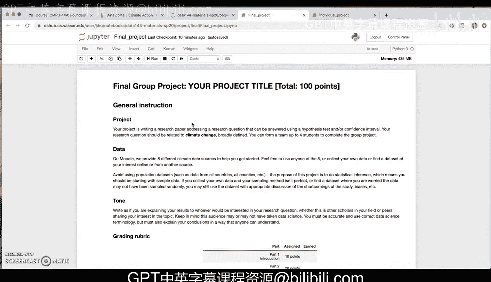

# 47：期末项目数据集下载与上传指南 📚

在本节课中，我们将学习如何为期末小组项目下载数据集，并将其上传至工作空间，以便在 Jupyter Notebook 中进行数据分析。

## 概述

期末项目需要从指定或自选的数据源获取数据。本节将演示如何从课程网站（Moodle）上提供的数据源下载 CSV 格式的数据集，并上传到您的 Jupyter Notebook 工作空间。

## 下载数据集

上一节我们介绍了项目的基本要求，本节中我们来看看如何获取数据。首先，您需要访问课程网站（Moodle）上的“气候数据源”版块。

以下是下载数据集的具体步骤：

1.  在课程网站的“气候数据源”版块中，浏览并选择一个数据源链接。例如，我们选择“排放指标数据源”。
2.  点击链接后，会跳转至数据门户网站（如“气候行动追踪器”）。
3.  在数据网站上，您通常需要选择筛选条件。例如，选择区域（如“欧盟”）、部门（如“电力”）和指标（如“人均电力活动”）。您可以根据需要选择多个指标。
4.  选择“历史数据”或您需要的场景。
5.  网站可能会生成可视化图表，但我们需要原始数据。请找到并点击下载选项。
6.  在下载格式中，请务必选择 **CSV** 文件格式进行下载。

## 上传数据集至工作空间

成功下载数据集后，下一步是将其上传到您的 Jupyter Notebook 工作空间，以便进行分析。

以下是上传数据集的具体步骤：

1.  打开您的 Jupyter Notebook 工作空间。
2.  导航到您的项目文件夹（例如 `final_project`）。
3.  点击“上传”按钮。
4.  从您的电脑中选择刚刚下载的 CSV 文件。
5.  文件上传后，建议重命名文件以消除空格或特殊字符，便于后续引用。例如，将 `European Union data.csv` 重命名为 `European_Union_data.csv`。





## 在 Jupyter Notebook 中加载数据

数据集上传完成后，就可以在 Jupyter Notebook 中加载并查看它了。




以下是在 Notebook 中加载数据的基本代码示例：

```python
# 使用 pandas 库读取 CSV 文件
import pandas as pd
my_data = pd.read_csv(‘European_Union_data.csv’)

# 查看数据的前几行
my_data.head()
```

运行代码后，您可以查看数据的结构、变量（列）以及前几行的内容。请确保您了解每个变量的含义（例如，部门、指标、国家、年份），这些信息通常可以在原始数据网站上找到。

## 重要注意事项

在您探索不同数据源时，请记住以下关键点：

*   课程网站提供了多个数据源，也鼓励您寻找自己感兴趣的其他数据源。
*   下载数据时，核心是确保获得 **CSV** 格式的文件。
*   务必记录并理解数据集中每个变量的定义、测量单位以及不同分类（如国家、场景）的含义，这将是您项目报告的重要组成部分。

## 总结



本节课中我们一起学习了期末项目数据准备的完整流程：从课程网站定位数据源、在数据门户网站筛选并下载 CSV 格式的数据集，到将数据集上传至 Jupyter 工作空间，最后使用代码加载数据。请确保理解您的数据，并随时向课程团队提问。