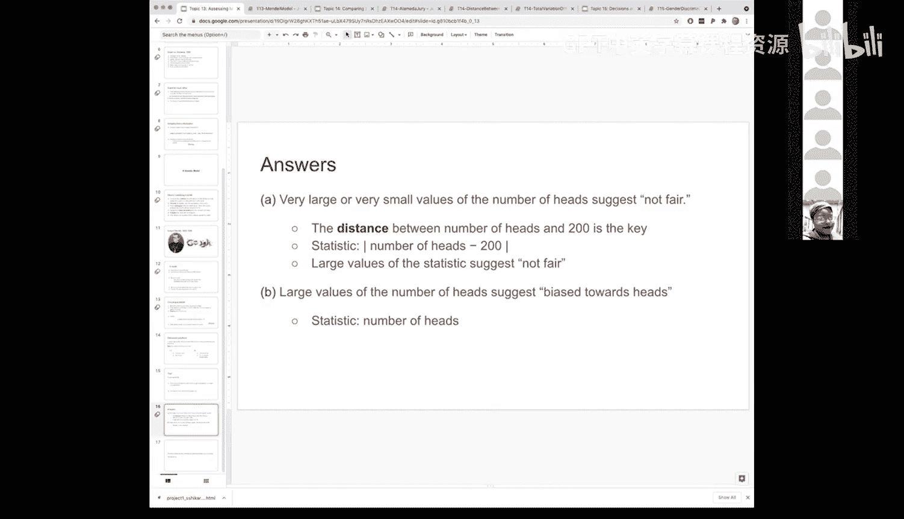

# 48：模型评估 🧪


在本节课中，我们将学习如何评估一个统计模型。我们将通过一个具体的例子——孟德尔的豌豆实验——来理解评估模型的一般框架。这个框架包括：选择一个合适的统计量，在模型假设下进行模拟，然后比较观测到的统计量与模拟结果的分布，从而判断模型是否合理。

---

## 模型评估的一般框架 📊

上一节我们介绍了模型评估的基本概念。本节中，我们来看看评估模型的具体步骤。

评估模型的核心是提出一个问题：**数据是否支持我们的特定模型？** 为了回答这个问题，我们需要遵循一个通用的框架。

以下是评估模型的三个主要步骤：

1.  **选择一个统计量**：这个统计量应能帮助我们区分模型成立与否。统计量的选择取决于具体问题。
2.  **在模型假设下进行模拟**：我们假设模型是正确的，然后通过模拟生成大量数据，并计算每次模拟的统计量值。
3.  **比较观测值与模拟分布**：将实际观测到的统计量值，与模拟得到的统计量分布进行比较。如果观测值落在分布的极端位置，则表明数据可能不支持该模型。

这个框架将适用于我们后续遇到的许多不同类型的模型。

---

## 案例分析：孟德尔的豌豆实验 🌱

现在，让我们通过一个具体例子来应用这个框架。我们将回顾格雷戈尔·孟德尔的著名实验。

孟德尔种植了许多豌豆植株，并观察其花色（紫色或白色）。他提出的模型是：**每株植物有75%的概率开紫花，25%的概率开白花**，且各植株花色独立。当时人们并不了解显性基因和隐性基因的遗传学原理。我们的目标是评估这个模型是否合理。

### 第一步：选择统计量

为了评估这个模型，我们需要选择一个能衡量数据与模型预测（75%紫花）之间差异的统计量。

一个合适的统计量是**观测到的紫花比例与75%的绝对距离**。公式如下：

**`统计量 = | 观测紫花比例 - 0.75 |`**

这个统计量衡量了观测结果偏离模型预测的程度。值越大，表明数据与模型的差异越大，即越不支持该模型。

### 第二步：进行模拟

我们假设孟德尔的模型（75%紫花）是正确的，并据此进行模拟实验。

1.  **设定参数**：孟德尔实际种植了 `n = 929` 株植物，观测到 `709` 株开紫花。因此，观测到的紫花比例为 `709 / 929 ≈ 0.763`。
2.  **模拟一次实验**：在模型假设下，一次模拟实验相当于从成功概率为 `0.75` 的二项分布中抽取 `929` 个结果，并计算紫花比例。
3.  **多次重复模拟**：我们使用“累加器模式”重复此模拟过程很多次（例如10,000次），并记录每次模拟得到的统计量值。

以下是模拟过程的核心代码逻辑：

```python
# 初始化累加器数组，用于存放每次模拟的统计量
purples = np.array([])

# 进行大量模拟
for i in np.arange(10000):
    # 模拟一次孟德尔实验，得到紫花数量
    new_purple = simulate_one_experiment()
    # 将新结果添加到累加器数组中
    purples = np.append(purples, new_purple)

# 将数组转换为表格，便于绘制直方图
simulation_table = Table().with_column('模拟紫花数', purples)
```

### 第三步：比较与结论

模拟完成后，我们得到了在“模型正确”假设下，统计量（即与75%的距离）的分布情况。

1.  **绘制分布图**：我们绘制这10,000次模拟得到的统计量的直方图。这个分布展示了仅由随机性导致的、与模型预测的典型偏离程度。
2.  **定位观测值**：计算孟德尔实际观测结果的统计量：`| 0.763 - 0.75 | = 0.013`。
3.  **做出判断**：将观测统计量 `0.013` 放在模拟分布的直方图上。我们发现它位于分布的中心区域，属于常见的偏离范围。

**结论**：由于观测到的差异在随机波动可解释的范围内，因此**模拟结果支持孟德尔的模型**。数据没有提供反对该模型的证据。

---

## 如何选择统计量？ 🤔

选择正确的统计量是评估模型的关键。统计量应能敏锐地捕捉到我们关心的备择假设（即模型可能错误的方式）。

让我们通过一个抛硬币的例子来理解这一点。假设我们抛一枚硬币400次，记录了结果。

以下是两种不同的情境及对应的统计量选择策略：

*   **情境A：检验硬币是否公平**
    *   **问题**：这枚硬币是公平的吗？
    *   **思考**：公平硬币预期出现200次正面。任何显著多于或少于200次的情况都表明不公平。
    *   **合适的统计量**：正面次数与200的**绝对距离**。
        *   **公式**：`| 正面次数 - 200 |`
        *   **解释**：该值越大，硬币越可能不公平（无论是偏向正面还是反面）。

*   **情境B：检验硬币是否偏向正面**
    *   **问题**：这枚硬币是公平的，还是偏向正面？
    *   **思考**：此时我们有一个更具体的方向性假设。如果硬币偏向正面，我们预期正面次数会**显著多于**200。
    *   **合适的统计量**：简单的**正面次数**，或者正面次数减去200（不加绝对值）。
        *   **公式**：`正面次数 - 200`
        *   **解释**：这个值如果是一个很大的正数，则支持“偏向正面”的假设；如果接近0或为负数，则不支持。

这个对比说明，**统计量的选择直接反映了我们想要回答的问题**。问题越具体，统计量的设计也应越有针对性。

---

## 总结 📝

本节课中我们一起学习了评估统计模型的核心流程。

1.  我们首先建立了一个通用框架：**选择统计量 -> 模拟 -> 比较**。
2.  接着，我们以**孟德尔豌豆实验**为例，完整实践了这一流程。我们选择了与模型预测的**距离**作为统计量，通过模拟发现观测数据符合模型的预期，从而支持了孟德尔的假设。
3.  最后，我们探讨了**如何根据具体问题选择统计量**，并通过抛硬币的例子说明，针对“是否公平”和“是否偏向正面”这两个不同问题，需要选用不同的统计量来有效区分模型。



掌握这个评估框架，是进行数据驱动决策和科学推断的重要基础。在接下来的课程中，我们将反复应用这个方法来分析各种类型的模型和数据。