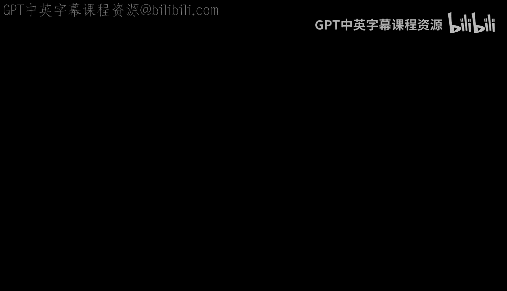
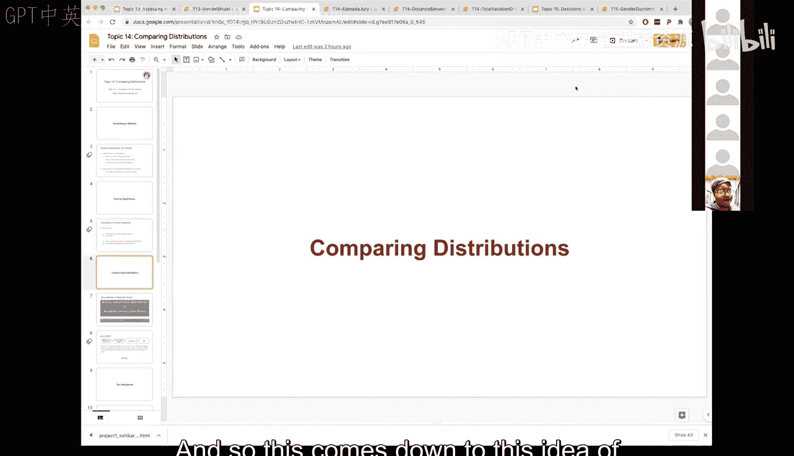
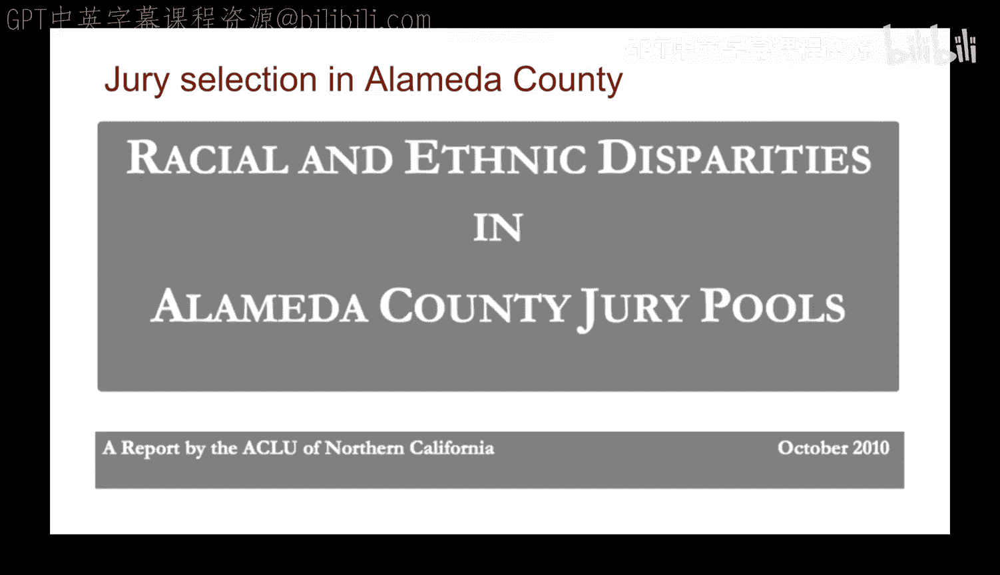
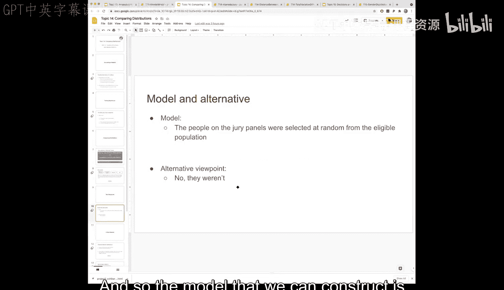
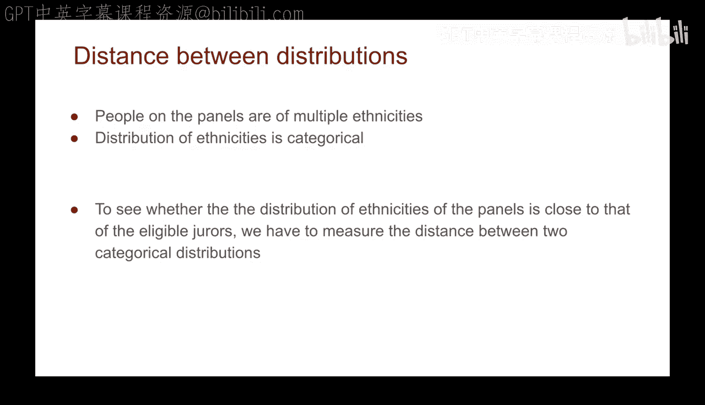
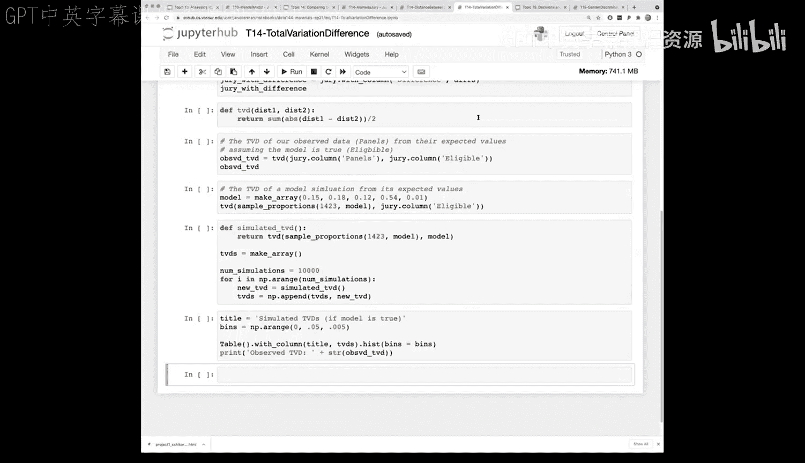
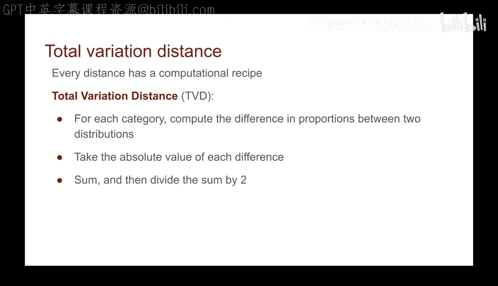
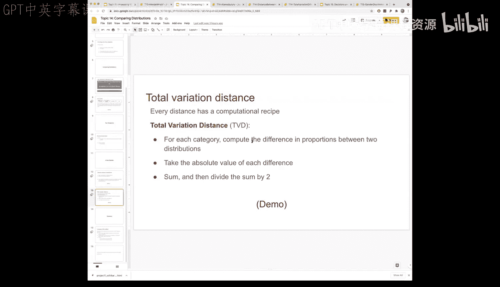
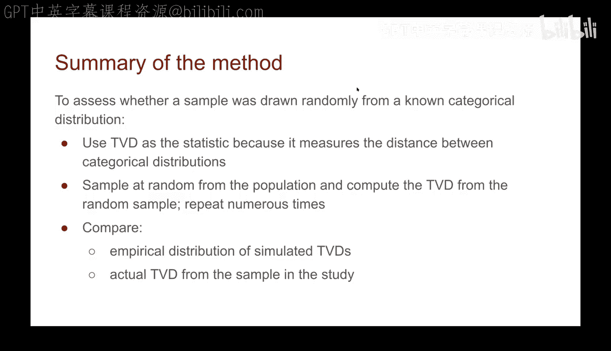
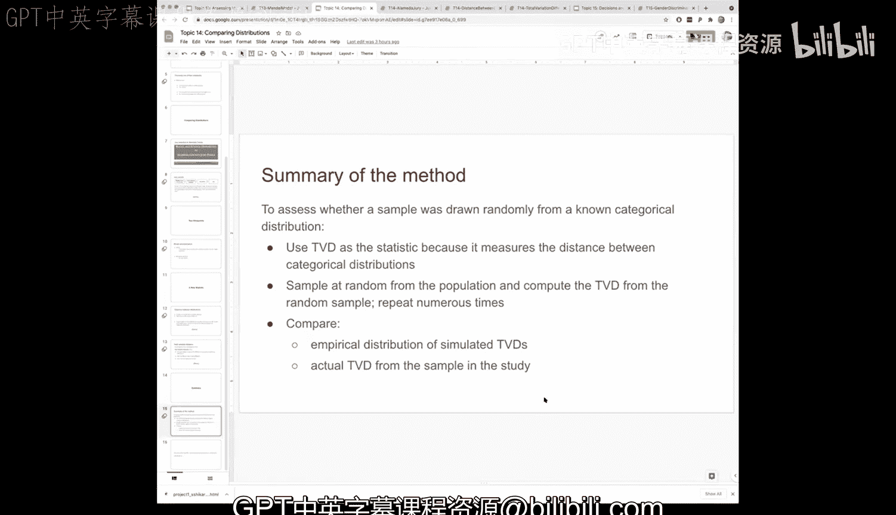

# 49：分布比较 📊



在本节课中，我们将学习如何比较两个分布。核心在于设计一个能够捕捉分布间差异的统计量，这是进行模拟检验的基础。我们将通过一个具体的例子来展开，并引入一些关键术语。

## 概述与术语 📖



上一节我们讨论了模拟的基本框架，本节中我们来看看如何将其应用于比较分布。



首先，我们明确“统计量的经验分布”这一概念。在本课程中，“经验”指的是通过模拟实验得到的结果。因此，统计量的经验分布就是基于我们大量模拟运行所产生的统计量值的分布，它本质上是一个直方图，展示了模拟中统计量各观测值出现的频率。

如果我们的模拟重复次数足够多，这个经验分布就能很好地近似统计量真实的概率分布。

## 假设检验框架 ❓

通常，我们在验证模型时会提出一个是非问题，即建立一个假设。数据本身将帮助我们进行判断。我们之前看过几个例子，运行这些模拟的目的就是帮助我们决定哪一种观点是正确的。

以下是假设的典型形式：
*   **零假设 (Null Hypothesis)**：例如，“巧克力对心脏病没有影响”。这是一种观点。
*   **备择假设 (Alternative Hypothesis)**：例如，“巧克力对心脏病有影响”。这是另一种对立的观点。

上节课我们看过的陪审团例子也是如此。我们可以问：“陪审团是从合格陪审员中随机选出的吗？”（零假设）。或者问：“不，陪审团中拥有大学学位的人太多了”（备择假设）。这归根结底就是比较分布的问题。

## 案例研究：阿拉米达县陪审团 👨‍⚖️

我们将通过一个具体案例来学习。这个例子来自美国公民自由联盟2010年的一份报告，该报告特别调查了加利福尼亚州的阿拉米达县，比较了法律规定的陪审团组成与实际发生的情况。

首先，了解阿拉米达县陪审团的遴选流程有助于理解数据：
1.  县内符合一定条件（如年龄、居住地）的居民构成“合格陪审员”池。
2.  从合格陪审员池中，会进一步组成“陪审团备选组”。
3.  律师和法官再从备选组中决定最终坐上陪审席的成员。



加州法律规定，陪审团备选组的组成应当能代表法院所在地区的人口特征。我们将使用ACLU研究中的实际数据来检验这一规定是否得到遵守。

ACLU查看了阿拉米达县的11场联邦审判，共计1453名陪审团备选组成员。他们统计了备选组成员的种族构成，并使用人口普查数据获取了该县总人口的种族构成。

以下是整理后的数据表：



| 种族     | 合格人口比例 | 观察到的备选组比例 |
| :------- | :----------- | :----------------- |
| 亚裔     | 0.15         | 0.26               |
| 黑人     | 0.18         | 0.08               |
| 拉丁裔   | 0.12         | 0.08               |
| 白人     | 0.54         | 0.54               |
| 其他     | 0.01         | 0.04               |

“合格人口比例”列代表了有资格进入陪审团备选组的人口分布。“观察到的备选组比例”列是ACLU在实际11场审判中观测到的分布。

我们想要回答的问题是：观测到的备选组分布，是否可能仅仅是随机抽样的结果？还是存在其他系统性偏差？直观地看，数据表显示某些种族的比例存在明显差异。

## 建立模型与模拟 🎲

我们可以建立如下模型：**陪审团备选组是从合格人口中随机选出的**。因此，观测到的备选组分布完全是由于随机机会造成的。备择观点则是：并非如此，存在其他因素影响。

为了检验这个模型，我们进行一次模拟实验。假设我们根据合格人口的分布（作为真实分布），随机抽取1423人（与实际观察的备选组人数相同）组成一个模拟的备选组。

通过多次运行这个模拟，我们可以得到许多个“模拟备选组”的种族分布。即使只运行一次模拟，我们也能看到模拟结果与合格人口比例接近，但与实际观测的备选组比例在某些类别上存在差异。这暗示可能不止是随机性在起作用。

## 定义统计量：总变异距离 📏





现在，我们需要一个统计量来量化两个分布之间的差异。在豌豆植物的例子中，我们比较的是单一类别（紫色花）的比例。但现在我们有多个类别（多个种族）。我们需要一个能衡量两个**分类分布**之间距离的统计量。

首先，我们计算每个种族类别上“观测比例”与“合格比例”的差值。

| 种族     | 合格比例 | 观测比例 | 差值       |
| :------- | :------- | :------- | :--------- |
| 亚裔     | 0.15     | 0.26     | **+0.11**  |
| 黑人     | 0.18     | 0.08     | **-0.10**  |
| 拉丁裔   | 0.12     | 0.08     | **-0.04**  |
| 白人     | 0.54     | 0.54     | **0.00**   |
| 其他     | 0.01     | 0.04     | **+0.03**  |

由于所有类别的比例之和必须为1，因此差值的总和必然为0（正差之和等于负差之和的绝对值）。所以，单纯求和无法衡量差异。

一个直观的想法是：考虑差值的绝对值。我们将使用**总变异距离** 作为统计量。它的计算步骤如下：
1.  计算两个分布在每个类别上的差值。
2.  取每个差值的绝对值。
3.  将所有绝对差值求和。
4.  因为绝对值求和会使实际距离被计算两次（正差和负差各贡献一次），所以将结果除以2。

**总变异距离公式**如下：
`TVD = (1/2) * sum(|分布1_i - 分布2_i|)`，其中 `i` 遍历所有类别。

以下是用Python代码描述的计算函数：
```python
def total_variation_distance(dist1, dist2):
    # 计算每个类别差值的绝对值，然后求和，最后除以2
    return sum(np.abs(dist1 - dist2)) / 2
```

对于我们观察到的数据，计算 `TVD(观测备选组，合格人口)`：
```python
observed_tvd = total_variation_distance(observed_panel_proportions, eligible_proportions)
# 结果约为 0.14
```

## 模拟与假设检验 🔬

现在，我们遵循之前的模拟检验框架：
1.  **定义统计量**：总变异距离。
2.  **建立零假设模型**：备选组是从合格人口中随机抽取的。
3.  **模拟抽样**：在零假设下，从合格人口分布中重复随机抽取1423人，模拟生成备选组。
4.  **计算模拟统计量**：对每次模拟，计算其 `TVD(模拟备选组，合格人口)`。
5.  **重复多次**：例如，重复10,000次，得到10,000个模拟TVD值，形成经验分布（直方图）。
6.  **比较**：将实际观测到的TVD (0.14) 放在这个经验分布中，看它是否属于极端值。



模拟结果显示，在“纯属随机”的零假设下，10,000次模拟得到的TVD值几乎全部小于0.04。而我们实际观测到的TVD值0.14远远超出了这个模拟分布的范围。

## 结论 📝

本节课中我们一起学习了如何比较两个分类分布。我们引入了**总变异距离** 这一统计量来量化分布间的差异，并通过阿拉米达县陪审团的案例，完整实践了模拟假设检验的流程。

核心步骤总结如下：
1.  提出关于数据生成过程的零假设（如“随机选取”）。
2.  选择一个能捕捉差异的统计量（如TVD）。
3.  在零假设下进行大量模拟实验，计算模拟统计量，构建其经验分布。
4.  将实际观测数据的统计量值与经验分布进行比较。





在陪审团案例中，观测到的TVD值在零假设下的模拟分布中是一个极端异常值。这提供了强有力的证据，表明阿拉米达县陪审团备选组的组成**不太可能**仅仅是由于随机机会造成的，从而拒绝了“随机选取”的零假设，暗示可能存在系统性的偏差。这展示了统计模拟在检验现实世界主张中的强大力量。