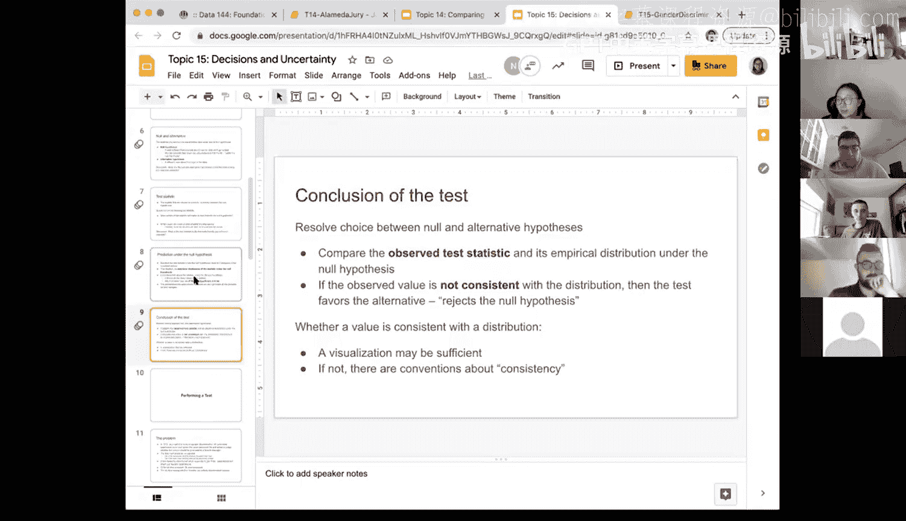

# 50：决策与不确定性

在本节课中，我们将学习如何基于模型假设进行数据模拟，并利用模拟结果来评估观测数据与模型的一致性。我们将正式介绍假设检验的术语和步骤，包括如何设定原假设与备择假设、如何选择检验统计量、如何在原假设下进行预测，以及如何根据模拟结果做出决策。

## 术语介绍

上一节我们概述了课程目标，本节中我们来看看假设检验中的核心术语。

### 假设

假设本质上是关于数据生成方式的两种不同观点。在假设检验中，我们通常设定两个假设。

*   **原假设**：通常代表“无事发生”或现状的观点。它是一个定义明确的概率模型，描述了数据是如何生成的。关键在于，我们必须能够基于这个假设来模拟数据。
*   **备择假设**：这是关于数据起源或生成方式的不同观点。它通常与研究问题相关，其具体形式取决于问题的设定。

例如，在陪审团选拔的例子中：
*   原假设是：选拔是随机的，不存在种族歧视。
*   备择假设是：选拔不是随机的，存在歧视。

在睡眠时间的例子中，如果研究问题是“人们睡眠是否充足（以8小时为充足标准）”，那么：
*   原假设是：平均睡眠时间为8小时。
*   备择假设是：平均睡眠时间少于8小时。

如果研究问题是“人们睡眠时间是否为8小时”，那么：
*   原假设是：平均睡眠时间为8小时。
*   备择假设是：平均睡眠时间不等于8小时。

### 检验统计量

在设定了假设之后，我们需要一个量化的标准来帮助我们在两者之间做出选择，这就是检验统计量。

检验统计量是我们根据数据计算出的一个数值。我们需要选择一个统计量，使得其取值能清晰地区分支持原假设和备择假设的证据。

以下是选择检验统计量时需要考虑的要点：

*   统计量的某些取值应使我们倾向于原假设。
*   统计量的另一些取值应使我们倾向于备择假设。
*   最好避免统计量的“极高”和“极低”值都支持备择假设的情况，以简化决策过程。

在阿拉米达县陪审团选拔的例子中，我们使用了**总变异距离**作为检验统计量，来衡量观测到的陪审团种族构成与假设（随机选拔）下预期构成的差异。该值越小，表明数据与原假设越一致；该值越大，则越支持备择假设。

### 在原假设下进行预测

确定了检验统计量后，下一步是在原假设为真的前提下，模拟生成大量数据，并计算相应的统计量。

这个过程会产生检验统计量的一个经验分布（通常以直方图形式展示）。这个直方图显示了如果原假设为真，检验统计量可能取哪些值，以及这些值的相对可能性。

需要记住的是：
*   这个分布是**经验分布**，基于模拟得到，是对理论抽样分布的近似。
*   它是在**原假设为真**的条件下，对统计量做出的预测。

### 做出检验结论

最后一步是将从实际数据中计算出的**观测统计量**，与上一步得到的模拟统计量分布进行比较。

决策规则如下：
*   如果观测值落在模拟分布的中心或“主体”部分，表明在原假设下，观察到当前数据是相当可能的，因此**不拒绝原假设**。
*   如果观测值落在模拟分布的极端尾部（即非常不可能出现的区域），表明数据与原假设不一致，因此**拒绝原假设**，支持备择假设。

判断“极端”与否的标准，即一致性准则，我们将在后续详细讨论。

## 假设检验步骤总结

本节课中我们一起学习了假设检验的基本框架，它包含以下四个核心步骤：

1.  **设定假设**：明确原假设（可模拟的现状）和备择假设（不同的观点）。
2.  **选择检验统计量**：选择一个能有效区分两种假设的数值量。
3.  **在原假设下进行预测**：通过模拟生成检验统计量的经验分布。
4.  **做出结论**：比较观测统计量与模拟分布，决定拒绝或不拒绝原假设。

这个流程构成了统计推断的基础，后续我们将通过具体例子来实践这些步骤。