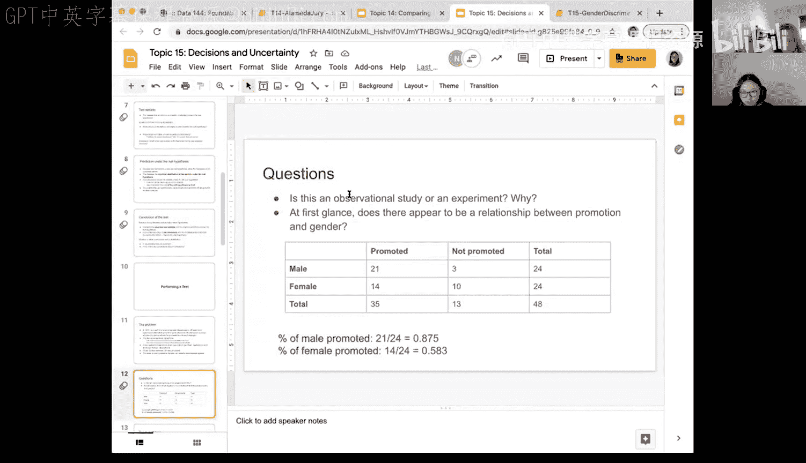
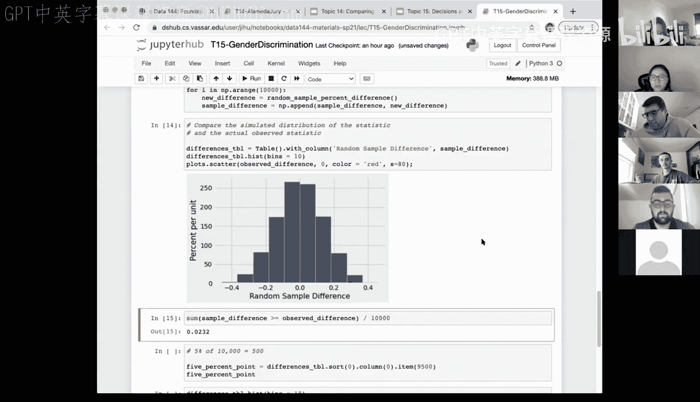

# 51：执行假设检验 🧪


在本节课中，我们将学习如何执行一个完整的假设检验。我们将通过一个关于性别歧视的经典研究案例，演示从建立假设、模拟数据到计算统计量的全过程。本节内容将重点介绍在零假设下如何通过“洗牌”来模拟数据。

## 概述

我们将分析一个1972年的研究，该研究旨在调查银行是否存在性别歧视。48位男性主管被要求根据相同的人事档案决定是否晋升候选人，唯一的区别是档案中候选人的性别。我们将基于这个数据集，检验“女性受到不公平歧视”的假设。




## 研究设计与数据

首先，我们来看研究的具体设置和数据。


这项研究共有48份人事档案。档案内容完全相同，但一半档案标注候选人为男性，另一半标注为女性。48位主管被随机分配审阅男性或女性的档案。最终，在48份档案中，有35人获得了晋升。

以下是晋升结果的交叉表：

| 性别 | 晋升 (Yes) | 未晋升 (No) | 总计 |
| :--- | :---: | :---: | :---: |
| 男性 | 21 | 3 | 24 |
| 女性 | 14 | 10 | 24 |
| 总计 | 35 | 13 | 48 |

从表中可以计算出，男性的晋升率为 **21/24 = 87.5%**，女性的晋升率为 **14/24 ≈ 58.3%**，观察到的差异约为 **29.2%**。

## 确定研究类型与初步观察

在开始检验之前，我们需要思考两个问题。

以下是关于研究类型的问题：
*   这是一个观察性研究还是实验性研究？请说明理由。

以下是关于数据关系的问题：
*   根据上表，你认为晋升与性别之间存在关系吗？为什么？

经过课堂讨论，多数观点认为这更接近一个实验性研究。因为研究者控制了除性别外的所有变量（档案内容相同），并随机分配主管审阅不同性别的档案。这种设置有助于我们推断因果关系，而不仅仅是关联性。

观察到的29.2%的差异引出了核心问题：这个差异是随机产生的（即运气不好），还是确实存在性别歧视的证据？

## 建立假设

基于上述问题，我们可以建立正式的假设。

*   **零假设 (H₀)**：不存在性别歧视。观察到的晋升率差异（约29.2%）仅是由于随机分配造成的。
*   **备择假设 (H₁)**：存在性别歧视。观察到的差异太大，不能仅用随机性来解释。

用公式表示，我们关注的是**男性与女性晋升比例的差值**：
`观察到的统计量 = P(男性晋升) - P(女性晋升) ≈ 0.292`

假设检验的第一步——建立假设——已经完成。接下来，我们需要在零假设成立的前提下模拟数据。

## 在零假设下模拟数据 🎲

这是本次检验最具挑战性的部分。零假设声称“晋升与性别无关”。那么，如何根据这个假设生成新的样本数据呢？

我们拥有的原始数据表有两列：`gender`（性别）和 `promoted`（是否晋升）。在零假设下，`promoted` 列的“是”与“否”的标签应该与 `gender` 列完全独立。

一种实现方法是 **洗牌（Shuffling）**。具体思路是：我们保持 `gender` 列不变，但将 `promoted` 列中的35个“是”和13个“否”的标签随机重新排列（即无放回抽样）。这样就得到了一个符合零假设（晋升与性别无关）的新数据集。

以下是使用Python实现洗牌的代码示例：

```python
# 假设 promotion_table 是包含 ‘gender‘ 和 ‘promoted‘ 两列的原始数据表
# 1. 从‘promoted‘列中随机抽取标签（洗牌）
shuffled_labels = promotion_table.sample(with_replacement=False).column(‘promoted‘)

# 2. 创建新表，保留原性别列，使用洗牌后的晋升标签
shuffled_table = promotion_table.with_column(‘promoted_shuffled‘, shuffled_labels)
```

运行一次上述模拟后，我们可以计算在新数据下的性别晋升率差异。这个差异可能远小于我们观察到的29.2%。

## 计算模拟统计量与P值

单次模拟的结果是随机的。为了理解零假设下统计量的分布，我们需要进行大量重复模拟。

以下是封装了单次模拟过程的函数和重复模拟的代码：

```python
def random_sample_percent_difference():
    # 洗牌晋升标签
    shuffled_labels = promotion_table.sample(with_replacement=False).column(‘promoted‘)
    shuffled_table = promotion_table.with_column(‘promoted_shuffled‘, shuffled_labels)

    # 计算洗牌后数据的交叉表及百分比
    pivoted = shuffled_table.pivot(‘promoted_shuffled‘, ‘gender‘)
    pivoted[‘percent‘] = pivoted.column(‘Yes‘) / 24  # 每组总数为24

    # 返回男性与女性的晋升率差值
    return pivoted.column(‘percent‘).item(1) - pivoted.column(‘percent‘).item(0)

# 重复模拟10000次，得到零假设下的统计量分布
differences = make_array()
for i in np.arange(10000):
    differences = np.append(differences, random_sample_percent_difference())
```

模拟完成后，我们可以绘制统计量（晋升率差异）的直方图，并将观察到的差异（29.2%）在图中标出。



**P值** 的定义是：在零假设成立的前提下，得到与观察到的统计量同样极端或更极端结果的概率。我们可以根据模拟结果近似计算P值：

```python
observed_diff = 0.291666  # 观察到的差异
p_value = np.sum(differences >= observed_diff) / 10000
```

如果P值很小（例如小于0.05），则表明观察到的结果在零假设下极不可能发生，从而成为拒绝零假设（即认为存在性别歧视）的证据。

## 总结


本节课中，我们一起学习了一个完整的假设检验流程：
1.  **理解案例与数据**：分析了一个关于性别歧视的研究设计及其数据。
2.  **建立假设**：明确了零假设（无歧视）和备择假设（有歧视）。
3.  **模拟数据**：掌握了在零假设下通过 **洗牌（Shuffling）** 技术生成模拟数据的关键步骤。这是理解“如果零假设成立，数据可能如何分布”的核心。
4.  **计算与决策**：通过多次模拟得到了统计量的经验分布，并引出了 **P值** 的概念，用于做出统计决策。


我们重点介绍了如何使用 `sample` 方法进行洗牌，以及如何使用 `pivot` 和数组操作来计算统计量。下节课我们将深入探讨P值的具体含义、如何根据P值做出决策，以及假设检验中常见的误区。