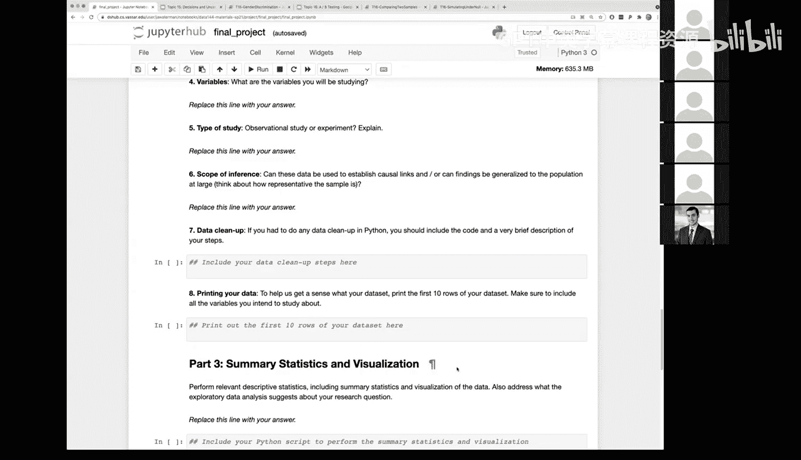

# 52：最终项目公告

在本节课中，我们将介绍本课程的最终项目安排。我们将了解项目的形式、要求、团队组建方式以及关键的时间节点。

## 项目概述与形式

本课程不设置传统的书面期末考试，而是以完成一个最终项目作为考核。项目将在一个Jupyter Notebook模板中完成，该模板会引导你完成整个数据分析流程。

## 项目主题与数据选择

本课程最初围绕气候变化主题设立，并已在Moodle上提供了一些相关的精选数据源。然而，考虑到当前COVID-19疫情对所有人的影响，我们也支持学生选择与疫情相关的项目主题。

以下是关于主题选择的说明：
*   你可以选择使用我们提供的关于气候变化的数据集。
*   如果你个人倾向于研究COVID-19疫情，我们也支持你选择相关的公开数据集进行分析。
*   你无需感到必须选择疫情主题的压力，完全可以选择继续研究气候变化。

无论选择哪个主题，项目模板都将指导你以数据科学家的方式开展工作，包括数据查看、可视化、清理、提出具体问题并进行初步分析。

## 团队组建

项目的首要任务是组建团队。班级共有21人，我们将分为7个小组，每组3人。

以下是关于团队组建的流程：
*   鼓励你们自行组队。
*   如果无法自行组队，我们可以协助进行匹配。
*   在本周日之前仍未加入任何小组的同学，将被随机分配组队。

到本周日结束时，所有小组名单将确定。

## 协作环境与工作流程

确定小组后，我们将为每个团队创建一个独立的Jupyter Hub登录账户。所有小组成员将共享该账户的密码。

这种设置解决了在个人账户间共享数据和协作编辑笔记本的难题。团队成员可以同时登录该账户进行工作。

为了避免多人同时编辑同一个笔记本文件可能产生的冲突，我们推荐以下工作流程：
1.  在团队账户中，保留一个“官方”版本的最终项目笔记本。
2.  当需要开展具体工作时，每位成员可以复制该笔记本，创建一个以自己名字命名的副本作为“草稿”空间进行独立工作。
3.  当在个人副本中完成某部分工作并测试无误后，再将相应的代码单元格复制回“官方”笔记本中。
4.  团队可以协调由一位成员负责最终的整合与编辑。

## 项目提交与展示

项目完成后，除了提交Jupyter Notebook文件，我们还需要一个简短的视频展示。

以下是关于提交的具体要求：
*   **最终提交物**：完成所有问题的Jupyter Notebook。Jupyter Notebook的优势在于其自文档化特性，你可以将实验笔记和代码结合在一起，形成一份完整的报告。
*   **视频展示**：需要录制一个5到7分钟的视频，介绍你的项目。你可以使用Zoom等工具进行录制。这是一种很好的展示工作成果、练习演讲和浓缩信息的方式。

## 时间节点与教师支持

项目的第一阶段检查点设在几周后的5月2日（星期日）。

在第一次检查点，我们主要关注以下内容：
*   确定所使用的数据源。
*   对数据进行初步可视化。
*   明确你打算围绕数据提出的核心问题。

目前阶段不要求进行深入的分析或推断。

在整个项目过程中，教授和助教乐于提供支持。我们将在实验课时间专门留出讨论环节，无论是线上还是线下，都可以用来讨论项目想法、数据方法，特别是对于选择COVID-19项目的同学，我们很乐意探讨项目的具体细节。

你也可以利用实验课时间与同学交流，确定或组建你的项目小组。

---

本节课中，我们一起学习了最终项目的整体安排。我们了解了项目采用Jupyter Notebook模板的形式，支持气候变化或COVID-19两大主题，并明确了以3人小组为单位进行协作。我们介绍了为团队提供的共享Jupyter Hub账户以及推荐的工作流程，以避免协作冲突。最后，我们明确了项目需提交Notebook文件和进行视频展示的要求，并记住了第一个检查点（5月2日）需要完成数据选定和问题定义。接下来，请开始思考你的项目方向并组建你的团队。