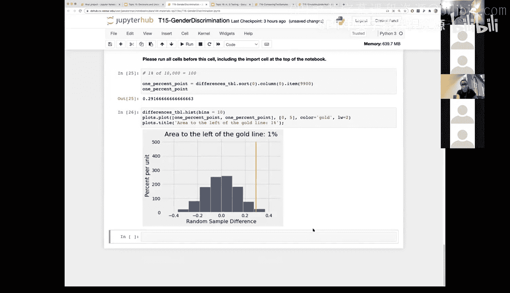

# 53：决策与不确定性 - 统计显著性 📊


在本节课中，我们将学习如何评估实验结果的统计显著性。我们将基于上一讲的内容，探讨如何通过模拟实验生成的分布来判断观察到的数据是否具有统计意义，并正式定义P值。

---

上一节我们介绍了通过模拟实验生成统计量的分布。本节中，我们来看看如何利用这个分布来判断我们的观察结果是否具有统计显著性。

当我们观察模拟实验生成的分布时，会发现根据所选统计量的不同，分布通常具有尾部特征。例如，在随机计数中，分布两侧可能都有尾部；而在使用距离度量（如计算绝对差值）时，我们通常看到的是单侧尾部分布。

我们可以利用这个尾部区域来讨论观察数据是否与我们的假设（零假设）一致。如果观察到的检验统计量落在模拟分布的尾部，即它是一个异常值，我们就说该检验统计量在零假设下是不一致的。

那么，如何定义“落在尾部”呢？通常有以下两种约定：

以下是两种常用的显著性水平约定：
*   **统计显著性**：如果观察值落在分布尾部面积小于5%的区域之外（即位于中间95%的区域），我们称结果为**统计显著**。
*   **高度统计显著性**：如果观察值落在分布尾部面积小于1%的区域之外（即位于中间99%的区域），我们称结果为**高度统计显著**。

---

现在，我们可以利用这个概念来正式定义P值。

P值的正式名称是**观察到的显著性水平**。其精确定义是：在零假设成立的前提下，检验统计量等于或比实际观察到的数据值更极端（朝着备择假设方向）的概率。

以职场性别歧视实验为例，备择假设的方向是差异值向右（更大）。因此，计算出的P值就代表了观察到的差异（或更大差异）纯粹由偶然因素导致的百分比。

---

回顾上一讲的演示，我们如何计算那个性别歧视例子中的P值呢？

在演示中，我们通过模拟得到了一个统计量（`sample_difference`数组）的分布直方图，并且我们知道实际观察到的统计量值。

以下是计算P值的步骤：
1.  我们有一个数组 `sample_difference`，它存储了所有模拟实验得到的统计量值。
2.  我们有一个常量 `observed_statistic`，代表从真实实验数据中计算出的统计量。
3.  通过比较数组中的每个值是否大于或等于观察值，我们可以得到一个布尔值（True/False）数组。
4.  在Python中，对布尔数组求和时，True会被计为1，False计为0。因此，这个和就代表了模拟结果中大于或等于观察值的次数。
5.  将这个次数除以模拟总次数（即数组长度），就得到了P值。

对应的核心计算代码如下：
```python
# 计算大于等于观察值的模拟结果数量
count_extreme = np.sum(sample_difference >= observed_statistic)
# 计算P值
p_value = count_extreme / len(sample_difference)
```
为了避免硬编码模拟次数（如10000），使用 `len(sample_difference)` 是更好的编程实践，这样即使改变模拟次数，代码也能正确运行。

在示例中，计算得到的P值约为0.0267，即2.67%。

---

那么，如何找到5%显著性水平对应的具体临界值呢？

假设我们进行了N次模拟（例如N=10000），5%的尾部意味着我们需要找到排序后数组的第95百分位数。具体方法是：

1.  首先将 `sample_difference` 数组进行排序。
2.  5%的尾部对应着最大的5%的值。因此，临界值是排序后数组中第 `(1 - 0.05) * N` 个位置的值（例如第9500个值）。

在示例中，5%的临界值计算出来约为0.2。当我们将这个临界值标记在直方图上时，可以看到观察值落在了0.2之外，即落在了5%的尾部区域内。

同样地，1%的临界值（第9900个值）计算出来约为0.29。观察值小于这个临界值，意味着它没有落在1%的尾部区域内。

因此，对于这个实验，由于观察值落在5%尾部区域内但不在1%尾部区域内，我们可以得出结论：结果具有**统计显著性**，但**不是高度统计显著**。

---



本节课中我们一起学习了统计显著性的核心概念。我们了解到，可以通过模拟实验构建零假设下的统计量分布，并通过计算P值或与预设的显著性水平（如5%、1%）临界值进行比较，来判断观察结果是否具有统计意义。P值代表了在零假设成立时，得到当前观察结果或更极端结果的概率。这一套方法为基于数据的决策提供了重要的量化依据。