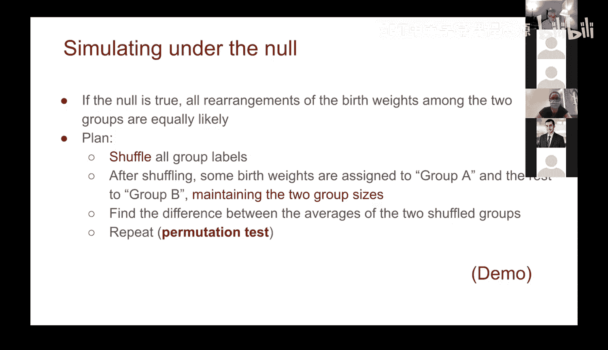

# 54：A/B测试 🧪


在本节课中，我们将学习一种名为A/B测试的重要方法，用于比较两个不同的样本组。我们将通过一个关于新生儿体重的具体案例，来理解如何判断观察到的差异是偶然发生的，还是反映了两个群体之间的真实差异。

## 概述：什么是A/B测试？ 🤔

A/B测试是一种用于比较两个样本组（通常称为A组和B组）的统计方法。公司（如谷歌）经常使用这种方法来评估不同策略或版本的效果。其核心问题是：我们从A组和B组获得的数据值，是来自同一个潜在分布（即差异仅由偶然性造成），还是来自两个不同的分布（即存在真实的群体差异）？

## 案例背景：吸烟与新生儿体重 👶

我们将使用一个关于新生儿的数据集。研究人员记录了大量新生儿的出生信息，并希望探究母亲在怀孕期间吸烟是否会影响婴儿的出生体重。因此，我们的两个样本组是：
*   **A组**：母亲在怀孕期间吸烟的婴儿。
*   **B组**：母亲在怀孕期间不吸烟的婴儿。

我们关注的核心指标是**出生体重**（单位：盎司）。

## 第一步：数据探索与可视化 📊

首先，我们需要查看数据的基本情况。我们可以使用分组功能来统计每组的人数，并绘制两组体重的分布直方图。

以下是数据探索的步骤：

1.  **分组统计**：我们按“母亲是否吸烟”这一分类列进行分组，并计算每组的样本数量。
    ```python
    # 假设 `births` 是包含‘maternal_smoker’和‘birth_weight’列的数据表
    group_counts = births.group('maternal_smoker')
    ```
    结果显示，非吸烟母亲组有715个样本，吸烟母亲组有459个样本。

2.  **绘制分布直方图**：我们可以利用直方图函数的`group`参数，一次性绘制两个组的体重分布。
    ```python
    births.hist('birth_weight', group='maternal_smoker')
    ```
    通过观察直方图，我们可以直观地看到，吸烟母亲组的婴儿体重分布似乎整体向左（较低体重）偏移。这提示我们可能存在差异，但这需要统计检验来确认。

## 第二步：建立假设与检验统计量 📈

为了进行严谨的检验，我们需要建立明确的假设。

*   **零假设 (H₀)**：母亲是否吸烟对婴儿出生体重**没有影响**。两组婴儿的体重来自同一个分布，我们观察到的任何差异都纯粹是**抽样偶然性**造成的。
    *   公式化表述：`weight_smoker` 的分布 = `weight_nonsmoker` 的分布
*   **备择假设 (H₁)**：吸烟母亲所生婴儿的平均体重**低于**非吸烟母亲所生婴儿的平均体重。

接下来，我们需要定义一个**检验统计量**来量化两组之间的差异。根据备择假设，一个合适的统计量是两组平均体重的差值。

我们定义检验统计量为：
`检验统计量 = (非吸烟组平均体重) - (吸烟组平均体重)`

**为什么这样定义？** 如果备择假设成立（吸烟组体重更轻），那么这个差值应该是一个较大的正数。因此，**较大的统计量值倾向于拒绝零假设**。

我们可以通过编程计算这个观察到的统计量：
```python
# 计算每组的平均体重
means_table = births.group('maternal_smoker', np.average)
# 提取平均值并计算差值
mean_nonsmoker = means_table.column(1).item(0) # 假设第一行是非吸烟组
mean_smoker = means_table.column(1).item(1)    # 第二行是吸烟组
observed_difference = mean_nonsmoker - mean_smoker
```
在这个案例中，计算出的`observed_difference`约为9.2盎司。但我们需要知道，这个9.2盎司的差异是否足够大，以至于不太可能仅由偶然性导致。

## 第三步：模拟零假设——排列检验 🔀

为了回答上述问题，我们在**零假设成立**的框架下进行模拟。如果零假设为真（吸烟与否不影响体重），那么“母亲是否吸烟”这个标签与婴儿体重之间就没有关联。我们可以通过**随机打乱（洗牌）** “吸烟者/非吸烟者”这个标签来模拟这种情况。

**模拟逻辑如下：**
1.  保持所有婴儿的**出生体重数据不变**。
2.  将“母亲是否吸烟”这个标签完全随机地重新分配给每个婴儿，但保持原来两组的人数不变（即715个“非吸烟”标签和459个“吸烟”标签）。
3.  计算打乱标签后新“分组”的平均体重差值。这个差值完全是在零假设下随机产生的。
4.  将步骤2和3重复很多次（例如2500次），得到在零假设下统计量的经验分布。

以下是实现一次模拟的核心代码思路：
```python
def one_simulated_difference(table, label, group_label):
    # 1. 打乱分组标签
    shuffled_labels = table.sample(with_replacement=False).column(group_label)
    # 2. 创建带有打乱标签的新表
    shuffled_table = table.with_column(‘Shuffled Label‘, shuffled_labels)
    # 3. 计算打乱标签后的统计量（使用之前定义的函数）
    return difference_of_means(shuffled_table, label, ‘Shuffled Label‘)
```

## 第四步：运行模拟并分析结果 📉

我们运行大量模拟（如2500次），将所有模拟得到的统计量值收集起来，并绘制其直方图。这个直方图展示了**在零假设为真的情况下，统计量（平均体重差）可能出现的随机波动范围**。

最后，我们将**实际观察到的统计量（9.2盎司）** 放到这个模拟分布中去看。

**结果解读：**
*   模拟产生的统计量值大多集中在-3到+3盎司之间。
*   而我们实际观察到的9.2盎司，远远超出了这个随机波动的范围，位于模拟分布的极端尾部。
*   这意味着，如果零假设成立（吸烟不影响体重），那么我们观察到如此大（9.2盎司）差异的概率是极低的（在2500次模拟中一次也未出现）。

## 总结 🎯

本节课我们一起学习了A/B测试（排列检验）的完整流程：

1.  **确定组别与问题**：明确你要比较的A组和B组，以及要检验的指标（如出生体重）。
2.  **建立假设**：设定零假设（无差异）和备择假设（有特定方向的差异）。
3.  **选择检验统计量**：定义一个能反映差异的数值（如组间均值差）。
4.  **模拟零假设**：通过随机打乱组别标签，模拟在零假设成立的世界里数据可能的样子，并多次计算模拟后的统计量。
5.  **做出决策**：将实际观察到的统计量与模拟分布进行比较。如果观察值落在模拟分布的极端位置，我们就有证据拒绝零假设，认为观察到的差异不太可能仅由偶然造成，从而支持备择假设。



在本案例中，我们得出结论：母亲怀孕期间吸烟与婴儿出生体重较低之间存在统计上显著的关联，观察到的差异不太可能仅由随机抽样导致。