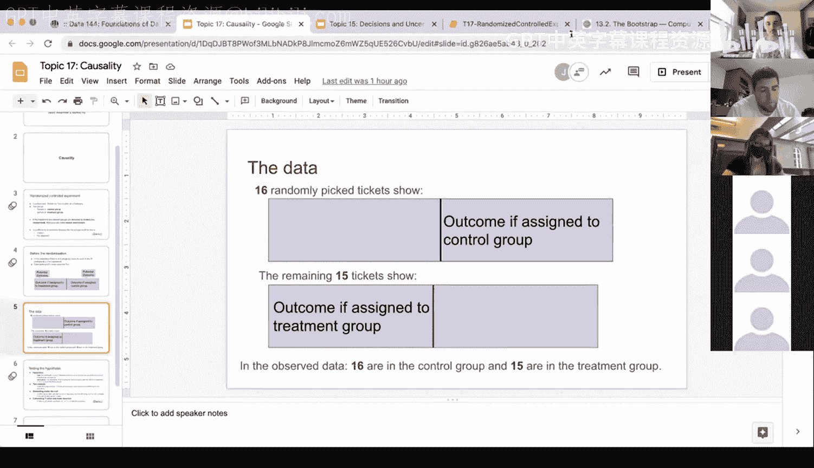
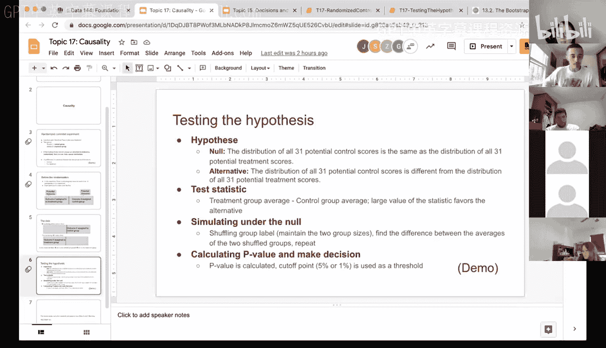

# 55：因果性与假设检验 🧪


在本节课中，我们将学习因果性推断的核心概念，并通过一个关于治疗下背痛的随机对照实验案例，完整地实践假设检验的流程。我们将从理解实验设计开始，逐步完成假设设定、检验统计量计算、模拟零假设以及最终的P值决策。

## 随机对照实验与因果性

上一节我们介绍了因果推断的基本思想，本节中我们来看看如何通过随机对照实验来建立因果结论。

随机对照实验是建立因果关系的黄金标准。在这种实验中，研究者将参与者**随机**分配到两个组：**处理组**和**控制组**。处理组接受待研究的干预（如一种新药），而控制组则不接受该干预，或接受一种安慰剂。

**核心概念**：如果两个组的参与者是通过随机分配形成的，那么实验结束后观察到的任何结果差异，只能归因于两个来源：**随机机会**（零假设）或**处理效应**（备择假设）。正是由于随机化确保了组间的可比性，我们才能做出因果推断。

## 案例：BTA治疗下背痛

现在，我们通过一个具体案例来应用上述概念。研究人员想研究BTA（肉毒杆菌毒素A）是否能有效缓解下背痛。

*   **参与者**：共有31名受试者。
*   **随机分配**：16人被随机分配到控制组，15人被分配到处理组。
*   **数据**：数据集包含两列：
    *   `group`：组别（`control` 或 `treatment`）。
    *   `result`：结果（`1` 表示疼痛有改善，`0` 表示无改善）。

我们的目标是检验BTA治疗是否有效。

### 步骤1：设定假设

首先，我们需要建立零假设和备择假设。

*   **零假设 (H₀)**：所有31名受试者潜在的“控制组结果”的分布，与所有31名受试者潜在的“处理组结果”的分布**相同**。这意味着BTA治疗无效，观察到的任何差异仅由随机分配导致。
*   **备择假设 (H₁)**：所有31名受试者潜在的“控制组结果”的分布，与所有31名受试者潜在的“处理组结果”的分布**不同**。这意味着BTA治疗有效。

### 步骤2：选择检验统计量

我们需要一个能衡量两组差异的数值。一个自然的选择是两组结果均值的差。

**公式**：检验统计量 = 处理组结果平均值 - 控制组结果平均值

在观察数据中，我们计算得到这个差值为 **0.475**。这意味着处理组的改善比例平均比控制组高0.475（或47.5个百分点）。




为了便于计算，我们可以定义一个Python函数：

```python
def difference_of_means(table, label, group_label):
    # 简化表格，只保留需要的两列
    reduced = table.select(label, group_label)
    # 按组计算均值
    means_table = reduced.group(group_label, np.average)
    # 返回处理组均值减去控制组均值
    return means_table.column(1).item(1) - means_table.column(1).item(0)

observed_diff = difference_of_means(bta_data, ‘result‘, ‘group‘)
# observed_diff 结果为 0.475
```

### 步骤3：在零假设下模拟数据

接下来，我们在零假设（即治疗无效）成立的前提下模拟数据。如果治疗无效，那么`group`标签（是控制组还是处理组）应该与`result`结果无关。因此，模拟零假设的一个好方法是**随机打乱`group`标签**，同时保持两组的人数不变（16人控制组，15人处理组）。

以下是模拟一次并计算统计量的函数：

```python
def one_simulated_diff(table, label, group_label):
    # 随机打乱组别标签
    shuffled_labels = table.sample(with_replacement=False).column(group_label)
    # 将打乱后的标签与原结果列组成新表
    shuffled_table = table.select(label).with_column(‘Shuffled Label‘, shuffled_labels)
    # 计算打乱后的组间均值差
    return difference_of_means(shuffled_table, label, ‘Shuffled Label‘)
```

然后，我们重复此过程很多次（例如10,000次），得到在零假设下检验统计量的分布。

```python
simulated_diffs = make_array()
for i in np.arange(10000):
    sim_diff = one_simulated_diff(bta_data, ‘result‘, ‘group‘)
    simulated_diffs = np.append(simulated_diffs, sim_diff)
```

### 步骤4：计算P值并做出决策

现在，我们将观察到的统计量（0.475）与模拟出的零假设分布进行比较。P值定义为：**在零假设为真的前提下，得到与观察数据同样极端或更极端结果的概率**。

在我们的案例中，因为备择假设是处理组均值更高（BTA有效），所以“更极端”指的是模拟差值大于或等于0.475的情况。

```python
p_value = np.count_nonzero(simulated_diffs >= observed_diff) / len(simulated_diffs)
# p_value 计算结果约为 0.0075
```

计算得到P值约为 **0.0075**。

**决策**：
*   通常我们使用 **5% (0.05)** 作为显著性水平阈值。
*   如果P值 < 0.05，我们拒绝零假设，认为有统计学证据支持备择假设。
*   本例中，0.0075 < 0.05，因此我们**拒绝零假设**。
*   结论：在5%的显著性水平下，有足够的统计证据表明BTA治疗对缓解下背痛有效。

## 总结

本节课中我们一起学习了如何通过随机对照实验进行因果推断。我们回顾了假设检验的完整框架：
1.  **设定假设**：明确零假设（无效应）和备择假设（有效应）。
2.  **选择统计量**：选择一个能衡量处理效应的数值（如组间均值差）。
3.  **模拟零假设**：通过随机化（如打乱组别标签）模拟在零假设成立时的数据，并计算模拟统计量的分布。
4.  **计算P值与决策**：将观察到的统计量与模拟分布比较，计算P值，并根据预先设定的显著性水平做出拒绝或不拒绝零假设的决策。




通过这个关于BTA治疗下背痛的实例，我们不仅巩固了假设检验的步骤，也深刻理解了随机化在建立因果结论中的核心作用。