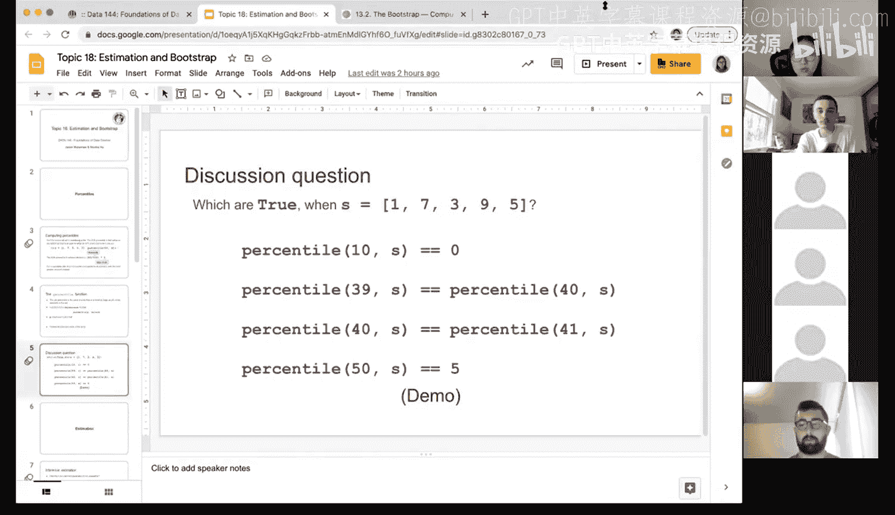
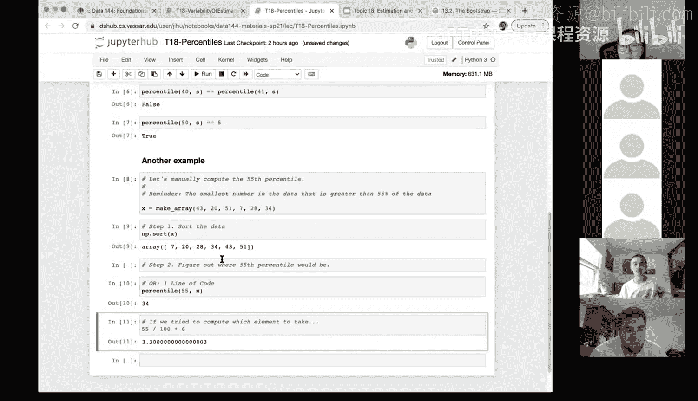

# 56：估计与自助法


在本节课中，我们将学习估计与自助法的基本概念。我们将从百分位数这一核心概念入手，理解其定义和计算方法，为后续学习如何从单一样本中生成更多样本并进行统计推断打下基础。

## 百分位数 📊

上一节我们回顾了假设检验的流程。本节中，我们来看看一个描述数据分布位置的重要工具：百分位数。百分位数用于衡量一个数值在数据集中所处的相对位置。例如，SAT成绩通常以百分位数的形式报告，它表示你的成绩超过了多少百分比的其他考生。

### 定义与计算

对于一个数值数组，其第 `p` 百分位数定义为：**将数组按升序排序后，第一个大于或等于数组中 `p%` 元素的值**。

听起来可能有些复杂，让我们通过一个例子来理解。假设我们有一个数组：`[1, 7, 3, 9, 5]`。

计算其第80百分位数的步骤如下：

1.  **排序**：首先将数组按升序排列，得到 `[1, 3, 5, 7, 9]`。
2.  **计算位置**：计算 `p%` 对应的元素数量。对于第80百分位数，计算 `80% * 5 = 4`。这意味着我们需要找到一个值，它至少大于或等于排序后数组中前4个元素。
3.  **确定百分位数**：在排序后的数组 `[1, 3, 5, 7, 9]` 中，第一个满足“至少大于或等于前4个元素”的值是第4个元素，即 **7**。因此，第80百分位数是7。

如果百分位对应的位置不是整数呢？例如，计算第70百分位数：
`70% * 5 = 3.5`。根据定义，我们需要找到第一个至少大于或等于数组中3.5个元素的值。这仍然是第4个元素，即7。

Python中可以使用 `numpy.percentile` 或 `np.percentile` 函数方便地计算百分位数。其基本语法是：
```python
np.percentile(array, p)
```
其中 `array` 是数值数组，`p` 是0到100之间的百分位数。

### 概念辨析

为了加深理解，我们通过几个判断题来辨析百分位数的概念。考虑数组 `S = [0, 1, 1, 2, 3]`。




以下是几个陈述及其判断：

1.  **第10百分位数是0。** (错误)
    *   排序后数组为 `[0, 1, 1, 2, 3]`。`10% * 5 = 0.5`。第一个至少大于或等于0.5个元素的值是第1个元素，即0。等等，这里需要仔细看：定义是“至少和p%的元素一样大”。0.5个元素意味着它需要至少和半个元素一样大？实际上，更准确的理解是：找到最小的值 `x`，使得至少有 `p%` 的数据小于或等于 `x`。对于第10百分位，`10% * 5 = 0.5`，向上取整为1，即需要至少有1个数据小于等于该值。排序后第一个满足此条件的值是 `0`（因为第一个数据0 <= 0）。所以，**这个陈述是正确的**。但根据最初“第一个至少和p%元素一样大”的解释，结果也是0。这里存在细微的理解差异，但按常见计算方式，第10百分位数确实是0。

2.  **第39百分位数与第40百分位数相同。** (正确)
    *   计算 `39% * 5 = 1.95`，`40% * 5 = 2`。两者都指向排序后数组 (`[0,1,1,2,3]`) 中索引为2（第三个）的元素。根据常用方法（线性插值），它们可能略有不同，但根据我们“取第一个满足条件的值”的规则，它们都对应第二个“1”。因此，在这个例子中，两者相同。

3.  **第40百分位数与第41百分位数相同。** (错误)
    *   `40% * 5 = 2`，指向第二个“1”（索引1，值1）。`41% * 5 = 2.05`，指向下一个元素，即“2”（索引3，值2）。因此，两者不同。

4.  **第50百分位数是2。** (错误)
    *   第50百分位数即中位数。对于数组 `[0, 1, 1, 2, 3]`，中位数是中间的值，即第三个元素“1”。因此，第50百分位数是1，不是2。

### 另一个计算示例

让我们手动计算另一个数组的百分位数以巩固理解。假设数组为：`[43, 20, 51, 7, 28, 3]`。

目标是计算第55百分位数：

1.  **排序**：升序排列为 `[3, 7, 20, 28, 43, 51]`。
2.  **计算位置**：`55% * 6 = 3.3`。
3.  **确定值**：我们需要找到排序后数组中，第一个至少大于或等于3.3个元素的值。这指向第4个元素（索引3），即 **28**。

因此，该数组的第55百分位数是28。使用Python的 `np.percentile([43,20,51,7,28,3], 55)` 会得到相同的结果。

---




本节课中我们一起学习了百分位数的概念与计算方法。我们明确了其定义，并通过实例和辨析掌握了如何确定数据集的百分位数，包括在Python中的实现。理解百分位数是进行数据描述和后续统计推断（如自助法）的重要基础。下一节，我们将利用百分位数等概念，探讨如何从单一样本出发进行估计。