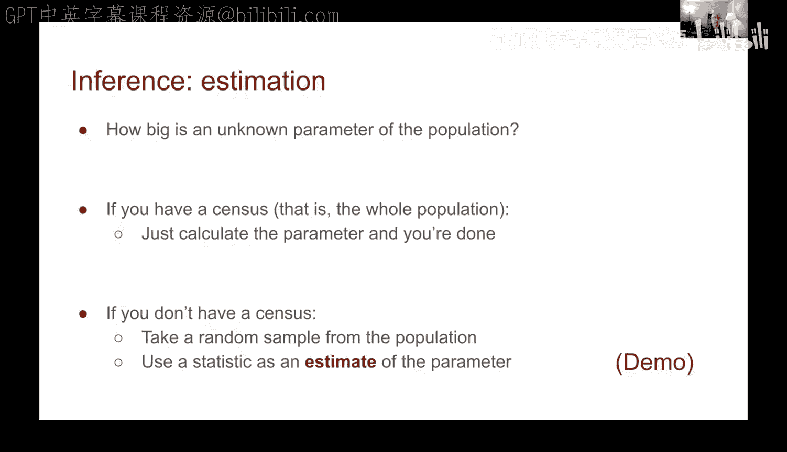
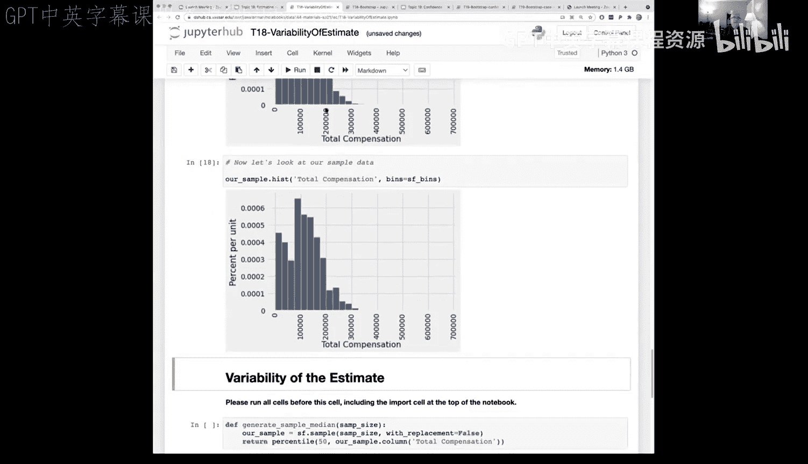
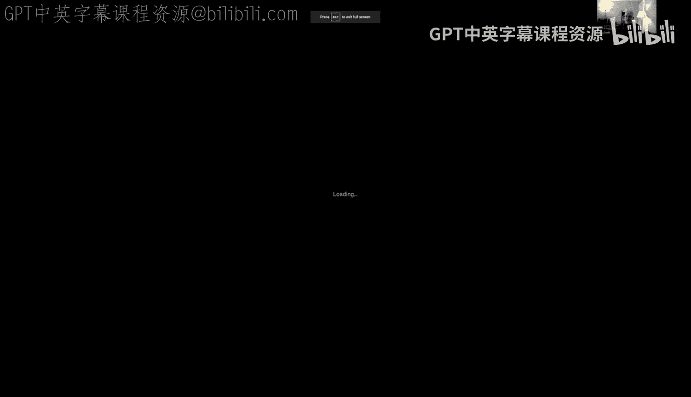
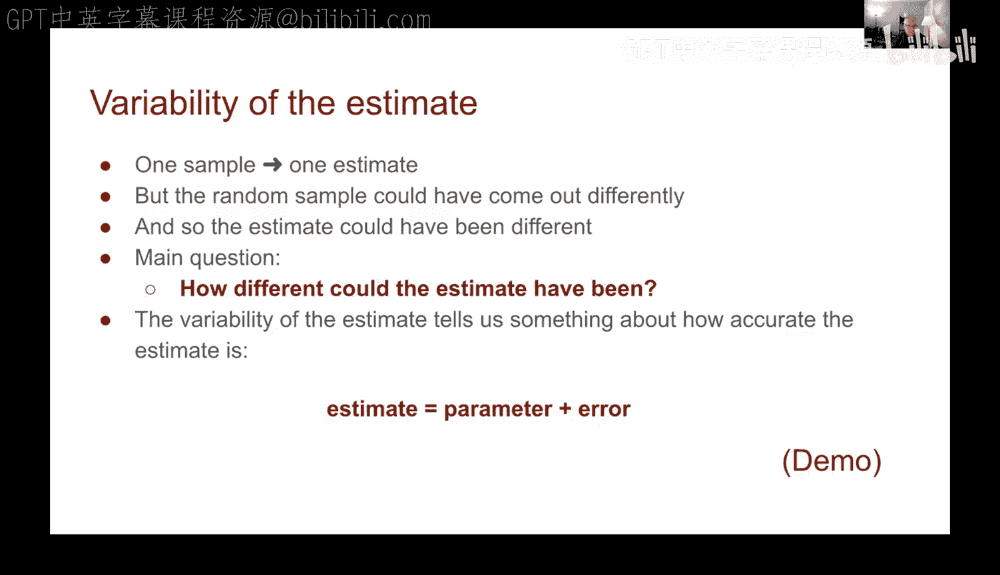
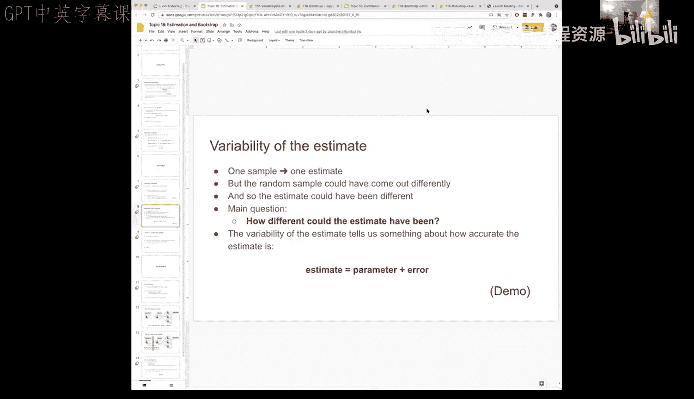
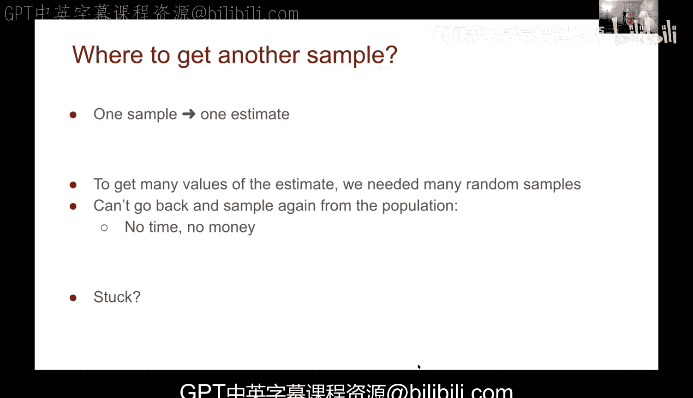

# 57：估计与自助法


在本节课中，我们将学习**估计**的概念，并初步了解一种强大的技术——**自助法**。我们将通过一个关于旧金山公共雇员薪酬的真实数据集，来理解如何仅凭一个样本对总体参数进行推断，并评估估计的变异性。

## 概述：从样本到估计



上一节我们讨论了百分位数。本节我们将在此基础上，探讨**估计**。当我们无法获取整个总体的数据时（例如进行人口普查成本过高），我们会从总体中抽取一个随机样本，并计算我们感兴趣的统计量（如中位数），以此作为总体参数的**估计值**。

## 从总体到样本

为了演示，我们使用一个包含旧金山公共雇员薪酬的完整数据集作为“总体”。这让我们可以计算真实的总体参数，并将其作为“地面实况”，用以评估我们估计方法的准确性。

首先，我们对数据进行简单清理，例如移除极低的异常薪酬。清理后，我们计算总体薪酬的**中位数**，得到“地面实况”值约为 **107,500** 美元。

```python
# 假设 `sf` 是包含‘Total Compensation’列的总体数据表
population_median = percentile(50, sf.column('Total Compensation'))
```

在实际情况中，我们通常没有总体数据。因此，我们会从总体中抽取一个随机样本。以下是抽取样本并计算样本中位数的过程：

```python
sample_size = 300
# 不放回地随机抽取样本
sample = sf.sample(sample_size, with_replacement=False)
# 计算样本统计量（中位数）
sample_median = percentile(50, sample.column('Total Compensation'))
```

运行一次后，我们得到的样本中位数（例如111,000美元）与总体中位数（107,500美元）接近但不同。这种差异是预期的，因为样本是随机的。

## 估计的变异性





我们只进行了一次抽样，得到了一个估计值。但如果我们抽取不同的随机样本，估计值可能会变化。这种变化称为估计的**变异性**，它反映了我们估计的准确性。

我们可以将估计值理解为：
**估计值 = 真实参数 + 误差**

其中，**误差 = 估计值 - 真实参数**。误差的正负可以告诉我们估计是偏高（正误差）还是偏低（负误差）。



为了理解这种变异性，理想情况下我们应该从总体中重复抽取许多样本。由于我们拥有完整的总体数据（这在现实中很罕见），我们可以通过计算来模拟这个过程：

```python
def generate_sample_median(sample_size):
    """从总体中抽取一个样本并返回其中位数"""
    sample = sf.sample(sample_size, with_replacement=False)
    return percentile(50, sample.column('Total Compensation'))

# 模拟抽取1000次样本，观察中位数的分布
medians = make_array()
for i in np.arange(1000):
    medians = np.append(medians, generate_sample_median(300))

# 将结果制成表格并绘制直方图
results = Table().with_column('Sample Median', medians)
results.hist()
# 在图上标出总体中位数（地面实况）
plt.scatter(population_median, 0, color='red', s=50);
```

运行这段代码后，我们会看到1000个样本中位数的分布近似于以总体中位数为中心的钟形曲线。这说明我们的估计方法在平均意义上是准确的，但单个估计值存在波动。

## 面临的困境与引入自助法

然而，上述模拟有一个关键问题：它要求我们**反复从总体中抽取新样本**。在现实中，每进行一次调查（抽样）都耗费时间和金钱，我们通常只有**一个样本**可用。

那么，我们如何仅凭这一个样本来估计我们统计量（如中位数）的变异性呢？我们如何知道如果重做调查，结果可能会有多大变化？

这正是**自助法**要解决的核心问题。它提供了一种巧妙的方法，可以仅从我们手头已有的单个样本中，“模拟”出重复抽样的过程。



## 总结

本节课中，我们一起学习了：
1.  **估计**的基本概念：用样本统计量推断总体参数。
2.  通过拥有完整数据的例子，我们计算了总体参数的“地面实况”，并看到了单个样本估计值与之的差异。
3.  我们探讨了估计的**变异性**，并通过重复抽样模拟展示了估计值的分布。
4.  最后，我们指出了现实中的核心困境：通常我们只有一个样本，无法负担重复抽样的成本。这为下一节将要介绍的强大工具——**自助法**——做好了铺垫。



在下一节中，我们将揭晓自助法如何利用“重抽样”的智慧，仅从一个样本中估计出统计量的变异性。