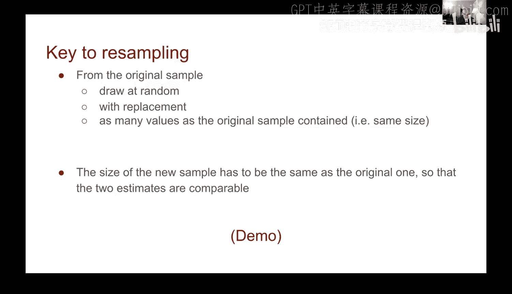
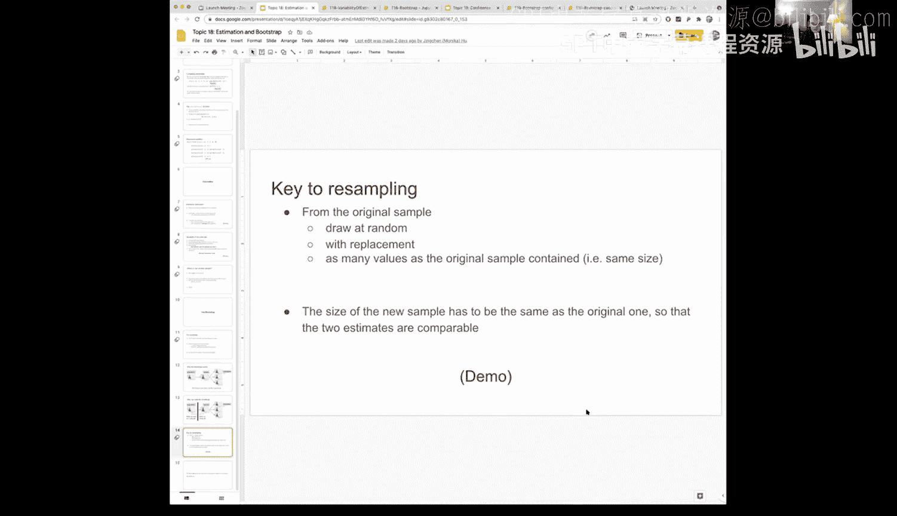

# 58：Bootstrap估计方法


## 概述
在本节课中，我们将学习一种名为Bootstrap的强大统计技术。当无法获取整个总体数据时，Bootstrap方法可以帮助我们通过单一初始样本，模拟重复抽样过程，从而估计总体参数（如中位数）的分布。我们将重点理解其核心思想、操作步骤以及如何通过代码实现。

## 从问题到解决方案
上一节我们讨论了从总体中获取多个样本以估计参数分布的困难。本节中，我们来看看Bootstrap方法如何巧妙地解决这个问题。

Bootstrap的核心思想是：如果我们有一个足够大且随机的初始样本，那么这个样本本身就可以很好地代表总体。基于此，我们可以将这个初始样本视为一个“新总体”，并从中进行重复抽样（称为“重抽样”），进而生成多个样本用于分析。

## Bootstrap的工作原理
以下是Bootstrap方法的关键步骤：

1.  **获取初始样本**：从目标总体中随机抽取一个足够大的样本。这是唯一一次直接从总体中进行的抽样。
2.  **将样本视为总体**：假设这个初始样本就是我们的“总体”。
3.  **进行重抽样**：从这个“新总体”（即初始样本）中，进行多次（例如1000次）随机抽样。每次抽样的样本量必须与初始样本相同。
4.  **计算统计量**：针对每一次重抽样得到的样本，计算我们关心的统计量（例如中位数）。
5.  **形成估计分布**：将所有重抽样计算出的统计量汇总，其分布即为我们对总体参数抽样分布的估计。



## 核心规则与概念
为了确保Bootstrap有效，必须遵循以下两条关键规则：

*   **重抽样必须来自初始样本**：所有重抽样操作都基于第一步获得的那个初始样本。
*   **必须采用“有放回”随机抽样**：这是Bootstrap与初始抽样的关键区别。初始抽样通常是无放回的，但重抽样必须有放回。

**为什么需要有放回？**
假设初始样本量为300。如果我们进行300次无放回的重抽样，最终只会得到完全相同的初始样本，无法产生任何新的变化。有放回抽样意味着每次抽取一个数据点后，会将其放回样本池中，使得它有可能被再次抽到。这样，每次重抽样虽然样本量相同，但具体的数据组合会有所不同，从而能模拟出抽样变异。

用代码表示，核心的重抽样过程如下：
```python
# 假设 `original_sample` 是我们的初始样本，`sample_size` 是其大小
bootstrap_sample = original_sample.sample(n=sample_size, replace=True)
# `replace=True` 即表示有放回抽样
```

## 案例演示：旧金山薪资数据
让我们通过一个具体的例子，将上述理论付诸实践。我们将使用旧金山市政府员工的薪资数据。

首先，我们加载并清理数据，得到总体的薪资分布（即“地面实况”）。总体薪资中位数是我们试图估计的真实参数。

接着，我们从总体中随机抽取一个样本（例如300条记录），这是我们的**初始样本**。计算该样本的中位数，它接近但通常不等于总体中位数。

现在，进入Bootstrap环节：
1.  我们将这个初始样本当作“新总体”。
2.  从这个“新总体”中进行有放回的重抽样，生成一个**Bootstrap样本**（重抽样样本）。
3.  计算这个Bootstrap样本的中位数。
4.  重复步骤2和3很多次（例如1000次），得到1000个Bootstrap中位数。

最后，我们绘制这1000个Bootstrap中位数的分布图。这个分布的中心（例如均值或中位数）为我们提供了对总体中位数的一个估计。同时，该分布的宽度也反映了我们估计的不确定性。



## 总结
本节课我们一起学习了Bootstrap估计方法。这是一种在只能获得单一样本的情况下，通过有放回地重抽样初始样本来模拟抽样分布、进而估计总体参数的强大技术。其成功的关键在于初始样本必须足够大且随机，从而能代表总体。我们明确了Bootstrap必须遵循“有放回”抽样的核心规则，并通过薪资案例演示了完整的实现流程。掌握这一框架后，你就能将其应用于各种统计量的估计问题中。