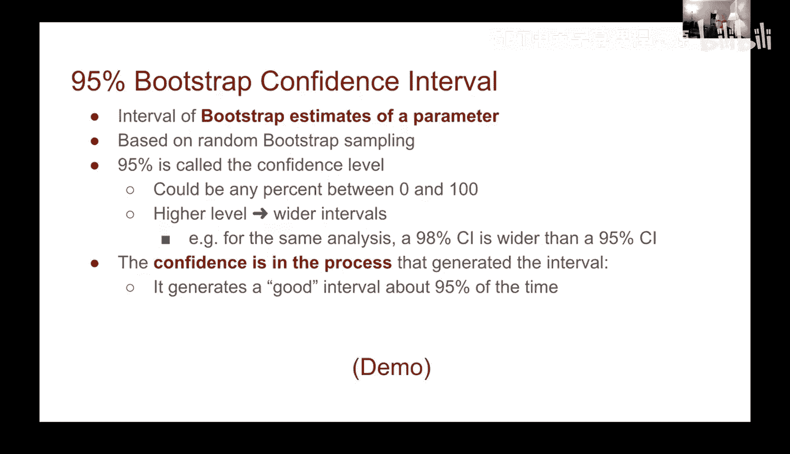
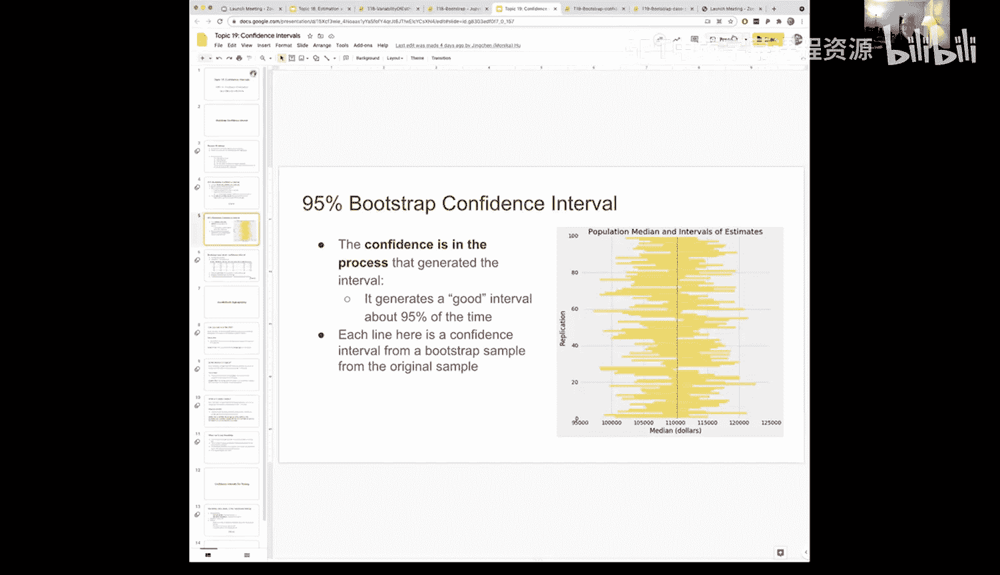
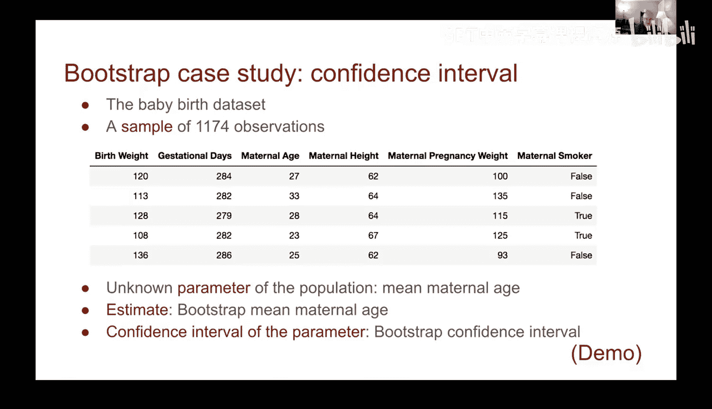
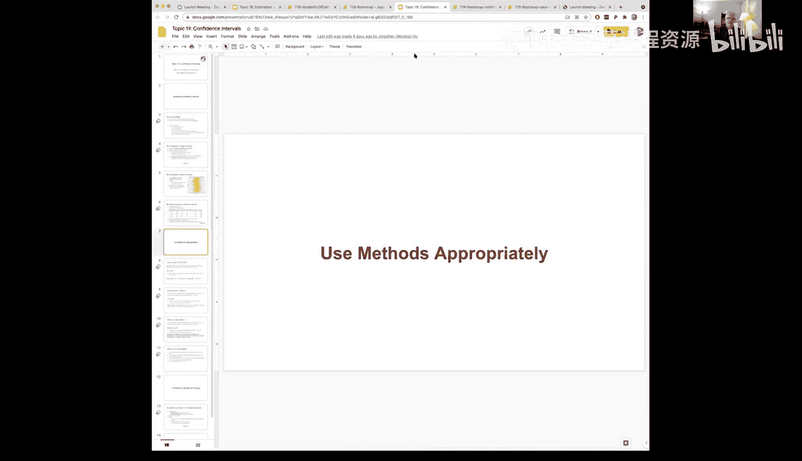
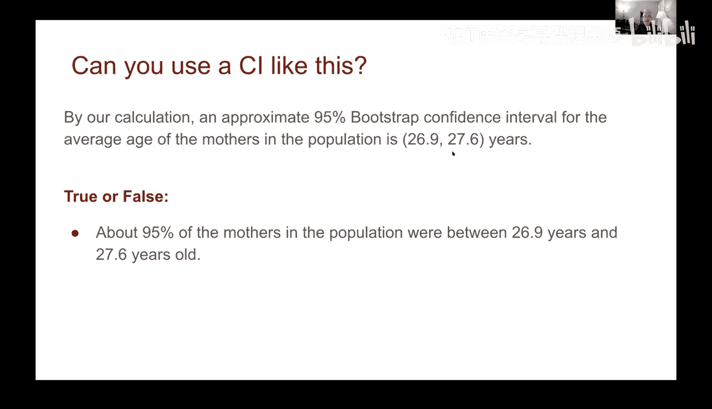
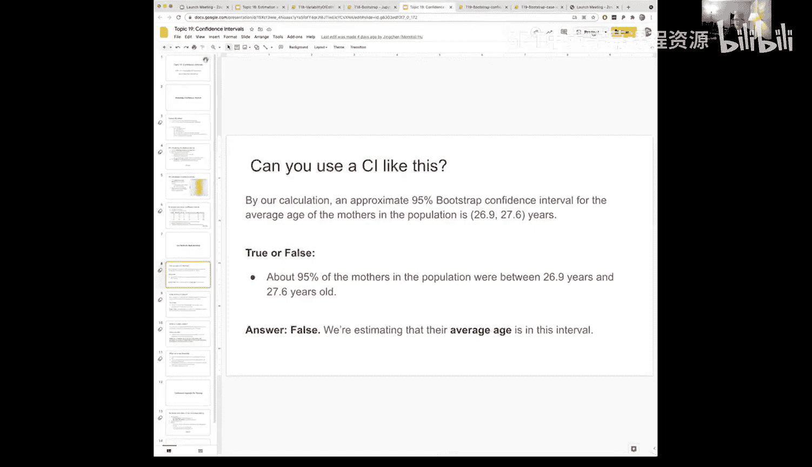
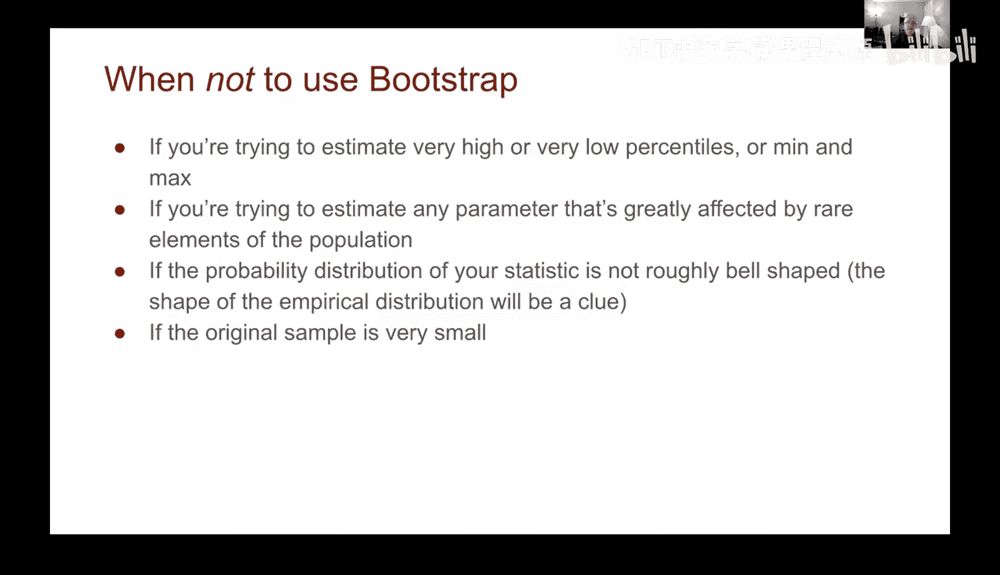
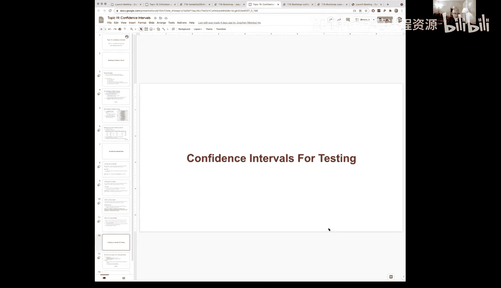

# 59：置信区间


## 概述
在本节课中，我们将要学习置信区间这一核心概念。我们将探讨如何利用自助法（Bootstrap）这一强大的重采样技术，来生成统计量的估计值，并进一步评估这些估计值的可靠性。我们将学习如何构建和解释置信区间，特别是95%自助置信区间，并通过具体的数据集示例来理解其含义和应用。

---



## 自助法回顾
上一节我们介绍了自助法这一工具。它允许我们通过重采样技术，从样本数据中生成对总体统计量的估计。

自助法的核心步骤如下：
1.  从原始样本中进行**有放回**的随机抽样。
2.  每次重采样的样本量必须与原始样本相同。
3.  重复此过程多次（例如1000次），计算每次重采样样本的统计量（如中位数、均值）。
4.  通过比较这些重采样统计量的分布，我们可以评估原始估计的变异性。

---

## 什么是置信区间？
当我们得到一个统计量的估计值后，一个很自然的问题是：这个估计值有多好？置信区间正是用来回答这个问题的工具。

与仅返回一个具体的估计值（例如 `x`）不同，置信区间返回的是一个估计范围，从某个**下限值**到某个**上限值**。这个区间的大小基于我们设定的**置信水平**。

以下是关于置信区间的几个关键点：
*   **置信水平的选择**：95%是一个常用值，但它可以是0%到100%之间的任何百分比。选择更高的置信水平（如99%）会导致更宽的区间，因为它需要“捕获”真实参数的可能性更高。
*   **区间的解释**：当我们说“95%自助置信区间”时，我们的意思是：如果我们重复进行自助重采样过程，那么由此生成的区间将有95%的概率包含真实的总体参数。
*   **对过程的信心**：95%的置信度是对**生成区间这个过程**的信心。具体来说，我们相信这个过程生成的区间，大约有95%的次数是“好”的区间（即包含真实参数）。

---



## 构建95%自助置信区间：示例
让我们通过一个具体例子来演示如何构建置信区间。我们使用旧金山市政府雇员薪资数据集，目标是估计薪资中位数。

以下是构建置信区间的步骤：

1.  **获取原始样本**：从总体中抽取一个初始样本（例如300名雇员）。
2.  **执行自助法**：以上述样本为基础，进行有放回的重采样，并计算每次重采样的中位数。将此过程重复很多次（例如1000次）。
3.  **确定区间边界**：收集这1000个自助中位数，并找到其分布的中间95%部分。这意味着我们排除两端各2.5%的极端值。
    *   左边界 = 第2.5个百分位数
    *   右边界 = 第97.5个百分位数
4.  **可视化与解释**：绘制自助中位数的直方图，并用金色条带标出置信区间。由于我们知道总体的真实中位数（用红线表示），可以验证它是否落在金色区间内。



将以上步骤整合为代码流程如下：
```python
# 1. 计算原始样本统计量
original_statistic = calculate_statistic(original_sample)

# 2. 执行多次自助重采样
bootstrap_stats = []
for i in range(1000):
    resample = original_sample.sample(with_replacement=True)
    stat = calculate_statistic(resample)
    bootstrap_stats.append(stat)

# 3. 计算置信区间边界
left = percentile(bootstrap_stats, 2.5)
right = percentile(bootstrap_stats, 97.5)
confidence_interval = (left, right)
```

通过多次运行整个“抽样 -> 自助法 -> 生成区间”的过程，我们可以验证，大约有95%生成的金色区间包含了代表真实参数的红线。这直观地展示了95%置信水平的含义。



---



## 应用于未知总体：母亲年龄案例
在现实中，我们通常无法获知总体真实值。让我们将置信区间应用到一个新数据集：婴儿出生数据，我们想知道母亲的平均年龄。



由于我们只有样本数据，没有全体母亲年龄的“地面真值”，但我们相信自助法的过程。

以下是分析步骤：
1.  **检查样本数据**：查看母亲年龄的分布，并计算样本均值（约为27岁）。
2.  **定义自助函数**：编写一个函数，对现有样本进行有放回重采样，并计算重采样样本的均值。
    ```python
    def bootstrap_mean(table):
        resample = table.sample(with_replacement=True)
        mean_age = np.mean(resample['maternal_age'])
        return mean_age
    ```
3.  **生成自助分布**：重复上述函数1000次，收集1000个自助均值。
4.  **计算置信区间**：找出这1000个均值的第2.5和第97.5百分位数，得到95%置信区间。
5.  **解释结果**：假设我们得到的区间是 `(26.89, 27.58)`。我们的结论是：基于所使用的自助法过程，我们有95%的信心认为，总体中母亲的平均年龄落在这个区间内。

---

## 澄清对置信区间的误解
理解置信区间的确切含义至关重要，以下是两个需要澄清的常见误解：

**误解一：区间包含大部分个体值**
*   **错误陈述**：“约95%的母亲年龄在26.9岁到27.6岁之间。”
*   **澄清**：置信区间是关于**总体参数（如均值）**的，而不是关于**总体中个体**的分布。我们估计的是平均年龄在这个范围，并非大多数母亲的个人年龄在此范围。

**误解二：区间描述参数的概率**
*   **错误陈述**：“总体平均年龄在26.9到27.6岁之间的概率是95%。”
*   **澄清**：总体参数（如真实平均年龄）是一个固定的未知值，没有随机性。因此，谈论“参数落在某区间的概率”是不正确的。95%的置信度描述的是**方法**：如果我们反复使用这个方法构建区间，那么这些区间中有95%会包含那个固定的真实参数。

**核心要点**：置信度是对**区间构建过程**的可靠性评估，而非对参数本身不确定性的概率陈述。

---

## 自助法的适用性与局限性
自助法功能强大，但并非万能。在以下情况中需谨慎使用或避免使用：

*   **估计极端百分位数或最值**：当目标统计量是最大值、最小值或极高/极低百分位数（如第99百分位）时，自助法效果可能不佳。因为原始样本可能无法充分捕捉分布尾部的稀有事件。
*   **参数受稀有事件强烈影响**：如果总体参数被少数极端值（“黑天鹅”事件）主导，而原始样本未能捕获这些值，那么自助法也无法准确估计。
*   **样本量过小**：自助法的前提是原始样本能较好地代表总体。如果样本量非常小，这个前提可能不成立，导致结果不可靠。
*   **自助分布形状异常**：一个实用的检查方法是观察自助统计量的分布直方图。如果分布呈近似钟形（正态），则结果通常较可靠。如果分布形状怪异、多峰或严重偏斜，则可能预示着自助法在此不适用。

---





## 总结
本节课中我们一起学习了置信区间的核心概念与应用。我们了解到，置信区间利用自助法为统计量估计提供了一个范围，并量化了估计的不确定性。关键是要记住，置信水平（如95%）反映的是我们对**区间构建过程**的信心，而非参数本身的概率。我们还探讨了如何计算和解释置信区间，并通过实例区分了正确的理解与常见的误解。最后，我们讨论了自助法的适用场景和局限性，以确保在实践中正确使用这一强大工具。