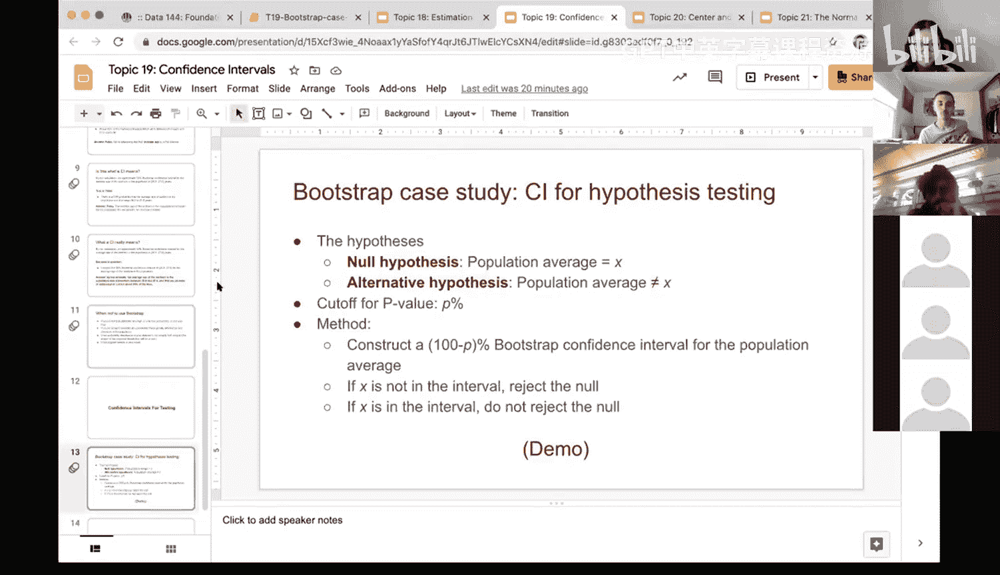

# 60：置信区间与假设检验 📊


在本节课中，我们将学习如何利用自助法构建置信区间，并进一步将其应用于假设检验。我们将通过一个关于母亲年龄的案例研究，详细讲解从数据准备、自助抽样到构建置信区间并进行决策的完整流程。

---

## 课程回顾：自助法原理 🔄

上一节我们介绍了置信区间的基本概念。本节中，我们来看看支撑置信区间计算的核心方法——自助法。

自助法在仅有一个样本的情况下非常有用。它通过从原始样本中有放回地重复随机抽样，来模拟多次抽样的过程，从而估计统计量的变异性。

在实践中，使用Python的`.sample`方法并设置`replace=True`即可实现有放回抽样。同时，每次自助样本的大小应与原始样本相同。

以下是自助法的基本步骤：
1.  从原始样本中随机抽取一个样本（有放回），大小与原始样本相同。
2.  计算该自助样本的统计量（例如均值）。
3.  重复上述过程大量次数（例如10,000次）。
4.  根据得到的统计量集合，构建其经验分布。

这个过程使我们能够基于单一样本，对总体参数（如总体均值）的不确定性进行推断。

---

## 置信区间的构建与理解 📈

理解了自助法后，我们来看看如何用它构建置信区间，并正确理解置信区间的含义。

一个95%的自助法置信区间，是从大量自助样本统计量（例如10,000个均值）中，取出中间95%的数值范围所构成的区间。具体来说，我们首先将所有自助统计量从小到大排序，然后找到第2.5百分位数和第97.5百分位数，这两个值之间的范围就是95%置信区间。

在Python中，我们可以使用`np.percentile`函数轻松计算这些百分位数。

关于置信区间，有几个关键点需要理解：
*   **置信水平**：可以选择95%、99%等。置信水平越高，区间宽度通常越大。
*   **区间含义**：一个95%置信区间并不意味着总体参数有95%的概率落在这个区间内。它的正确解释是：如果我们用相同的方法重复多次抽样并计算置信区间，那么大约有95%的区间会包含真实的总体参数。
*   **与假设检验的联系**：置信区间可以转化为假设检验的工具。例如，95%置信区间对应着5%的显著性水平。

---

## 案例研究：使用置信区间进行假设检验 🧪

现在，我们将理论应用于实践。本节将通过一个具体的案例，展示如何使用自助法置信区间进行假设检验。

我们将使用一个关于新生儿的数据集，探究母亲的平均年龄。我们的零假设是：总体中母亲的平均年龄等于某个特定值（例如30岁）；备择假设是：不等于该值。

传统的假设检验使用P值。现在我们引入使用置信区间的新方法。具体步骤如下：
1.  确定假设检验的显著性水平（例如 α = 0.05）。
2.  构建一个 (1 - α) × 100% 的自助法置信区间（例如，α=0.05对应95%置信区间）。
3.  做出决策：如果零假设中要检验的值**不在**置信区间内，则拒绝零假设；如果**在**区间内，则不拒绝零假设。

其原理是：如果零假设为真，那么观测到的统计量（或要检验的值）有很大概率会落在基于数据构建的置信区间内。如果它落在区间外，则表明在零假设下观察到如此极端数据的概率很低，从而提供了拒绝零假设的证据。

---

## Python实现：从数据到决策 💻

让我们在Python中实现上述过程。我们将使用`baby`数据集中的母亲年龄(`maternal_age`)数据。

首先，我们定义一个通用的函数来获取一次自助抽样的均值。这个函数设计得较为通用，可以适用于不同的数据集和列。

```python
def one_bootstrap_mean(data_table, column_label):
    """
    从给定的数据表中，对指定列进行一次自助抽样并返回其均值。
    参数:
        data_table: 数据表（DataFrame）。
        column_label: 需要计算均值的数值型列名（字符串）。
    返回:
        一次自助样本的均值。
    """
    resample = data_table.sample(frac=1, replace=True) # 有放回抽样，保持原样本大小
    resample_values = resample[column_label].values
    return np.mean(resample_values)
```

接下来，我们进行大量重复抽样，计算每个自助样本的均值，并存储起来。

```python
# 设置重复次数
num_repetitions = 10000

# 初始化一个空数组来存储自助均值
bootstrap_means = np.array([])

# 循环进行自助抽样
for i in np.arange(num_repetitions):
    new_mean = one_bootstrap_mean(births, ‘maternal_age‘)
    bootstrap_means = np.append(bootstrap_means, new_mean)
```

然后，我们基于这10,000个自助均值计算95%置信区间。

```python
# 计算置信区间的左右边界（中间95%）
left = np.percentile(bootstrap_means, 2.5)
right = np.percentile(bootstrap_means, 97.5)

# 输出结果
sample_mean = np.mean(births[‘maternal_age‘])
print(f"原始样本均值: {sample_mean:.4f}")
print(f"95% 自助法置信区间: [{left:.2f}, {right:.2f}]")
```

假设我们的零假设是：总体母亲平均年龄为30岁。决策过程非常简单：

```python
# 要检验的值
hypothesized_value = 30

# 做出决策
if hypothesized_value < left or hypothesized_value > right:
    print(f"{hypothesized_value} 不在置信区间内。拒绝零假设。")
else:
    print(f"{hypothesized_value} 在置信区间内。不拒绝零假设。")
```

由于30远高于我们计算出的置信区间（大约在[26.9, 27.6]之间），因此我们拒绝“总体母亲平均年龄为30岁”的零假设。

如果我们使用更严格的99%置信区间（对应α=0.01），区间会变得更宽，但30很可能仍然不在区间内，结论依然是拒绝零假设。

---

## 总结 ✨

本节课中我们一起学习了：
1.  **自助法回顾**：作为从单一样本推断总体不确定性的核心方法。
2.  **置信区间构建**：如何利用自助法统计量的百分位数来构建置信区间，并理解了其频率学派的解释。
3.  **假设检验新视角**：学习了如何将置信区间作为假设检验的工具。通过比较零假设下的值与置信区间的关系，可以做出统计决策。
4.  **完整案例实现**：在Python中从头到尾实现了一次完整的基于自助法置信区间的假设检验流程。




这种方法为假设检验提供了一个直观的、基于区间的视角，与传统P值方法相辅相成，增强了统计推断的可解释性。