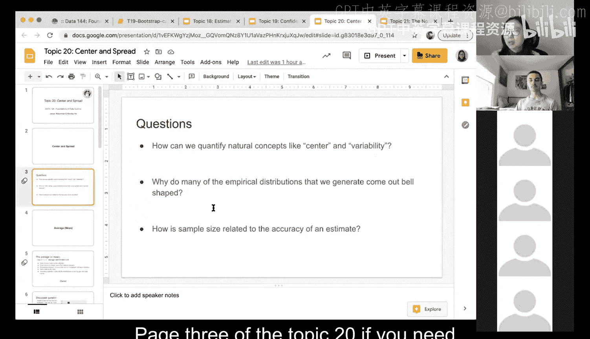
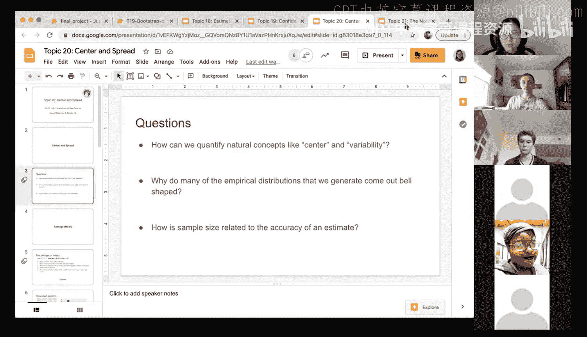

# 61：中心与离散度 📊

在本节课中，我们将学习如何量化数据分布的两个核心概念：中心与离散度。我们将探讨衡量这两个概念的不同方法，并理解在何种情况下应选择何种度量方式。

---

上一节我们介绍了本节课的主题。本节中，我们来看看如何量化“中心”这一概念。

中心描述的是数据分布的典型值或中间点。以下是几种常用的中心度量方法：

*   **均值**：即平均值，是所有数据点的总和除以数据点的数量。其公式为：
    `均值 = (数据点1 + 数据点2 + ... + 数据点n) / n`
*   **中位数**：将数据集按大小排序后，位于正中间的那个值。如果数据点数量为偶数，则中位数是中间两个数的平均值。

选择使用均值还是中位数，取决于数据的具体分布。均值对极端值（异常值）敏感，而中位数则更具稳健性。

---

在了解了中心之后，我们接下来看看如何量化“离散度”。

离散度描述的是数据点的变异程度或分散情况。以下是几种常用的离散度度量方法：

*   **极差**：数据集中的最大值与最小值之差。公式为：
    `极差 = 最大值 - 最小值`
*   **方差**：衡量每个数据点与均值之间距离的平方的平均值。公式为：
    `方差 = Σ(每个数据点 - 均值)² / (n-1)`
*   **标准差**：方差的平方根，其单位与原始数据相同，更易于解释。公式为：
    `标准差 = √方差`

与中心度量类似，选择哪种离散度度量也需考虑数据特性和分析目标。

---

我们之前观察到，通过重复抽样（如自助法）得到的统计量（如均值）的**经验分布**，常常呈现钟形（即近似正态分布）。这与原始样本数据本身的分布形状无关。即使原始数据分布很奇怪，其统计量的抽样分布在样本量足够大时，也倾向于呈现钟形。这是一个重要的统计现象，我们将在后续课程中深入探讨。

---

最后，我们来讨论样本量与估计准确性的关系。

显然，样本量越大，基于样本计算的统计量（如样本均值）对总体参数的估计通常就越准确。然而，这种关系并非简单的线性增长。样本量与估计准确性（通常用标准误来衡量）之间存在数学关系：随着样本量n的增加，估计的变异性（标准误）会以`1/√n`的速率减小。这意味着，初期增加样本量能显著提升精度，但达到一定程度后，收益会递减。

---

本节课中，我们一起学习了量化数据分布的中心与离散度的主要方法，包括均值、中位数、极差、方差和标准差。我们讨论了如何根据数据特点选择合适的度量，并初步探讨了统计量的经验分布常呈钟形的原因，以及样本量对估计准确性的影响。理解这些概念是进行更高级统计推断（如假设检验）的重要基础。