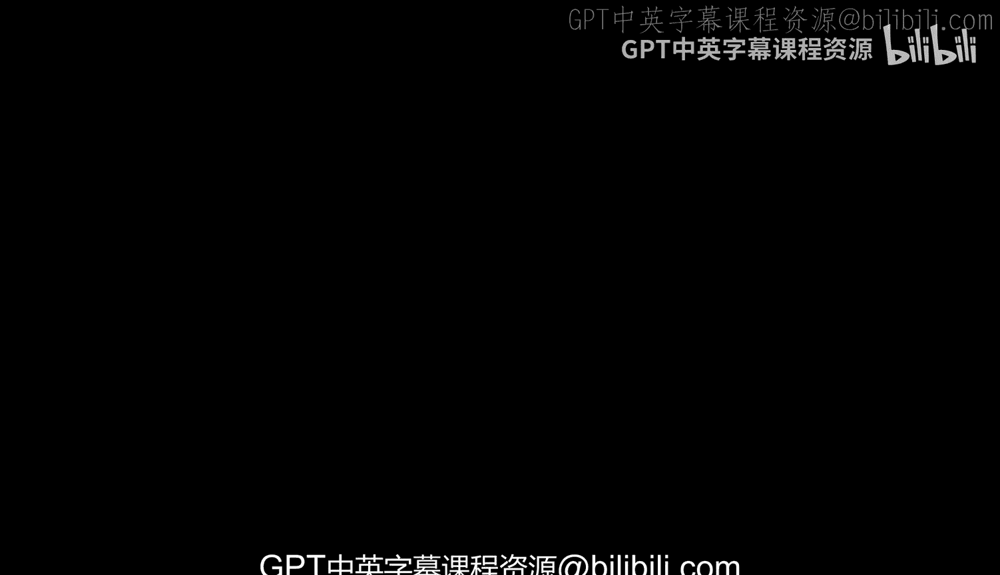
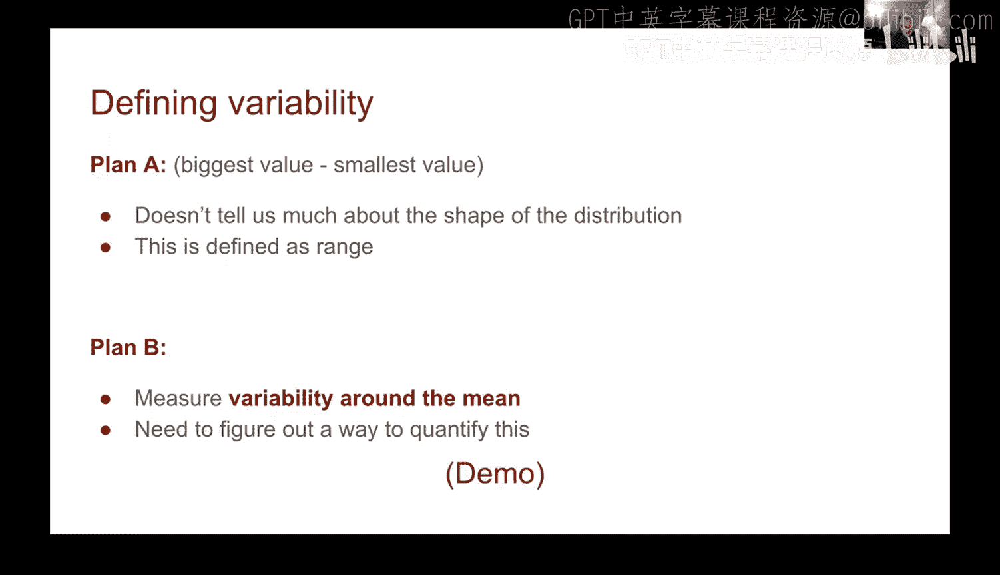
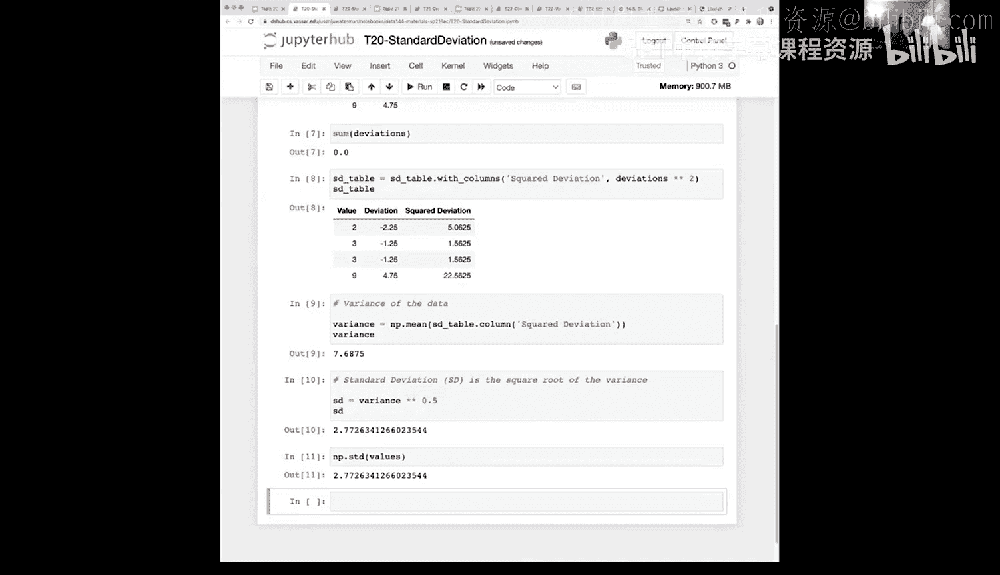
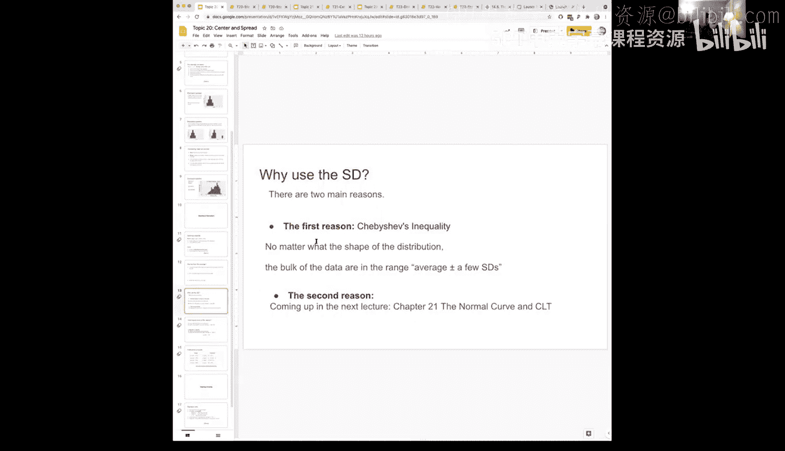
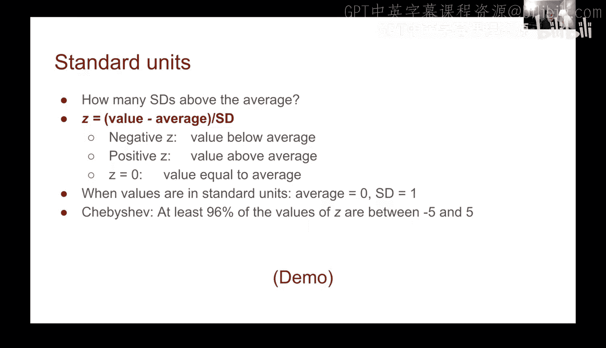
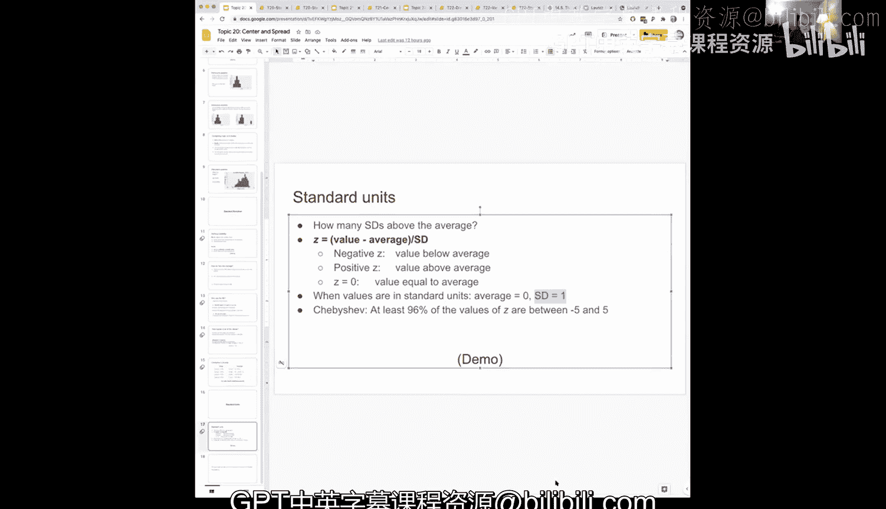

# 64：数据中心与离散度 📊



在本节课中，我们将要学习如何量化数据的离散程度。我们将回顾均值、方差和标准差的概念，并引入一个强大的工具——标准单位，它能帮助我们以统一的方式比较不同数据集。



## 回顾：均值与离散度

上一节我们介绍了均值，它是数据集的平均值，计算公式为：

**均值 = 数据总和 / 数据个数**

然而，仅知道数据的中心位置是不够的。我们还需要了解数据围绕这个中心是如何分布的，即数据的离散度或变异性。离散度衡量的是数据点距离均值有多远。

## 量化离散度：从偏差到方差

为了量化离散度，一个自然的想法是计算每个数据点与均值的差值，即偏差。

**偏差 = 数据点值 - 均值**

以下是计算偏差的步骤：
1.  计算数据集的均值。
2.  用每个数据点的值减去均值，得到该点的偏差。

但如果我们把所有偏差加起来，其总和总是为零，因为正负偏差会相互抵消。因此，偏差的总和不是一个好的离散度度量指标。

为了解决正负抵消的问题，我们可以对偏差进行平方。平方后的偏差全部变为非负数，并且距离均值越远的点，其平方偏差的权重越大。




**平方偏差 = (数据点值 - 均值)²**



接着，我们可以计算这些平方偏差的平均值，这个平均值就称为方差。

**方差 = 所有平方偏差的总和 / 数据个数**

方差有效地衡量了数据整体的离散程度。数值越大，说明数据点越分散。

## 标准差：回到原始单位

由于方差是平方后的结果，它的单位是原始数据单位的平方。为了使离散度度量与原始数据单位一致，我们对方差开平方根，得到标准差。

**标准差 = √方差**

标准差是数据分析中最常用的离散度度量。它保留了方差的特性，同时单位与原始数据一致，便于解释。

在Python的NumPy库中，我们可以直接计算标准差：

```python
import numpy as np
data = np.array([...]) # 你的数据
std_dev = np.std(data)
```

## 切比雪夫不等式：标准差为何重要

我们之所以如此重视标准差，一个关键原因是切比雪夫不等式。

无论数据的分布形状如何（对称、偏斜等），切比雪夫不等式都给出了一个强有力的保证：大部分数据都落在距离均值若干个标准差的范围内。

具体来说，对于任意大于1的数z，至少有 **(1 - 1/z²)** 比例的数据落在 **(均值 - z × 标准差， 均值 + z × 标准差)** 这个区间内。

以下是几个常见的z值对应的比例下限：
*   当 z = 2 时，至少有 1 - 1/4 = 75% 的数据落在均值±2个标准差内。
*   当 z = 3 时，至少有 1 - 1/9 ≈ 88.9% 的数据落在均值±3个标准差内。
*   当 z = 5 时，至少有 1 - 1/25 = 96% 的数据落在均值±5个标准差内。

这是一个保守的下界。对于许多分布（如正态分布），实际落在该区间内的数据比例远高于此下限。

## 标准单位：统一比较的标尺



基于切比雪夫不等式，我们经常希望用“距离均值多少个标准差”来描述数据点的位置。这引出了标准单位的概念。

将一个数据值转换为标准单位的公式是：

**标准单位值 = (数据值 - 均值) / 标准差**

这个转换过程称为标准化。

以下是标准单位的一些关键特性：
1.  **中心为0**：转换后数据集的均值变为0。
2.  **尺度为1**：转换后数据集的标准差变为1。
3.  **无量纲**：它表示该数据点位于均值以上或以下多少个标准差。
    *   正值表示高于均值。
    *   负值表示低于均值。
    *   0表示等于均值。

## 实战演示：将年龄数据转换为标准单位

让我们通过一个例子来实践。假设我们有一个包含母亲年龄的数据集。

首先，我们定义一个将数组转换为标准单位的辅助函数：

```python
def standard_units(array):
    """将数组转换为标准单位。"""
    return (array - np.mean(array)) / np.std(array)
```

然后，对原始年龄数据应用这个函数：

```python
maternal_age_std = standard_units(maternal_age_array)
```

转换后，我们验证新数据集的均值接近0，标准差为1。绘制直方图会发现，数据的形状没有改变，但坐标轴的含义变了：横轴现在表示距离均值多少个标准差。

在标准单位的直方图中，均值0就是分布的平衡点。我们可以清晰地看到，例如，大部分数据都落在-2到+2个标准差的范围内，这与切比雪夫不等式给出的下界（z=2时至少75%）是相符的，并且实际比例通常更高。

## 总结

本节课中我们一起学习了量化数据离散度的核心方法。
1.  **方差**和**标准差**是衡量数据围绕均值分散程度的关键指标。
2.  **切比雪夫不等式**揭示了标准差的重要性，它保证了对任何分布，大部分数据都集中在均值附近若干个标准差的范围内。
3.  **标准单位**通过公式 `(值 - 均值)/标准差` 将数据标准化，使得不同数据集之间可以进行比较，并让我们能够直观地以“标准差个数”来理解数据点的位置。



掌握这些概念，是理解更复杂的数据分布和统计推断的基础。