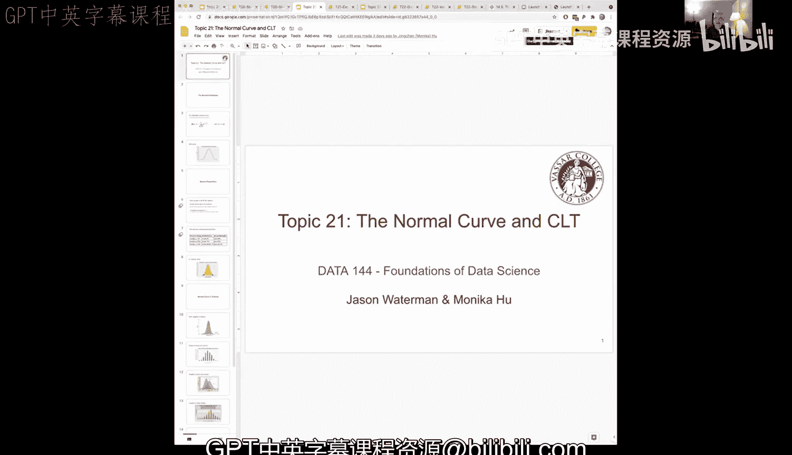
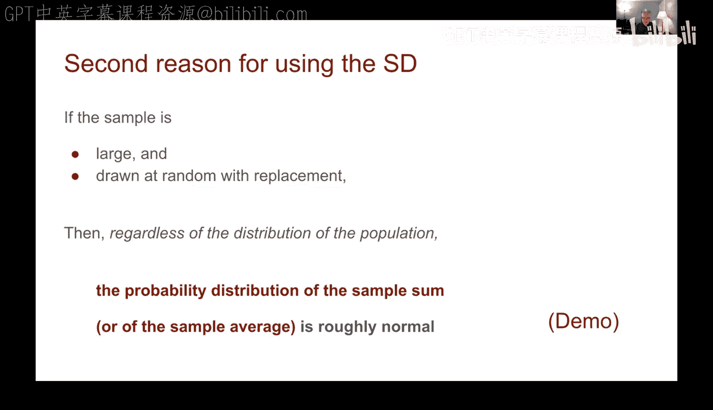
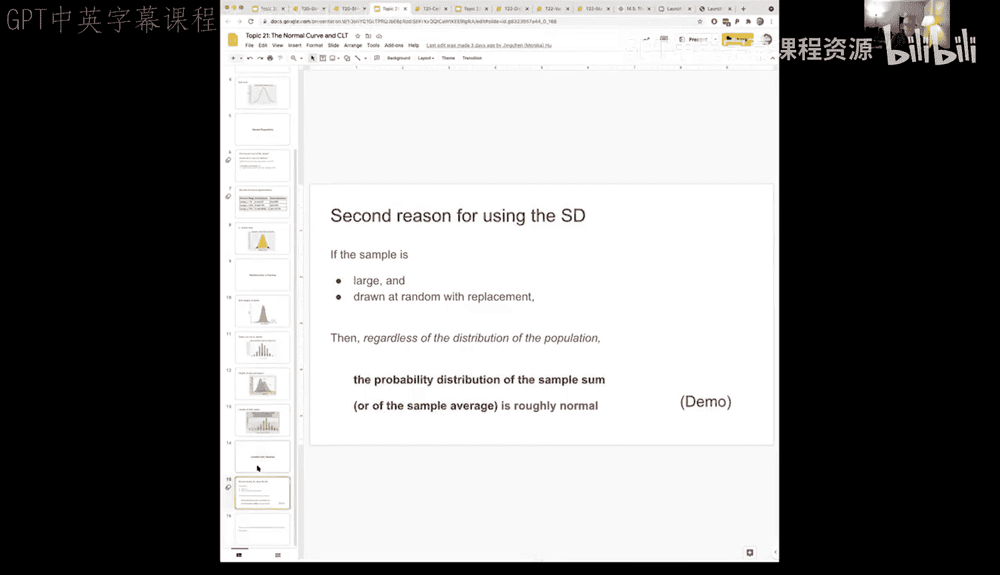

# 65：正态曲线与中心极限定理 📊




在本节课中，我们将要学习两个核心概念：**正态分布**（或称钟形曲线）和**中心极限定理**。它们是统计学和数据科学中理解数据分布和进行推断的基石。我们将通过直观的解释和实际演示来理解它们的重要性。

## 正态分布 🛎️

正态分布，通常被称为“钟形曲线”，是统计学中最重要的一种概率分布。它由以下公式定义：

\[
f(x) = \frac{1}{\sigma\sqrt{2\pi}} e^{-\frac{1}{2}\left(\frac{x-\mu}{\sigma}\right)^2}
\]

其中，\(\mu\) 是均值，\(\sigma\) 是标准差。虽然这个公式看起来很复杂，但好消息是，我们通常不需要直接使用它进行计算，而是利用其性质。

正态曲线具有几个关键特性：
*   **对称性**：曲线关于其均值 \(\mu\) 对称。
*   **中心位置**：曲线的峰值（即众数）位于均值 \(\mu\) 处。
*   **面积总和为1**：曲线下的总面积代表所有可能性的总和，等于1。
*   **标准差决定形状**：标准差 \(\sigma\) 的大小决定了曲线的“胖瘦”。\(\sigma\) 越大，曲线越扁平；\(\sigma\) 越小，曲线越陡峭。

在标准正态分布中，均值 \(\mu = 0\)，标准差 \(\sigma = 1\)。下图展示了标准正态曲线，x轴的单位是“标准单位”（即距离均值有多少个标准差）。


## 正态分布的特殊性：精确的百分比范围 📏

正态分布之所以强大，是因为一旦我们知道数据服从正态分布，就可以对数据落在特定范围内的比例做出非常精确的断言，这比切比雪夫不等式给出的界限要紧密得多。

以下是正态分布中数据落在不同标准差范围内的精确比例：
*   大约 **68%** 的数据落在均值 ±1 个标准差（\(\mu \pm 1\sigma\)）的范围内。
*   大约 **95%** 的数据落在均值 ±2 个标准差（\(\mu \pm 2\sigma\)）的范围内。
*   大约 **99.7%** 的数据落在均值 ±3 个标准差（\(\mu \pm 3\sigma\)）的范围内。




相比之下，切比雪夫不等式对于任何分布（无论形状如何）只保证至少有 \(1 - 1/k^2\) 的数据落在均值 ±k 个标准差内。例如，当 k=2 时，它只保证至少有 75% 的数据在范围内，而正态分布告诉我们有 95%。因此，正态性假设能让我们做出更强、更精确的推断。

## 中心极限定理：正态性的来源 🔄

上一节我们介绍了正态分布的性质，你可能会问：我们如何知道数据是正态的呢？中心极限定理（CLT）为此提供了答案，它是统计学中最重要的定理之一。

**中心极限定理**指出：无论原始总体的分布形状如何（可以是偏斜的、双峰的等），只要我们从该总体中**随机抽取足够大的样本**（通常样本量 n ≥ 30 即可），并计算这些样本的**平均值**（或总和），那么这些样本平均值的分布将近似服从**正态分布**。

这个定理的关键点在于：
1.  **样本平均值分布的正态性**：即使原始数据不是正态的，其样本平均值的分布也会是正态的。
2.  **分布的中心**：这个正态分布的中心（均值）等于原始总体的均值 \(\mu\)。
3.  **分布的变异性**：这个正态分布的标准差（称为**标准误差**）等于总体标准差 \(\sigma\) 除以样本量的平方根：\(\sigma / \sqrt{n}\)。

## 中心极限定理的演示 ✨

让我们通过一个实际例子来观察中心极限定理的作用。我们使用航班延误时间的数据集。原始数据（总体）的分布如下图所示，它明显右偏，并非正态分布。


总体平均延误时间约为 16.6 分钟，标准差约为 40 分钟。现在，我们进行以下模拟实验：

1.  编写一个函数，从总体中随机抽取一个大小为 `sample_size` 的样本，并计算该样本的平均延误时间。
    ```python
    def one_sample_mean(sample_size):
        sample = population.sample(sample_size, replace=False)
        return sample[‘delay’].mean()
    ```
2.  我们将这个抽样过程重复 10,000 次，每次抽取 100 个航班（`sample_size = 100`），得到 10,000 个样本平均值。
3.  绘制这 10,000 个样本平均值的直方图。

**结果**：尽管原始总体分布是偏斜的，但这 10,000 个样本平均值的分布形状却非常接近**正态分布**，并且其中心大约就在总体均值 16.6 分钟附近。这完美地验证了中心极限定理。

## 样本量对分布的影响 📈

中心极限定理告诉我们，样本平均值的分布是正态的，并且其标准差（标准误差）为 \(\sigma / \sqrt{n}\)。这意味着样本量 `n` 的大小会直接影响这个分布的“胖瘦”。

为了直观理解，我们保持模拟次数（10,000次）不变，但改变每次抽取的样本量 `n`：
*   当 `n = 100` 时，样本平均值的分布有一定宽度。
*   当 `n = 400` 时，分布明显变窄，样本平均值更紧密地聚集在总体均值周围。
*   当 `n = 900` 时，分布进一步变窄，但变窄的幅度相比从100到400时有所减小。



这个演示带来了两个重要启示：
1.  **样本量增加，变异性降低**：随着样本量 `n` 增大，样本平均值分布的方差（或标准差）会减小，我们对总体均值的估计会变得更精确。
2.  **存在收益递减**：样本量增加的收益并非线性的。从100增加到400带来的精度提升，可能比从400增加到900更大。精度提升与 \(\sqrt{n}\) 成反比。

## 总结 🎯

本节课中我们一起学习了：
1.  **正态分布（钟形曲线）**：一种对称的、具有特定数学性质的分布，自然界和许多数据集中常见。它允许我们对数据范围做出精确的概率陈述（如95%的数据落在均值±2个标准差内）。
2.  **中心极限定理（CLT）**：统计学中的核心定理。它指出，无论总体分布如何，**大样本的样本平均值的分布总是近似正态的**，且其均值等于总体均值，标准差（标准误差）为 \(\sigma / \sqrt{n}\)。
3.  **实际意义**：CLT 为统计推断（如构建置信区间和进行假设检验）奠定了理论基础。它解释了为什么我们经常能在数据分析中看到正态分布，并说明了增加样本量可以提高估计的精确度。

理解这两个概念，是进行更高级数据挖掘和统计分析的必备基础。


