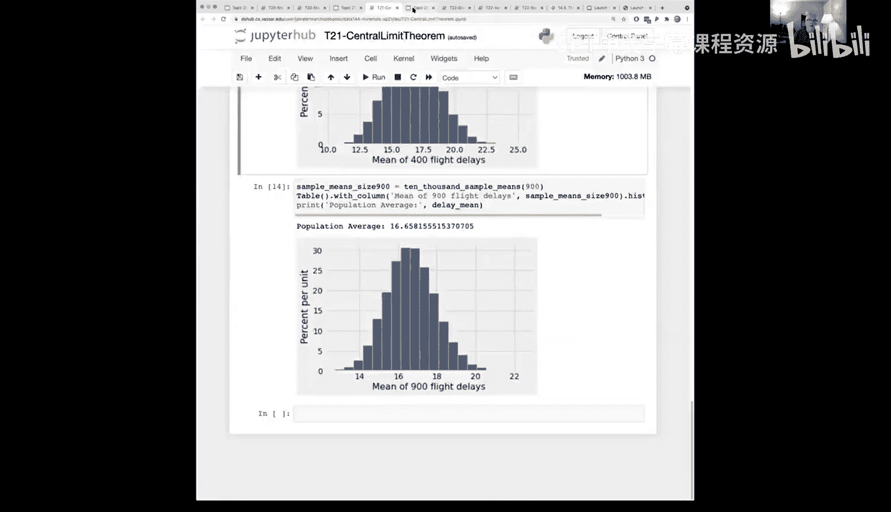
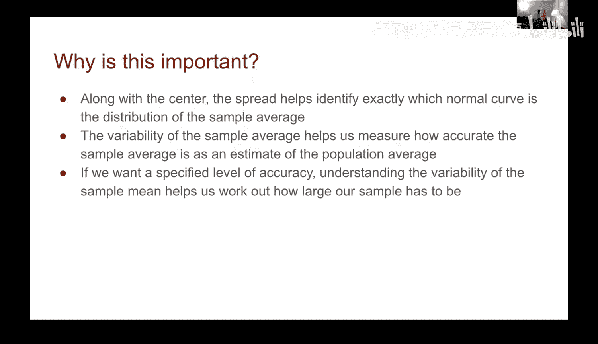
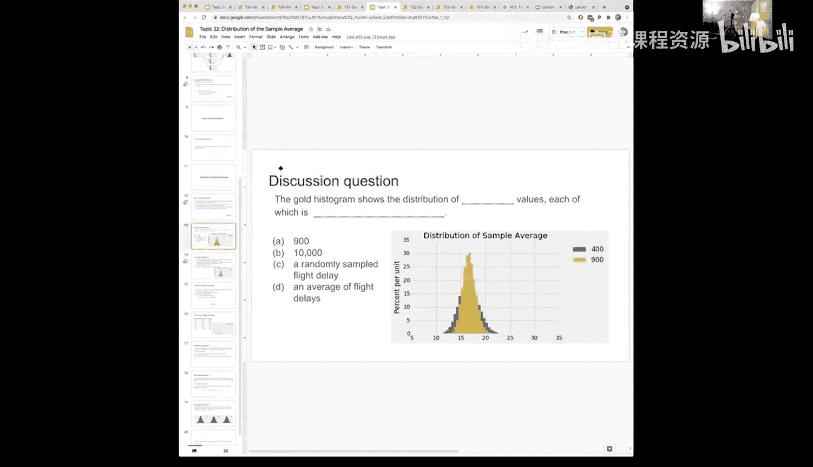
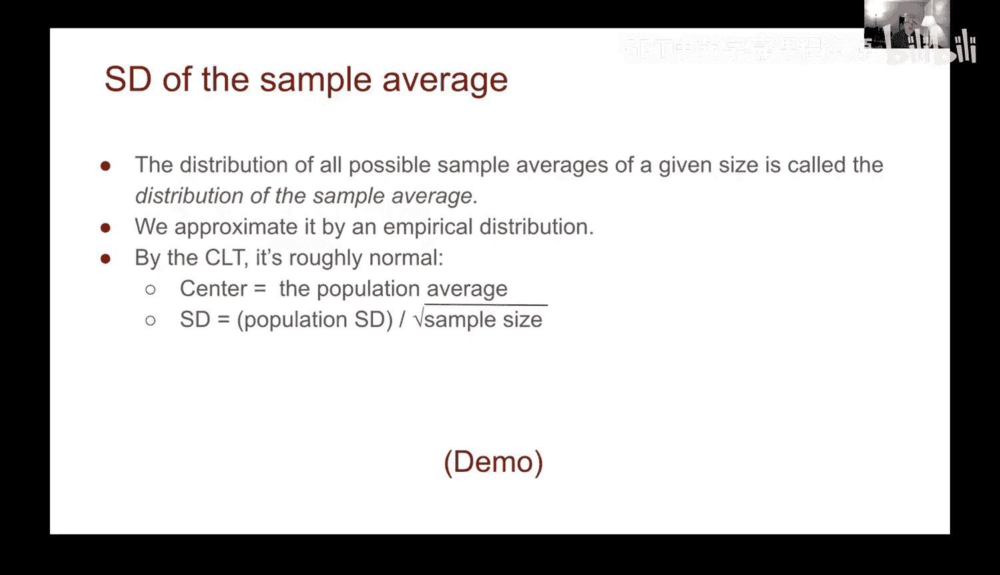
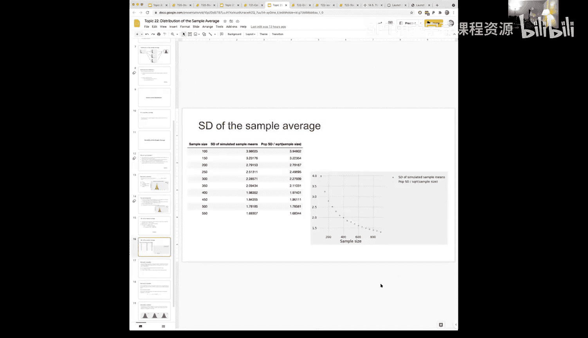

# 66：样本均值的分布 📊

在本节课中，我们将要学习样本均值的分布。我们将探讨为什么样本均值会形成一个分布，这个分布的中心和变异性意味着什么，以及样本大小如何影响我们估计的准确性。理解这些概念对于进行可靠的数据分析和解读统计结果至关重要。

## 为什么样本均值会有分布？ 🤔

上一节我们介绍了中心极限定理，本节中我们来看看样本均值分布的具体含义。

当我们从一个总体中随机抽取一个样本时，会计算出一个样本均值。然而，这个样本均值只是众多可能结果中的一个。如果我们抽取另一个不同的随机样本，可能会得到一个不同的样本均值。因此，样本均值本身是一个随机变量。

以下是理解样本均值分布的关键点：
*   **总体与样本**：我们通常无法测量整个总体，只能通过样本来估计总体参数。
*   **所有可能的样本**：理论上，我们可以考虑从总体中抽取所有可能的大小为 `n` 的样本。
*   **每个样本一个均值**：每一个可能的样本都会计算出一个样本均值。
*   **分布的形成**：所有这些可能的样本均值构成的集合，就形成了**样本均值的分布**。

在实践中，我们无法获取所有可能的样本。但是，我们可以通过重复抽样（例如进行10,000次试验）来近似这个分布，并观察其形状。

## 分布的中心与变异性 🎯

样本均值的分布有两个关键特征：中心（均值）和变异性（标准差）。

### 分布的中心

样本均值分布的中心就是总体均值。这意味着，如果我们取无数个样本并计算它们的均值，这些均值的平均值将等于总体均值 `μ`。用公式表示，样本均值 `x̄` 的期望值等于总体均值 `μ`：
`E(x̄) = μ`

这个性质使得样本均值成为总体均值的**无偏估计**。我们计算出的单个样本均值 `x̄`，就是我们对未知总体均值 `μ` 的最佳猜测。

### 分布的变异性

变异性描述了样本均值分布的分散程度，它由**样本均值的标准差**来衡量，通常称为**标准误差**。

标准误差的公式揭示了其与总体变异性和样本大小的关系：
`SE = σ / √n`
其中：
*   `σ` 是**总体标准差**。
*   `n` 是**样本大小**。

这个公式非常重要，它告诉我们：
1.  **总体变异性 (`σ`)**：如果总体本身的波动很大（`σ` 大），那么样本均值的波动也会很大，估计起来更困难。
2.  **样本大小 (`n`)**：增加样本大小可以减小标准误差。但请注意，减小速度与 `√n` 成正比，而非 `n` 本身。这意味着，要想将误差减半，样本大小需要增加到原来的四倍。

标准误差 (`SE`) 直接关系到我们估计的**准确性**。`SE` 越小，意味着不同样本得到的均值彼此越接近，我们对用单个样本均值 `x̄` 来估计 `μ` 就越有信心。

## 样本大小与估计精度 📈

现在，我们通过一个航班延误数据的例子，直观地看看样本大小如何影响估计的精度。

我们模拟了不同样本大小（如100， 400， 900）下的抽样过程，并观察样本均值分布的变化。

以下是模拟结果的核心观察：
*   当样本大小 `n = 100` 时，样本均值分布的标准差大约是总体标准差的 **1/10**。
*   当样本大小 `n = 400` 时，样本均值分布的标准差大约是总体标准差的 **1/20**。
*   当样本大小 `n = 900` 时，样本均值分布的标准差大约是总体标准差的 **1/30**。

这些比率并非巧合。它们精确地遵循标准误差的公式 `σ / √n`：
*   对于 `n=100`，`√100 = 10`，所以 `SE ≈ σ / 10`。
*   对于 `n=400`，`√400 = 20`，所以 `SE ≈ σ / 20`。
*   对于 `n=900`，`√900 = 30`，所以 `SE ≈ σ / 30`。

通过绘制不同样本大小下实际模拟的标准差（蓝色点）与理论公式计算的标准误差（金色线），可以发现两者几乎完全重合。这验证了公式的有效性，并清晰地展示：随着样本大小 `n` 增加，样本均值分布的变异性（标准误差 `SE`）不断减小，我们的估计也就越来越精确。

## 总结 🎓

本节课中我们一起学习了样本均值分布的核心概念。

我们了解到，由于随机抽样的缘故，样本均值本身是一个随机变量，它拥有自己的分布。这个分布的中心是总体均值 `μ`，其变异性由标准误差 `SE = σ / √n` 衡量。标准误差公式表明，估计的精度同时取决于总体内在的变异性 (`σ`) 和我们收集的样本大小 (`n`)。增加样本大小可以有效提高估计的精度，但其收益遵循平方根法则。

理解样本均值的分布、其中心、变异性以及与样本大小的关系，是进行统计推断、构建置信区间和解读民意调查中“误差范围”的基石。在接下来的课程中，我们将利用这些工具来量化估计的不确定性。