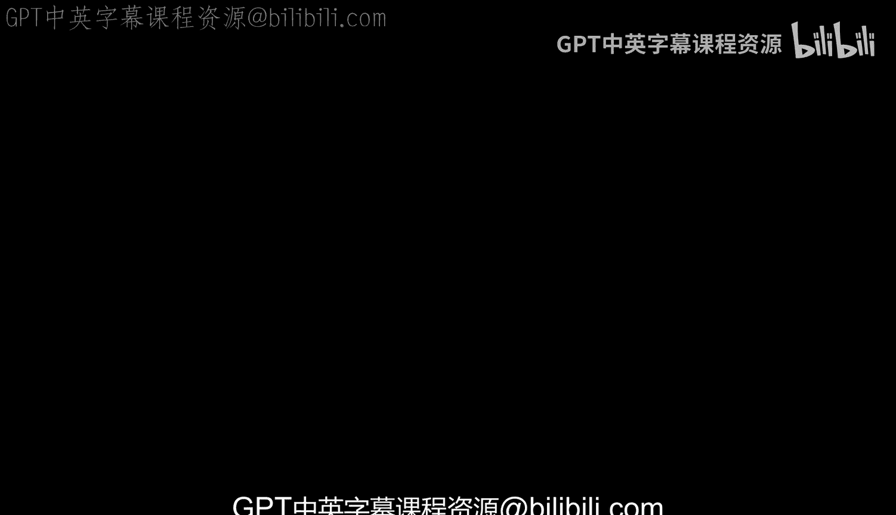
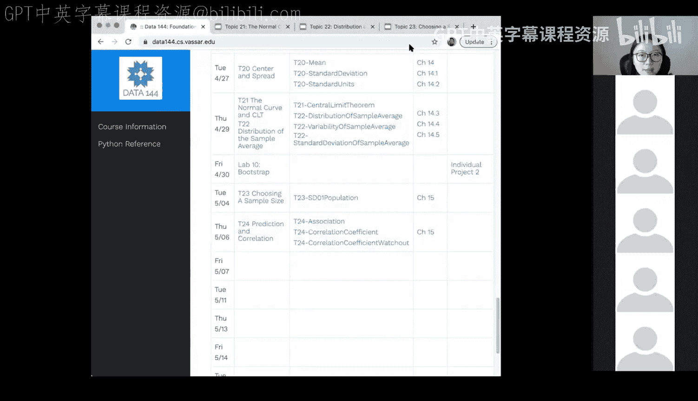
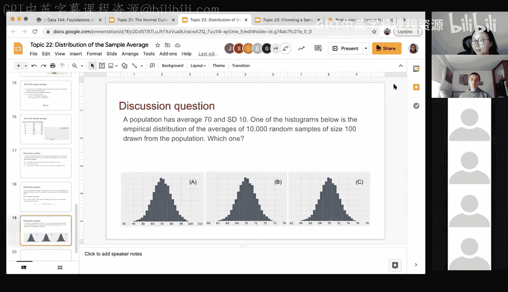
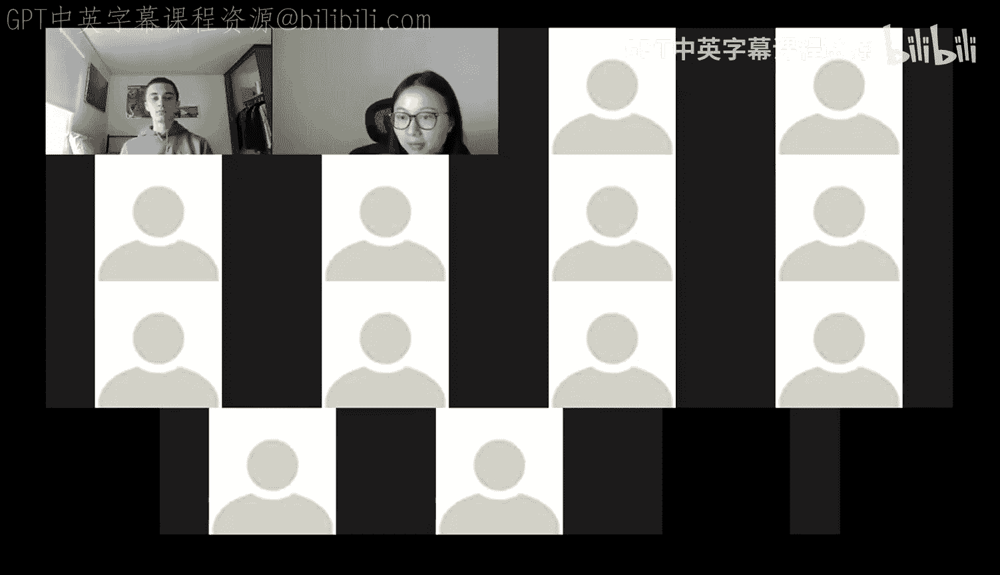
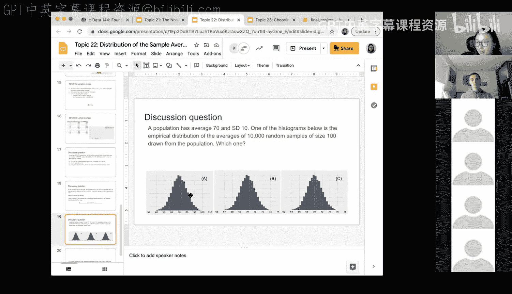
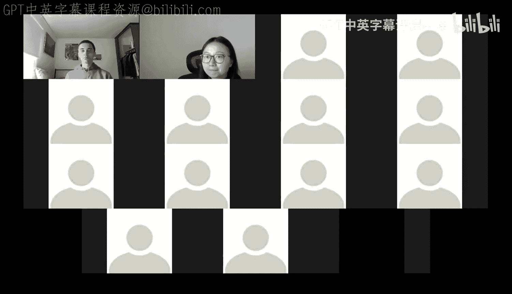

# 67：样本均值的分布与讨论问题

在本节课中，我们将学习样本均值的分布，并通过三个讨论问题来巩固对中心极限定理及其应用的理解。我们将重点关注样本量如何影响样本均值的变异性，并学习如何在实际问题中应用这些概念。

## 课程回顾 📚

上一节我们介绍了样本均值的分布。由于每次抽取不同的样本会得到不同的样本均值，因此样本均值本身也是一个随机变量，拥有自己的分布。

根据**中心极限定理**，无论总体分布如何，当样本量足够大时，样本均值的分布将近似服从**正态分布**。该正态分布的均值等于总体均值 `μ`，标准差等于总体标准差 `σ` 除以样本量的平方根 `√n`。

**公式**：`样本均值的标准差 = σ / √n`

更重要的是，我们认识到**样本量**在决定样本均值分布的变异性中扮演着关键角色。样本量越大，样本均值的分布就越集中，其变异性（标准差）越小。

## 讨论问题 🤔

以下是三个用于巩固理解的讨论问题。我们将逐一分析它们。

### 问题一：总体分布

一个城市有500,000户家庭。已知所有家庭年收入的**总体均值**为65,000美元，**总体标准差**为45,000美元。
问题：该城市家庭年收入的分布是？
A. 近似正态分布
B. 均匀分布
C. 无法从给定信息中确定

**分析与解答**：
题目中给出的65,000美元和45,000美元是描述整个城市（总体）的参数。然而，这些参数（均值和标准差）本身并不能告诉我们总体分布的形状。总体分布可以是任何形态，例如对于收入数据，它通常是右偏的。因此，仅凭均值和标准差无法确定分布形态。

**答案：C**

### 问题二：样本均值的区间估计

接上题，现从该城市所有家庭中**随机抽取900户**作为一个样本。
问题：约有68%的概率，样本家庭的**平均年收入**在 ______ 到 ______ 美元之间。（请填空并解释）

**分析与解答**：
本题关注的是**样本均值**的分布。根据中心极限定理，样本均值近似服从正态分布。
*   其均值等于总体均值：**65,000美元**。
*   其标准差为总体标准差除以样本量的平方根：`45,000 / √900 = 45,000 / 30 = 1,500美元`。

对于正态分布，约有68%的数据落在均值**±1个标准差**的范围内。因此，区间为：65,000 ± 1,500美元。

**答案：65,000 - 1,500 到 65,000 + 1,500** （即 63,500 到 66,500 美元）

### 问题三：识别样本均值的分布直方图

已知一个总体的均值为70，标准差为10。下图A、B、C中，哪一个最可能是“10,000个容量为100的随机样本的均值”的**经验分布直方图**？为什么？
（提示：三个直方图的X轴范围差异显著）

**分析与解答**：
我们同样需要分析**样本均值**的分布。
*   其均值等于总体均值：**70**。
*   其标准差为：`10 / √100 = 10 / 10 = 1`。

因此，这10,000个样本均值的分布应近似为均值为70、标准差为1的正态分布。根据经验法则（68-95-99.7规则），几乎所有的样本均值都应落在均值±3个标准差的范围内，即70 ± 3，也就是67到73之间。我们需要寻找一个X轴范围大致在此区间的直方图。

*   **选项A**的X轴范围远大于此（例如从40到100），这更可能代表总体本身或标准差未缩小的分布。
*   **选项B**的X轴范围集中在67到73附近，与我们的计算吻合。
*   **选项C**的X轴范围则过于狭窄。

**答案：B**

## 核心要点总结 📝

本节课中我们一起学习了：
1.  **样本均值是一个随机变量**，拥有自己的分布，这被称为抽样分布。
2.  **中心极限定理**指出，在大样本情况下，样本均值的分布近似正态，其均值为 `μ`，标准差为 `σ/√n`。
3.  **样本量 `n` 至关重要**：`n` 越大，样本均值分布的变异性越小，估计也越精确。
4.  在解决问题时，必须**仔细区分**题目描述的是**总体参数**、**总体分布**，还是**样本统计量**（如样本均值）的分布。混淆总体标准差和样本均值的标准差是一个常见错误。

通过以上讨论问题，我们练习了如何应用中心极限定理进行推断，并加深了对样本均值分布性质的理解。