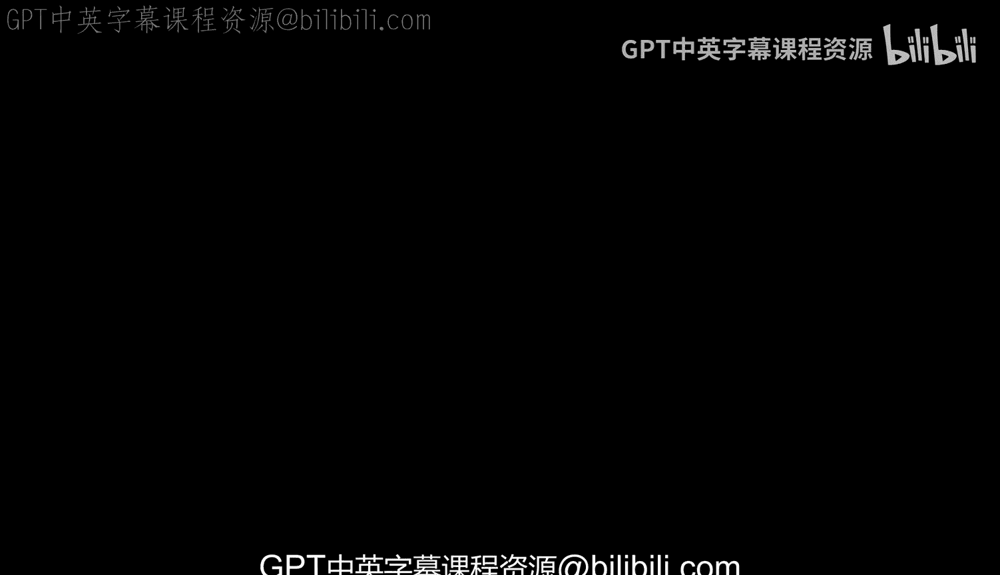
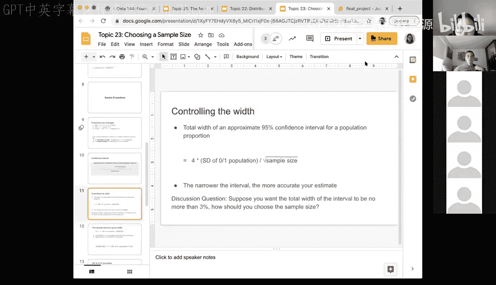
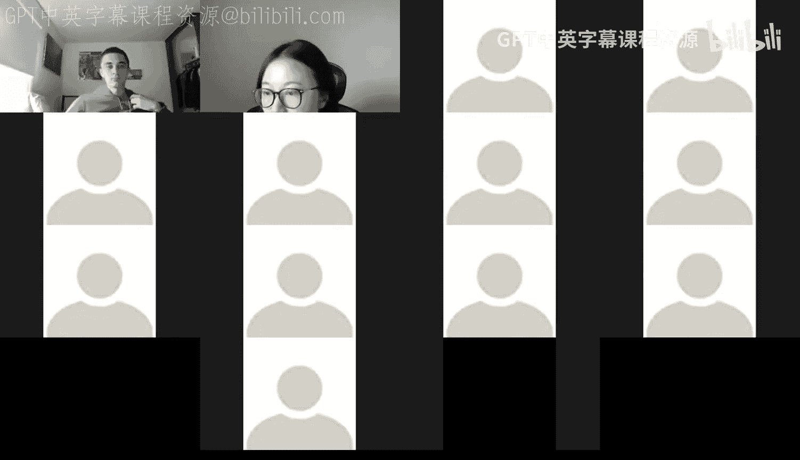
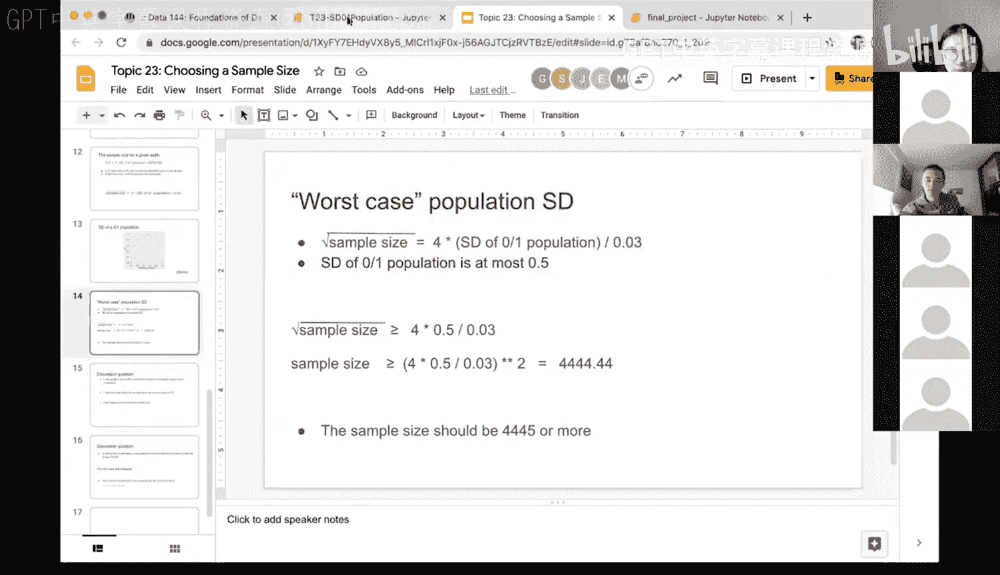

# 69：选择样本量与样本比例（第一部分） 📊




在本节课中，我们将学习如何为估计总体比例选择合适的样本大小。我们将从样本比例的概念出发，探讨其与样本均值的联系，并最终学习如何计算一个能确保置信区间宽度满足特定要求的样本量。

---

## 从分类数据到比例估计

上一节我们介绍了样本均值的置信区间。本节中我们来看看另一种重要的参数——总体比例。在许多调查中，例如询问婚姻状况，我们关心的往往是具有某个特定特征（如“已婚”）的个体在总体中所占的比例。

如果我们将原始的分类数据（如已婚、离异、丧偶等）重新编码为一个二元变量（例如，已婚记为1，非已婚记为0），那么样本中“1”的比例实际上就是这些0和1的平均值。这个认识至关重要。

**核心转换**：对于一个由0和1组成的数组，其**样本比例**（记为 $\hat{p}$）等于该数组的**样本均值**。
```python
# 示例：10个观测值，4个为1（已婚），6个为0（非已婚）
data = [1, 1, 1, 1, 0, 0, 0, 0, 0, 0]
sample_proportion = sum(data) / len(data)  # 结果为 0.4
```

因此，之前关于样本均值的一切理论——包括中心极限定理、均值的标准误以及置信区间的构建——都可以平移到对样本比例的分析上。

---

## 比例的置信区间

与样本均值类似，我们也可以为未知的总体比例 $p$ 构建置信区间。一个95%置信区间的形式如下：

**置信区间公式**：
$$ \text{置信区间} = \hat{p} \pm 2 \times \text{SE}(\hat{p}) $$
其中，$\hat{p}$ 是样本比例，$\text{SE}(\hat{p})$ 是样本比例的标准误。

那么，关键问题在于：如何计算样本比例的标准误 $\text{SE}(\hat{p})$？我们知道，对于样本均值，其标准误是 $\sigma / \sqrt{n}$，其中 $\sigma$ 是总体标准差。对于由0和1组成的特殊总体，其标准差有其特定的计算方法。

---





## 0-1总体的标准差

对于一个由0和1组成的总体，其标准差 $\sigma$ 取决于总体中“1”的真实比例 $p$。我们可以通过一个模拟来探索其规律。

以下是探索0-1总体标准差与比例 $p$ 关系的步骤：

1.  **构建总体**：对于一个固定大小（如10）的总体，我们可以通过指定其中“1”的个数来定义它。
2.  **计算标准差**：对于每一个特定的 $p$（即“1”的比例），计算该0-1数组的标准差。
3.  **观察规律**：改变 $p$ 的值，观察标准差如何变化。

```python
import numpy as np
import pandas as pd

def sd_of_01_population(num_ones, total_size=10):
    """计算一个由指定数量1和0组成的总体的标准差"""
    # 创建数组：前 num_ones 个为1，其余为0
    population = np.concatenate([np.ones(num_ones), np.zeros(total_size - num_ones)])
    return np.std(population)

# 尝试所有可能的1的个数（从0到10）
possible_ones = np.arange(11)  # 0, 1, 2, ..., 10
results = pd.DataFrame({
    ‘num_ones‘: possible_ones,
    ‘proportion_of_ones‘: possible_ones / 10
})
# 应用函数计算标准差
results[‘std_deviation‘] = results[‘num_ones‘].apply(sd_of_01_population)
```

运行上述代码会发现一个关键规律：**当总体中“1”的比例 $p$ 为 0.5 时，标准差达到最大值 0.5**。当 $p$ 为 0 或 1 时（即全为0或全为1），标准差为 0。图形呈现出一条以 $p=0.5$ 为对称轴的倒U型曲线。

这意味着，在计算样本量时，如果我们对真实的 $p$ 一无所知，最保守（即能保证在任何情况下都满足条件）的做法是使用其可能的最大标准差 0.5。

---

## 从区间宽度反推样本量

现在，我们回到核心问题：如何根据期望的置信区间宽度来确定样本量？

对于一个95%的置信区间，其总宽度（从下限到上限的距离）大约是 $4 \times \text{SE}(\hat{p})$。更精确地说，总宽度 $W$ 为：
$$ W \approx 4 \times \frac{\sigma}{\sqrt{n}} $$
其中 $\sigma$ 是0-1总体的标准差，$n$ 是样本量。

假设我们希望置信区间的总宽度 $W$ 不超过 3%（即 0.03）。同时，我们采用最保守的估计，使用 $\sigma$ 的最大可能值 0.5。我们可以建立以下不等式来求解所需的样本量 $n$：

**样本量计算公式**：
$$ 4 \times \frac{0.5}{\sqrt{n}} \leq 0.03 $$

解这个不等式：
1.  $\frac{2}{\sqrt{n}} \leq 0.03$
2.  $\sqrt{n} \geq \frac{2}{0.03} \approx 66.67$
3.  $n \geq (66.67)^2 \approx 4444.44$

因此，为了确保在**最坏情况**（$p=0.5$）下，总体比例的95%置信区间宽度也不超过3%，我们至少需要约 **4445** 个样本观测值。如果真实的 $p$ 偏离0.5，实际所需的样本量会更小，但选择 4445 能为我们提供一个安全的保证。

---

## 总结

本节课中我们一起学习了：
1.  **样本比例与均值的关联**：通过将分类数据二元化（0/1），样本比例可视为样本均值，从而可以沿用中心极限定理和置信区间的理论框架。
2.  **0-1总体的标准差**：其大小取决于总体比例 $p$，并在 $p=0.5$ 时达到最大值 0.5。在未知 $p$ 时，使用此最大值进行规划是最保守的策略。
3.  **根据精度要求确定样本量**：通过设定置信区间的目标宽度（如3%），并利用标准差公式反推，可以计算出满足精度要求所需的最小样本量。这为设计调查或实验前的样本量规划提供了量化方法。




理解如何从统计精度（置信区间宽度）的要求出发，倒推出必要的样本规模，是进行严谨的数据收集和推断分析的关键一步。