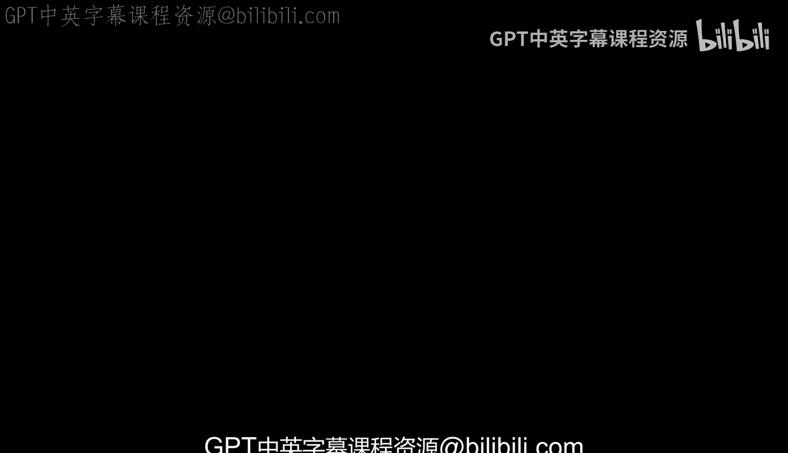
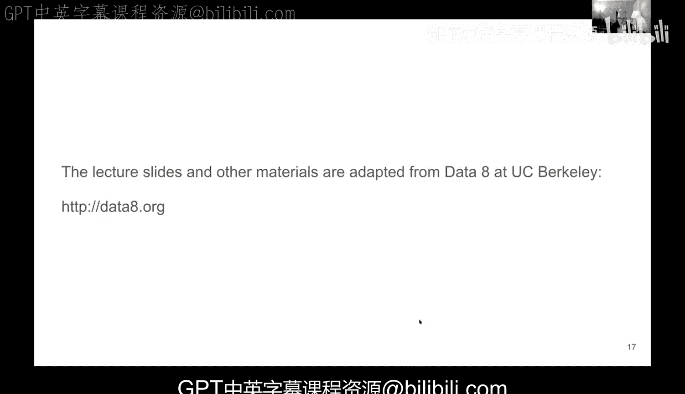

# 70：选择样本量

在本节课中，我们将继续学习关于样本比例的内容，重点是理解如何根据所需的置信区间宽度来确定合适的样本量。我们将通过具体的公式和计算来掌握这一核心概念。

## 回顾：样本比例与置信区间

上一节我们介绍了如何将比例问题视为一种特殊的平均值问题来处理。本节中我们来看看如何控制估计的精度。

对于二元数据（如投票意向调查），总体比例是未知的。我们通过抽取样本并计算样本比例来估计它。根据中心极限定理，大量模拟样本比例的分布会呈现钟形曲线（正态分布），其中心是样本比例的中位数。

我们可以通过查看样本比例分布的标准差来构建置信区间。这个分布的宽度（即我们估计的不确定性）受两个因素控制：
1.  **样本量**：样本量越大，估计越精确。但精度与样本量的平方根成反比，而非线性关系。
2.  **总体本身的变异程度**：总体中“是”与“否”的分布越均匀，标准差越大。

对于95%的置信区间，其总宽度约为总体标准差的4倍。公式可以表示为：
`总宽度 ≈ 4 * (总体标准差 / sqrt(样本量))`

## 核心挑战与解决方案

以下是确定样本量时的一个关键问题及其解决方法。

我们想用上述公式计算所需样本量，但存在一个实际问题：**我们不知道总体的真实标准差**。这是计算中的主要障碍。

幸运的是，对于二元数据（0和1），总体标准差有一个已知的最大值。当总体中“是”与“否”的比例各为50%时，标准差达到最大，其值为0.5。这是一个普适的上限。

因此，在不知道真实标准差的情况下，我们可以使用这个最坏情况下的最大值0.5进行保守估计。这样，我们就能计算出确保特定精度所需的最小样本量。

## 应用示例：计算样本量

现在，我们通过两个讨论问题来应用上述概念。

### 问题一：68%置信区间

第一个问题是：如果我们希望使用68%置信区间来估计总体比例，并且要求区间总宽度不超过2.5%，那么随机样本必须有多大？

以下是解决此问题的步骤：
1.  对于68%置信区间，我们需要向均值两侧各延伸约1个标准差，因此总宽度系数是2（1+1），而不是95%区间时的4。
2.  使用总体标准差的最大值0.5。
3.  设定期望的总宽度为0.025（即2.5%）。
4.  代入公式并求解样本量 `n`。

计算过程如下：
`2.5% = 2 * (0.5 / sqrt(n))`
`0.025 = 1 / sqrt(n)`
`sqrt(n) = 1 / 0.025`
`sqrt(n) = 40`
`n = 40^2 = 1600`

因此，样本量必须至少为1600。

### 问题二：根据给定样本量计算精度

第二个问题是：如果我们已经决定抽取一个10，000的样本，并使用95%置信区间，那么我们的估计值会在多大范围内（即精度是多少）？

以下是解决此问题的步骤：
1.  对于95%置信区间，总宽度系数为4。
2.  总体标准差仍取最大值0.5。
3.  样本量 `n` 为10，000。
4.  设总宽度为 `x`，代入公式求解。

计算过程如下：
`x = 4 * (0.5 / sqrt(10000))`
`x = 4 * (0.5 / 100)`
`x = 4 * 0.005`
`x = 0.02 或 2%`

因此，基于10，000的样本量和95%的置信水平，我们的估计值将在大约±2%的范围内。这解释了为何在民意调查中，我们常看到类似“支持率为47%，误差范围为±3%”的表述。那个±3%就是根据样本量和置信水平计算出来的区间宽度。

## 总结

本节课中我们一起学习了如何为比例估计问题选择合适的样本量。核心要点是：
*   估计的精度（置信区间宽度）取决于样本量和总体变异程度。
*   对于二元数据，我们使用总体标准差的最大值0.5进行保守计算。
*   通过调整公式 `宽度 = 系数 * (0.5 / sqrt(样本量))`，我们可以根据想要的宽度求解所需样本量，或根据已有样本量计算预期的精度。系数取决于置信水平（如95%对应4，68%对应2）。
*   理解这一点有助于解读现实中的民意调查数据，明白其公布的误差范围从何而来。