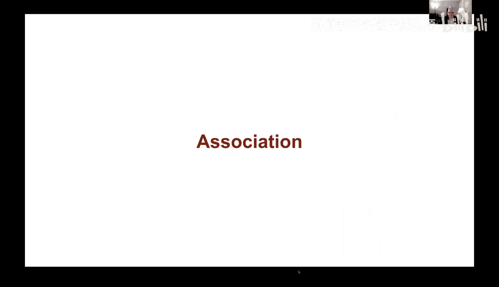

# 71：预测与关联

## 概述
在本节课中，我们将要学习预测的基本概念，回顾一种基于相似个体进行预测的方法，并探讨如何评估预测效果，以及如何判断一个变量是否是一个好的预测因子。

## 预测回顾：基于相似个体的预测

上一节我们介绍了预测的核心目标：利用不完整的信息对未来进行猜测。本节中我们来看看一种具体的预测方法。

预测意味着猜测未来。我们通常没有完整的信息来进行预测，因此需要基于不完整的信息做出猜测。在本课程早期，我们学习过一种预测方法：如果我们想预测某个个体的结果，但缺乏该个体的完整信息，我们可以观察那些已知结果的、相似的个体，并以这些已知结果作为我们预测的基础。

我们在研究高尔顿身高数据集时见过这种方法。作为回顾，当时我们收集了大量关于父母及其子女身高的数据。我们试图解决的问题是：能否利用父母的身高来预测孩子成年后的身高？我们选定了一个预测变量，称为“父母平均身高”，即父亲和母亲身高的平均值。我们使用这个变量来预测孩子的身高。

我们并未在此进行实际计算，而是先观察数据的可视化结果。从散点图可以看出，随着父母平均身高的增加，孩子的身高也倾向于增加，这表明两者之间存在某种关联。

## 如何进行具体预测？

那么，如何对数据集中不存在的孩子进行预测呢？假设我们有一个新孩子，其父母的平均身高是68英寸。我们的预测方法是：在数据集中，找出所有父母平均身高在67.5到68.5英寸之间的邻居数据点，然后计算这些已知孩子身高的平均值，这个平均值就是我们的预测值。

我们将此方法应用于所有数据点，得到了一条预测线。一个明显的现象是，尽管原始数据点较为分散，但预测线看起来近似一条直线，这表明预测关系是线性的。

## 评估预测效果：预测误差

在做出预测之后，我们需要评估预测的效果。一种方法是观察预测误差。

当我们根据孩子的性别分别分析预测误差时，发现了一个有趣的现象：我们的预测倾向于高估女性的身高，而低估男性的身高。

## 改进预测：按性别分组

于是，我们可以尝试一种更聪明的预测方法：仍然使用父母平均身高作为预测变量，但分别针对男性和女性孩子建立预测模型。结果显示，这种分组预测方法得到了更准确的预测结果。

这种通过计算局部平均值进行预测的方法，被称为**回归预测**。对于任何一个给定的预测值，它大致位于垂直数据条带的中心位置。

## 从预测到关联

现在，我们想更正式地探讨：一个变量是否能成为一个好的预测因子？这引出了我们下一个主题：关联。

## 总结
本节课中我们一起学习了预测的基本思想，回顾了基于“邻居”平均值的回归预测方法。我们了解到，可以通过分析预测误差来评估模型表现，并通过按重要特征（如性别）分组来改进预测。最后，我们认识到，评估一个预测因子的好坏需要更深入的分析，这为学习“关联”的概念做好了准备。