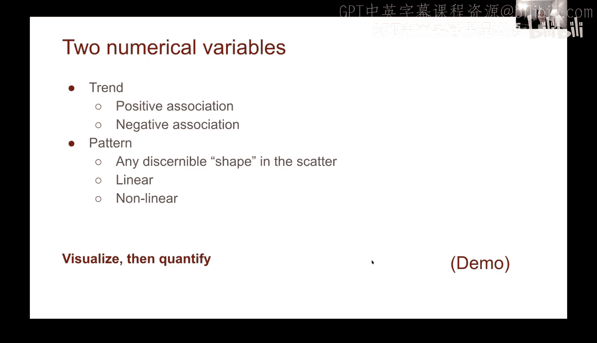
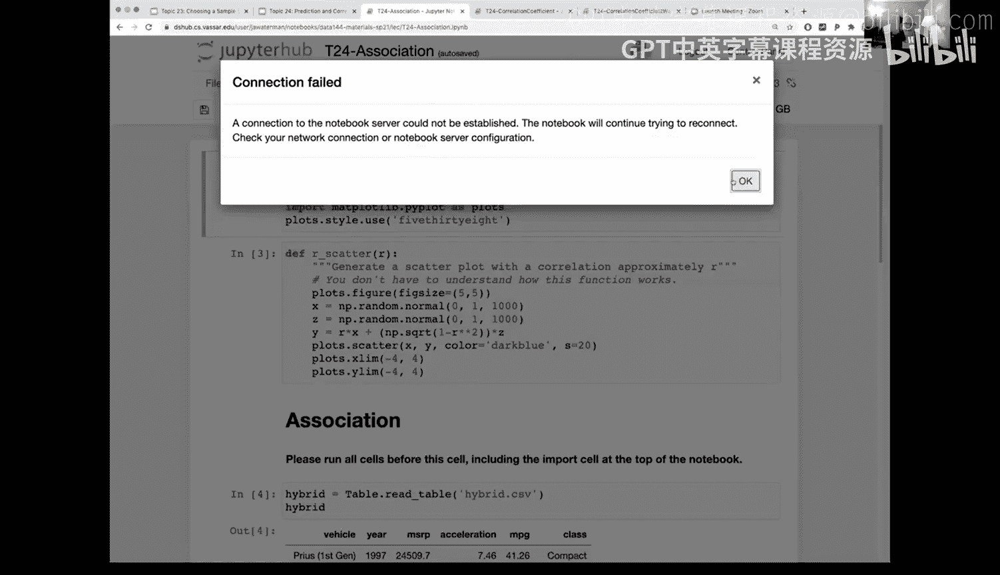
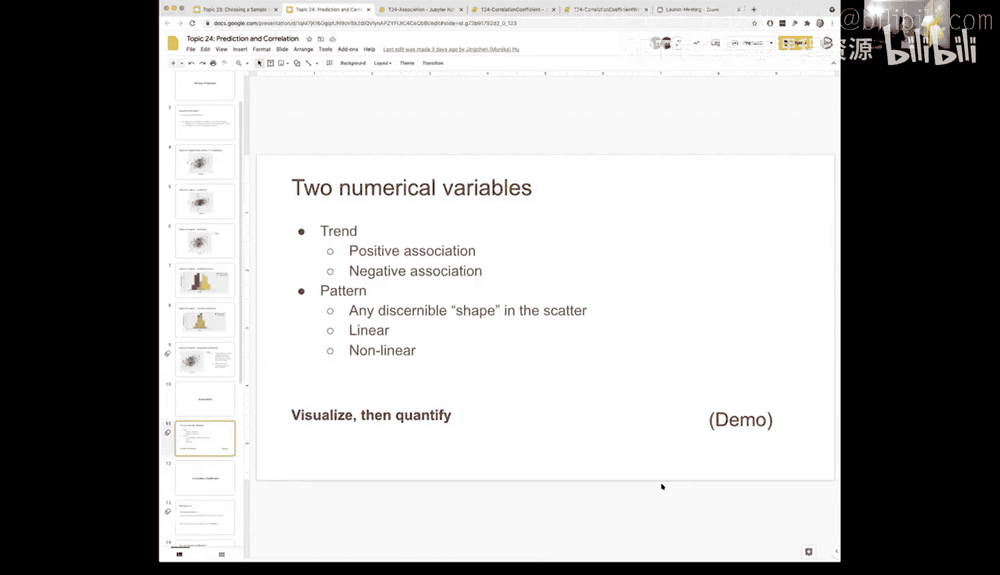

# 72：预测与关联

在本节课中，我们将学习如何探索和分析两个数值变量之间的关系。我们将通过可视化数据来观察趋势和模式，并引入标准单位的概念，以便更有效地比较不同的数据关系。

## 探索数据关联

上一节我们介绍了数据分析的基本概念，本节中我们来看看如何探索两个数值变量之间的关系。当我们获得一个新的数据集时，一个好的做法是首先观察和探索数据。在比较两个数值变量时，我们可以观察其趋势：当一个变量增加时，另一个变量如何变化。

以下是两种主要的关联趋势：

*   **正相关**：随着变量X的增加，变量Y也随之增加。
*   **负相关**：随着变量X的增加，变量Y反而减少。

除了趋势，我们还可以观察数据的**模式**，即散点图中是否存在某种形状。我们将重点关注**线性模式**，即数据点大致沿一条直线分布。当然，也存在非线性的关联关系。

我们遵循的一般路线是：首先通过可视化来感受数据的形状，然后通过量化指标（即一个统计数字）来总结我们所看到的内容。

## 可视化关联：混合动力汽车数据集

现在，让我们通过一个具体的例子来实践。我们将使用一个混合动力汽车的数据集，重点关注几个数值变量：制造商建议零售价（MSRP）、加速度和每加仑英里数（MPG）。

首先，我们单独查看MSRP的分布。其直方图显示，价格分布并不均匀，大多数车辆的价格集中在30，000美元左右，而少数豪华车型（如雷克萨斯）价格超过100，000美元。

接下来，我们同时观察两个变量，以探索它们之间的关联。

*   **MSRP 与 MPG**：当我们绘制价格与燃油效率的关系图时，可以看到一个**负相关**的趋势。随着每加仑英里数的增加，车辆价格倾向于下降。这种关系看起来并非完全线性，略带曲线。
*   **MSRP 与 加速度**：当我们绘制价格与加速度的关系图时，可以看到一个清晰的**正相关**。加速度更高的车辆往往也更昂贵。

我们也可以只关注特定类别的车辆，例如SUV。在SUV类别中，MSRP的分布看起来更均匀。同时，MSRP与加速度的正相关、以及与MPG的负相关关系依然存在，且后者看起来比全数据集时更接近线性。

## 使用标准单位进行比较

在可视化数据时，我们需要注意单位。例如，加速度的范围是8到18，而MPG是另一个范围，这使得不同散点图之间的直接比较变得困难。

为了解决这个问题，我们几乎总是将数据转换为**标准单位**。转换方法是对每个数据点进行标准化：

`标准单位值 = (原始值 - 数据平均值) / 数据标准差`

我们创建一个辅助函数来完成这个转换。转换后，数据的**形状和关联关系完全不变**，但坐标轴的单位改变了。所有数据的中心点变成了（0， 0），每个轴的单位都变成了“标准差”。这使得不同图表之间的比较变得直观和公平。

例如，将MPG和MSRP转换为标准单位后绘制散点图，其形状与原始单位图一致，但中心位于原点。同样，加速度与MSRP的标准单位图也清晰地展示了正相关关系。

## 总结

本节课中我们一起学习了如何探索两个数值变量之间的关联。我们首先通过散点图可视化数据，识别正相关和负相关的趋势，并观察线性或非线性的模式。然后，我们引入了**标准单位**的概念，通过将数据标准化到均值为0、标准差为1的尺度，来消除原始单位的影响，从而更有效地比较不同变量对之间的关联强度。这是量化数据关系的重要预备步骤。