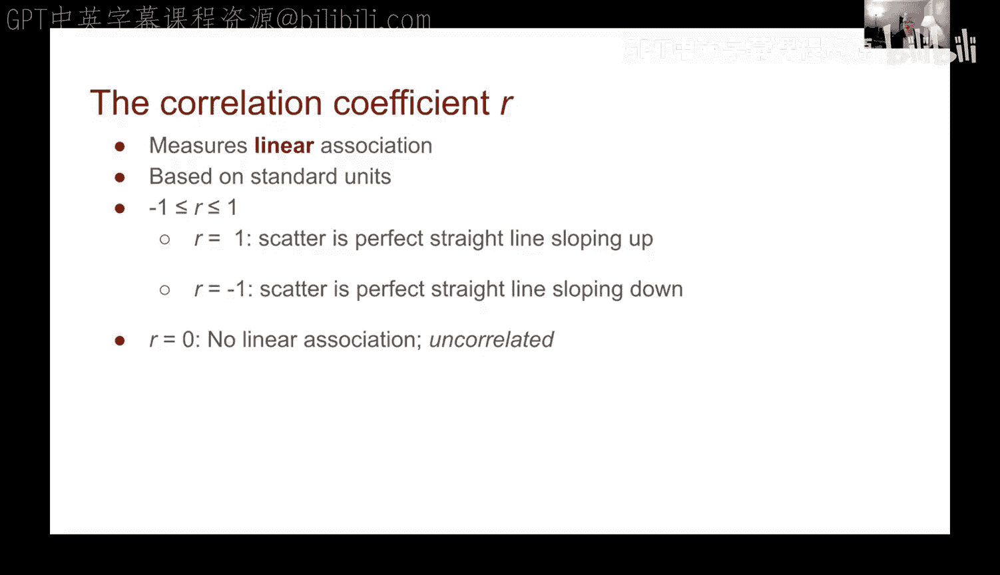

# 73：预测与相关性 - 相关系数


## 概述
在本节课中，我们将学习如何量化两个变量之间的线性关系。我们将介绍一个核心统计量——**相关系数**，它能够精确地衡量数据点围绕一条直线的聚集程度。我们将学习如何计算它，理解其取值范围的含义，并通过可视化示例来加深理解。

---

## 相关系数的定义与计算

上一节我们通过观察散点图直观地看到了变量间的关联。本节中，我们将使这种关联的度量更加形式化。为此，我们引入**相关系数**，通常用符号 **`r`** 表示。

相关系数的计算基于已转换为**标准单位**的数据。其计算步骤如下：

1.  将变量 `x` 和 `y` 的数据分别转换为标准单位。
2.  计算每一对标准单位数据 `(x_su, y_su)` 的乘积。
3.  计算所有这些乘积的平均值。

这个平均值就是相关系数 `r`。用公式可以表示为：

**`r = average( (x in standard units) * (y in standard units) )`**

以下是使用代码描述的计算过程：

```python
# 假设 `x` 和 `y` 是原始数据列
x_su = (x - np.mean(x)) / np.std(x)  # 转换为标准单位
y_su = (y - np.mean(y)) / np.std(y)

product = x_su * y_su               # 计算乘积
r = np.mean(product)                # 计算平均值，即相关系数
```



---

## 相关系数的性质与解释

相关系数 `r` 衡量的是数据围绕一条直线的聚集程度，因此它度量的是两个变量之间的**线性关联**。

`r` 的值域始终在 **-1** 到 **1** 之间：
*   **`r = 1`**：表示完全正相关。数据点完美地落在一条斜向上的直线上。
*   **`r > 0`**：表示正相关。随着 `x` 增大，`y` 也倾向于增大，散点图呈上升趋势。
*   **`r = 0`**：表示**没有线性关联**。但这并不意味着变量间没有关系，只是不存在直线关系。
*   **`r < 0`**：表示负相关。随着 `x` 增大，`y` 倾向于减小，散点图呈下降趋势。
*   **`r = -1`**：表示完全负相关。数据点完美地落在一条斜向下的直线上。

---

## 计算实例演示

为了具体说明，我们创建一个包含6个数据点的小型数据集并进行计算。

首先，我们生成数据并绘制散点图进行观察。

```python
# 示例数据
data = {'x': [1, 2, 3, 4, 5, 6],
        'y': [2, 4, 5, 4, 5, 7]}
table = Table().with_columns(data['x'], data['y'])
# 绘制散点图 (略)
```

接下来，按照定义步骤计算相关系数：

1.  将 `x` 和 `y` 转换为标准单位。
2.  计算标准单位下每对数据的乘积。
3.  求乘积的平均值。

通过计算，我们得到该数据集的相关系数 `r ≈ 0.61`。这是一个正值，表明 `x` 和 `y` 之间存在正相关关系，这与我们从散点图中观察到的趋势一致。

我们可以将上述步骤封装成一个辅助函数，方便后续使用：

```python
def correlation(tbl, x_label, y_label):
    x = tbl.column(x_label)
    y = tbl.column(y_label)
    x_su = (x - np.mean(x)) / np.std(x)
    y_su = (y - np.mean(y)) / np.std(y)
    return np.mean(x_su * y_su)

# 使用函数计算
r_value = correlation(table, ‘x‘, ‘y‘)  # 结果同样为 0.61
```

---

## 实际数据应用与可视化理解

现在，让我们将相关系数应用于更实际的数据集。例如，分析汽车数据中每加仑英里数（MPG）与制造商建议零售价（MSRP）的关系。

计算结果显示，`r ≈ -0.66`。这是一个负值，证实了我们之前的观察：燃油效率越高（MPG越大），汽车价格倾向于越低，存在负相关。

为了更直观地理解不同 `r` 值对应的数据形态，我们可以观察根据特定 `r` 值生成的模拟散点图：

以下是不同相关系数对应的数据分布特征：

*   **`r = -1 或 1`**：数据点严格落在一条直线上（斜向下或斜向上）。
*   **`r = ±0.9`**：数据点紧密地聚集在一条直线周围，仅有轻微“模糊”。
*   **`r = ±0.5`**：能观察到明确的线性趋势，但数据点更加分散。
*   **`r = ±0.1`**：线性趋势非常微弱，几乎难以察觉。
*   **`r = 0`**：数据点呈圆形或无规则的“团状”分布，没有明显的线性方向。

这些可视化图像清晰地表明，`r` 的绝对值大小反映了线性关系的强弱，而符号则指示了关系的方向。

最后，需要指出相关系数的一个数学性质：**相关系数与变量的顺序无关**。即 `correlation(x, y)` 始终等于 `correlation(y, x)`，因为乘法满足交换律。

---

## 总结


本节课中，我们一起学习了**相关系数 `r`** 这一核心概念。我们掌握了它的定义和基于标准单位的计算方法，理解了其取值范围（-1 到 1）所代表的统计意义——即衡量两个变量间线性关系的强度和方向。通过实际计算示例和不同 `r` 值对应的模拟散点图，我们直观地看到了强相关、弱相关以及无线性相关时数据的分布形态。记住，`r` 仅度量线性关联，当 `r=0` 时，只表示没有直线关系，并不代表变量间完全没有关联。