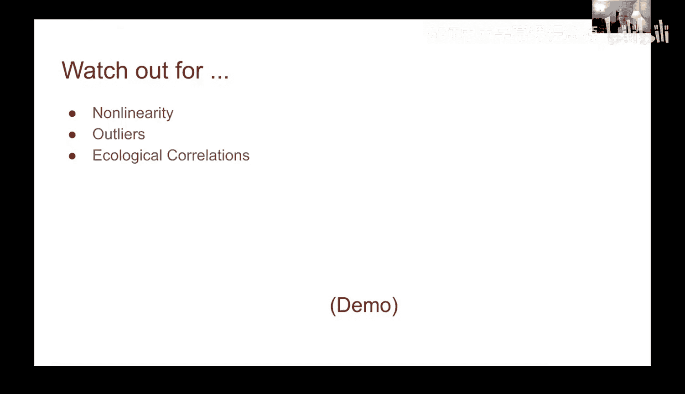
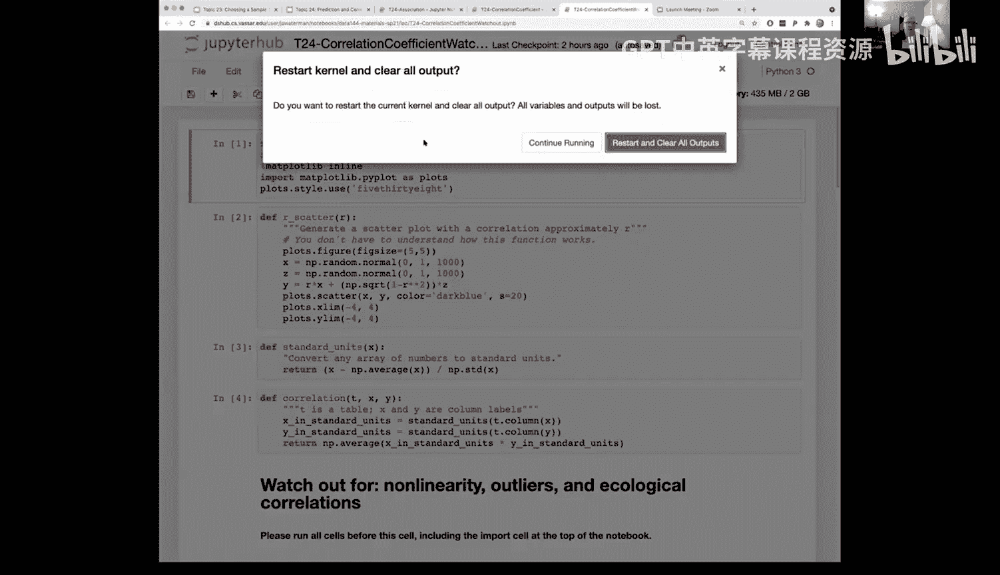
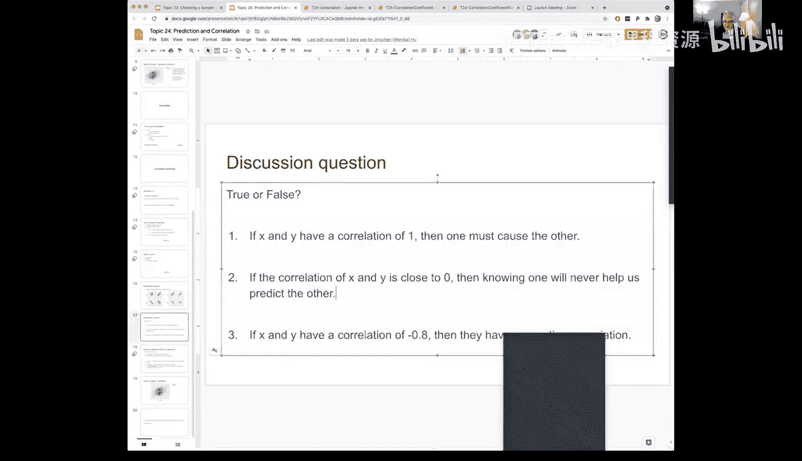

# 74：预测与相关性：注意事项 🚨

在本节课中，我们将探讨衡量变量间线性关系的相关系数 `r` 时需要注意的几个关键陷阱。理解这些局限性对于正确解读数据分析结果至关重要。

上一节我们介绍了相关系数 `r` 的计算和含义，本节中我们来看看在使用这个指标时需要警惕哪些问题。

## 相关系数的局限性

首先，我们必须记住相关系数 `r` 衡量的对象。它衡量的是两个变量 `x` 和 `y` 之间**线性关系**的强度和方向。因此，当 `r` 接近零时，我们只能得出“不存在线性关系”的结论，但这并不意味着变量间完全没有关系，它们可能存在其他形式的非线性关联。

以下是使用相关系数时需要留意的三个主要方面。

## 非线性关系

以下是第一个需要注意的方面：非线性关联。即使数据间存在明确的关系，如果这种关系不是线性的，相关系数也可能接近零。

我们生成一组数据，其中 `y` 是 `x` 的平方：`y = x^2`。从数据分布可以明显看出 `x` 和 `y` 之间存在关联。然而，计算这对数据的相关系数 `r` 时，结果为零。这明确说明，**相关系数为零仅代表没有线性关系，但不能排除存在其他（如二次）关系**。

因此，在分析数据时，我们始终建议先进行可视化。通过散点图可以清晰地识别出数据是否呈现线性模式，从而避免仅依赖 `r` 值做出错误判断。

## 异常值的影响

接下来，我们看看第二个方面：异常值。异常值可能对相关系数产生巨大影响，甚至扭曲原本明显的线性趋势。

考虑一组完美线性相关的数据，其相关系数 `r` 应为 1。现在，如果引入一个偏离趋势的异常数据点，重新计算 `r` 值可能会急剧下降，甚至接近零。这个异常值可能是由于数据录入错误、设备故障或其他偶然因素造成的。在数据量较小时，单个异常点的影响尤为显著。

另一个例子中，异常值的影响可能不那么极端，但仍会明显改变 `r` 值。因此，在计算相关系数前，检查并理解数据中的异常点是非常重要的。

## 生态学相关性谬误

最后，我们探讨第三个需要注意的概念：生态学相关性。这是指基于群体汇总数据（如平均值）得出的相关性，可能不适用于推断个体层面的关系。

例如，观察美国各州的SAT平均成绩，将每个州的“批判性阅读”平均分与“数学”平均分进行关联，可能会得到一个极高的相关系数（如0.98）。这似乎表明阅读好的州数学也好。然而，**这个结论是关于“州”这个群体的，不能直接推广到“学生”个体**。州平均分高可能是因为该州教育资源整体优越，但具体到某个学生，其阅读和数学成绩的关联性可能远低于0.98。

在分析项目数据时，尤其是处理汇总数据时，需要警惕这种谬误，避免做出过度概括的推断。

---

本节课中我们一起学习了使用相关系数 `r` 时的三个主要注意事项：**非线性关系**、**异常值的影响**以及**生态学相关性谬误**。记住，`r` 仅衡量线性关联，不代表因果关系，且对异常值敏感。在数据分析中，始终结合数据可视化进行判断，并谨慎理解数据聚合的层级，这样才能做出更准确的解读。