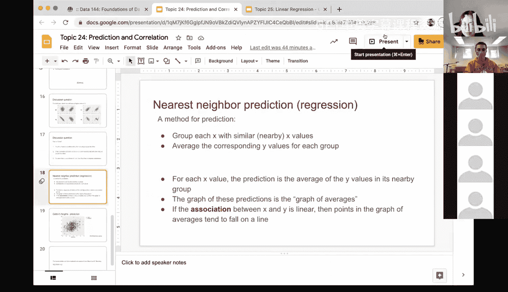
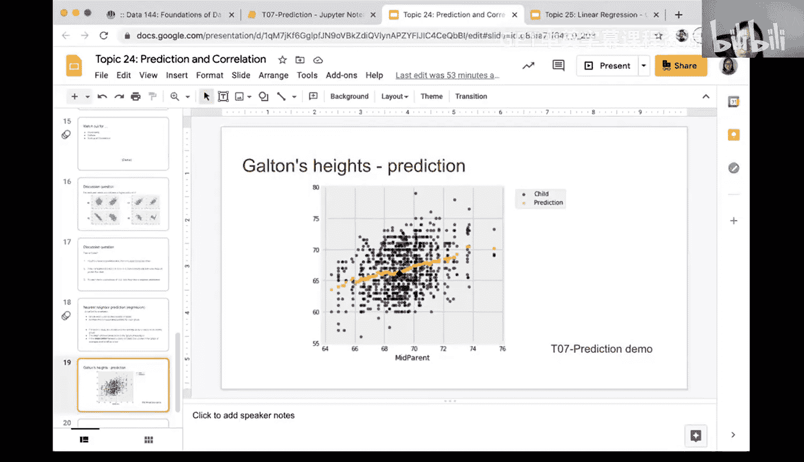
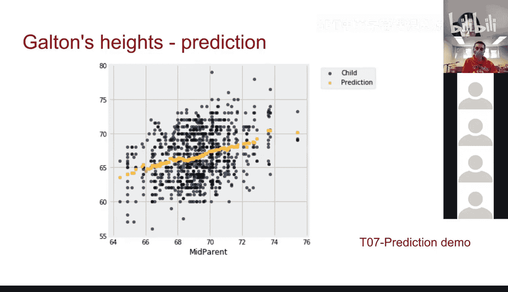

# 75：预测与关联 📊


在本节课中，我们将回顾并深入理解一种名为“最近邻预测”的预测方法。我们将通过高尔顿身高数据的例子，学习如何使用一个变量（如父母平均身高）来预测另一个变量（如子女身高），并探讨这种方法与线性关联（相关性）之间的关系。




---

## 回顾：最近邻预测方法 🔍

上一节我们介绍了预测的基本概念。本节中，我们来看看一种具体的预测方法——最近邻预测。

其核心思想是：为了预测某个给定X值（预测变量）对应的Y值（结果变量），我们不是只看单个点，而是观察所有与这个X值“相近”的数据点，然后取这些数据点Y值的平均值作为预测值。

用公式可以表示为：
**预测值 ŷ = 平均值(所有与 x 相近的数据点的 y 值)**

在高尔顿数据的例子中：
*   **X（预测变量）**：父母平均身高（mid-parent height）。
*   **Y（结果变量）**：子女身高。
*   **“相近”的定义**：例如，对于父母平均身高为68英寸的情况，我们收集所有父母身高在67.5英寸到68.5英寸之间的记录。

以下是使用Python实现此方法的关键步骤：

1.  **定义区间**：确定一个以目标X值为中心的小区间（例如，±0.5英寸）。
2.  **筛选数据**：使用条件筛选出所有X值落在此区间内的数据行。
3.  **计算平均值**：计算这些筛选出的数据行中Y值的平均值。

```python
# 示例代码逻辑
nearby_data = original_data.where(‘mid_parent_height’， are.between(67.5， 68.5))
prediction = np.mean(nearby_data.column(‘child_height’))
```

---

## 平均值图与线性关联 📈

上一节我们介绍了如何计算单个预测值。本节中，我们来看看当对所有可能的X值都进行这种预测时，会得到什么。

如果我们对数据集中每一个不同的父母平均身高值都执行上述最近邻预测，并将所有预测点（X， 预测的Y）绘制在散点图上，就会得到一条曲线，我们称之为**平均值图**。

这个图形揭示了预测变量X和结果变量Y之间的关系。一个重要的观察是：
**如果X和Y之间的关联是线性的，那么平均值图中的点往往会落在一条直线附近。**

这与我们学过的相关系数概念紧密相连：
*   当相关系数 **|r|** 接近1时，表明X和Y有很强的线性关联。
*   此时，平均值图中的预测点将非常接近一条直线。
*   在高尔顿数据中，我们看到父母身高与子女身高呈正相关，因此其平均值图也大致呈线性趋势。

---

## 实践演示：代码回顾 💻

上一节我们讨论了理论。本节中，我们通过回顾早期课程中的代码演示，来具体看看如何实现。

首先，我们加载数据并观察父亲、母亲和子女身高的分布。接着，我们创建了一个新的预测变量——“父母平均身高”。

```python
# 创建父母平均身高列
data = data.with_column(‘mid_parent’， (data.column(‘father’) + data.column(‘mother’)) / 2)
```

然后，我们绘制父母平均身高与子女身高的散点图。从图中可以直观地看到正相关趋势，这证实了使用父母平均身高作为预测因子是合理的。

最后，我们将最近邻预测的逻辑封装成一个函数，并对整个数据范围应用此函数，从而生成最终的平均值图。这张图就是我们之前讨论的理论的直观体现。



---

## “回归”一词的含义 🤔

在结束本章之前，我们探讨一个常见问题：为什么这种预测方法被称为“回归”？


观察平均值图，你会发现：
*   有些蓝色的实际数据点位于黄色预测曲线的上方。
*   有些则位于预测曲线的下方。

预测值（黄色曲线）更像是所有数据点的“中心”或“平均”趋势。无论实际数据点如何分布，我们的预测方法总是倾向于给出一个向整体平均值靠拢的值。这种现象被称为“**回归到平均值**”。

这正是“回归”这个术语的由来。它描述了预测值向中心趋势靠拢的这一特性。在后续学习更复杂的线性回归模型时，这一根本思想依然存在。

---

## 总结与展望 🎯

本节课中我们一起学习了：
1.  **最近邻预测**：一种通过取邻近数据点结果的平均值来进行预测的直观方法。
2.  **平均值图**：展示所有预测值的图形，它能揭示变量间的潜在线性关系。
3.  **与相关性的联系**：当两个变量线性相关时，平均值图会近似一条直线。
4.  **“回归”的含义**：预测方法具有“向平均值靠拢”的特性。




这是一种基础的预测方法。在接下来的主题中，我们将学习一种更正式、更强大的预测工具——**线性回归**。它将为我们提供一条明确的直线来概括数据关系，并广泛应用于各种数据分析场景。